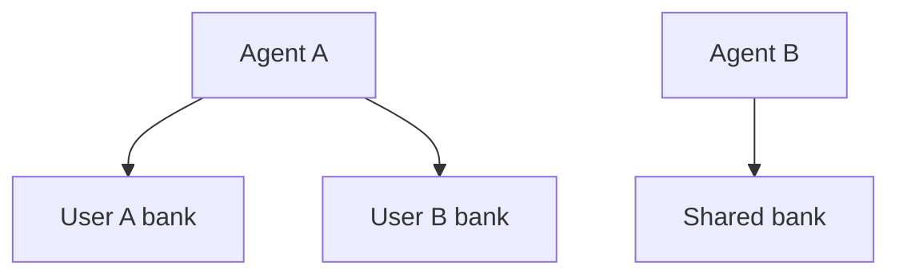
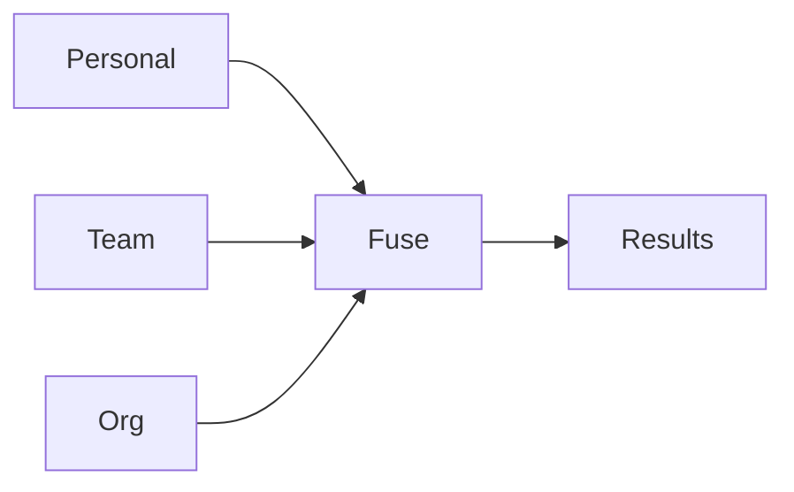

# Multi-bank orchestration

Agents don't have one memory - they have several. A support agent has personal context about the current user, shared team knowledge, and org-wide policies. Astrocytes orchestrates across these banks because it sits above the provider layer.

For the core API and provider architecture, see `03-architecture-framework.md`.

---

## 1. The problem

A single bank per agent is limiting:

- An agent serving multiple users needs per-user banks plus shared knowledge.
- A team of agents needs individual memory plus a shared team bank.
- Enterprise agents need personal + team + org-wide policy banks.

Without multi-bank orchestration, callers must query each bank individually, merge results, and handle per-bank policies themselves. That logic belongs in the framework.

---

## 2. Bank topology

Astrocytes supports three bank relationship patterns:

### 2.1 Isolated banks

Each bank is independent. No cross-bank queries. Default behavior.



### 2.2 Layered banks (cascade)

Banks are ordered by specificity. Query the most specific first; widen if results are thin.


### 2.3 Parallel banks (fan-out)

Query all banks simultaneously, fuse results across banks.



---

## 3. API surface

### 3.1 Single-bank (existing, unchanged)

```python
hits = await brain.recall("What does Calvin prefer?", bank_id="user-calvin")
```

### 3.2 Multi-bank recall

```python
hits = await brain.recall(
    "What does Calvin prefer?",
    banks=["user-calvin", "team-support", "org-policies"],
    strategy="cascade",
)
```

### 3.3 Strategy options

```python
@dataclass
class MultiBankStrategy:
    mode: Literal["cascade", "parallel", "first_match"]

    # Cascade-specific
    min_results_to_stop: int = 3      # Stop widening when we have enough
    cascade_order: list[str] | None = None  # Explicit order (default: config order)

    # Parallel-specific
    bank_weights: dict[str, float] | None = None  # Weight results by bank
    dedup_across_banks: bool = True
```

| Strategy | Behavior | Use case |
|---|---|---|
| `cascade` | Query banks in order; stop when `min_results_to_stop` reached | Personal → team → org (most specific first) |
| `parallel` | Query all banks concurrently; fuse results with optional weights | Agent needs breadth across all knowledge |
| `first_match` | Query banks in order; return first bank's results if non-empty | Fallback pattern (try primary, fall back to secondary) |

### 3.4 Multi-bank retain

Retain targets a single bank (you always know where to store). But metadata can reference other banks:

```python
await brain.retain(
    "Calvin prefers dark mode",
    bank_id="user-calvin",
    metadata={"also_relevant_to": ["team-support"]},
)
```

### 3.5 Multi-bank reflect

Reflect can synthesize across banks:

```python
synthesis = await brain.reflect(
    "What do we know about Calvin's preferences and our team's policies on UI customization?",
    banks=["user-calvin", "team-support", "org-policies"],
    strategy="parallel",
)
```

---

## 4. Cross-bank fusion

When using `parallel` strategy, results from different banks are fused:

1. **Per-bank recall**: run recall against each bank concurrently.
2. **Deduplicate**: remove identical memories that appear in multiple banks (by content hash).
3. **Weight**: apply per-bank weights (e.g., personal bank gets 2x weight over org bank).
4. **Re-score**: normalize scores across banks (different banks may use different scoring scales).
5. **RRF fusion**: merge weighted, normalized results using reciprocal rank fusion.
6. **Token budget**: truncate to fit the overall token budget.

```python
# Configuration
multi_bank:
  default_strategy: cascade
  bank_groups:
    support_agent:
      banks: ["user-{user_id}", "team-support", "org-policies"]
      strategy: cascade
      cascade_order: ["user-{user_id}", "team-support", "org-policies"]
      bank_weights:
        "user-{user_id}": 2.0
        "team-support": 1.5
        "org-policies": 1.0
```

---

## 5. Per-bank policy enforcement

Each bank can have its own policy overrides (see `10-use-case-profiles.md`). Multi-bank orchestration respects per-bank policies:

- **Rate limits**: applied per-bank, not aggregated. A cascade across 3 banks counts as 3 rate-limited operations.
- **PII barriers**: applied to the query before it reaches any bank. Applied once, not per-bank.
- **Token budgets**: the overall budget is split across banks (proportional to weight, or configurable).
- **Access control**: the caller must have read access to every bank in the query (see `19-access-control.md`).

---

## 6. Bank templates

For applications that create banks dynamically (one per user), templates define the default configuration:

```yaml
bank_templates:
  user:
    name_pattern: "user-{user_id}"
    profile: personal
    auto_create: true
    access:
      read: ["{agent_id}"]
      write: ["{agent_id}"]
  team:
    name_pattern: "team-{team_id}"
    profile: support
    auto_create: false
```

When `brain.recall(bank_id="user-123")` is called and the bank doesn't exist, the matching template creates it with the specified profile and access settings.

---

## 7. Principle traceability

| Feature | Principle |
|---|---|
| Multiple bank types (personal, team, org) | P4: Heterogeneity - specialized subtypes |
| Cascade strategy (widen when thin) | P5: Metabolic coupling - adapt retrieval depth to supply |
| Per-bank policy enforcement | P3: Homeostasis - per-region regulation |
| Cross-bank fusion | P2: Tripartite synapse - mediate the exchange |
