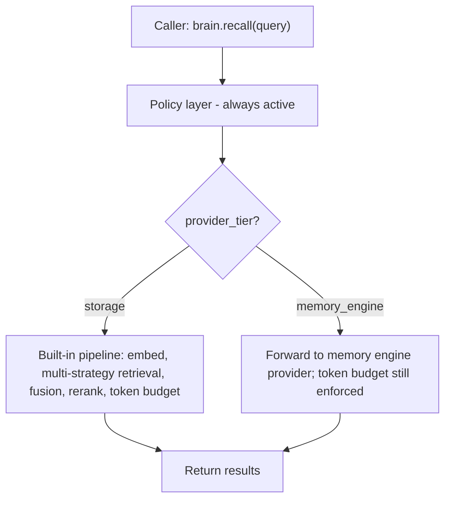
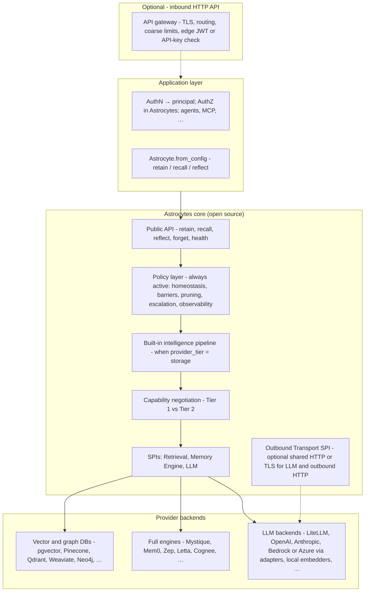
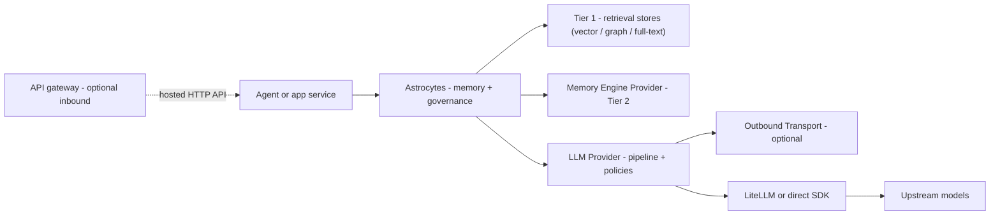
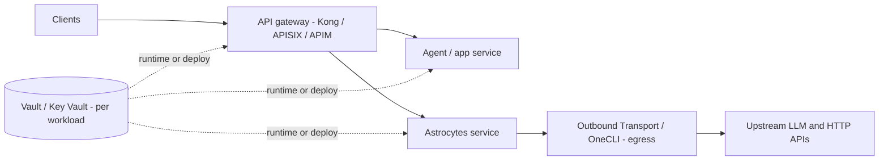

# Astrocytes framework architecture

This document defines the layer boundaries, composition model, and relationship to adjacent systems (memory engines, LLM gateways, storage backends, optional outbound HTTP/credential gateways, **authentication (AuthN)** and **authorization (AuthZ)** integration) for the Astrocytes open-source framework.

**AuthN / AuthZ in one sentence:** proving **who** the caller is (**AuthN**) is the **application’s** job (IdP, tokens, API keys); Astrocytes consumes a **principal** string. Deciding **what** that principal may do on each memory bank (**AuthZ**) is enforced **in the framework** via configurable grants and optional external policy engines - see section 4.5, `access-control.md`, and `identity-and-external-policy.md`.

For the neuroscience foundations, see `neuroscience-astrocytes.md`. For the design principles these layers implement, see `design-principles.md`.

---

## 1. What Astrocytes is

Astrocytes is an **open-source memory framework** that sits between AI agents and memory storage. It provides:

- A **stable API** for agents to store, retrieve, and synthesize memories.
- A **built-in intelligence pipeline** (embedding, entity extraction, multi-strategy retrieval, fusion, reranking) so users get a fully functional memory system with just Astrocytes + any storage backend.
- A **pluggable provider interface** at two tiers: simple **storage adapters** (vector/graph DBs) and full **memory engine providers** (Mystique, Mem0, Zep) that bring their own pipeline.
- An **optional outbound transport plugin surface** for credential gateways and enterprise proxies (HTTP/TLS/proxy configuration shared by LLM adapters and other outbound HTTP) - orthogonal to memory tiers; see section 4.4 and `outbound-transport.md`.
- **AuthN / AuthZ integration:** **Authentication (AuthN)** - external IdPs and middleware map credentials to an **opaque principal**; Astrocytes does not validate passwords or issue tokens. **Authorization (AuthZ)** - per-bank `read` / `write` / `forget` / `admin` checks run in the core (`access-control.md`); an optional **AccessPolicyProvider** can delegate allow/deny to enterprise PDPs (OPA, Cerbos, Casbin, …) - see section 4.5 and `identity-and-external-policy.md`.
- A **policy layer** that enforces neuroscience-inspired governance (homeostasis, barriers, pruning, observability) regardless of which backend is plugged in.

Astrocytes is **not** an LLM gateway. It does not route completion requests, track LLM spend, or normalize chat formats. That is the job of tools like LiteLLM.

Astrocytes is **not** an agent runtime. It does **not** define agent orchestration: graphs, steps, tool loops, checkpoints, scheduling, or multi-agent routing. Those concerns belong to **agent frameworks and your application** (LangGraph, CrewAI, Pydantic AI, custom orchestrators, …). The framework contract is **memory**, **governance**, and **provider SPIs**; thin adapters connect frameworks to that API - see `agent-framework-middleware.md`.

**Agent cards and catalogs:** Many products describe agents with **agent cards** or registry metadata. Astrocytes does not execute those cards or own the catalog, but it **does** aim to understand them **at the memory boundary**: a small, explicit **mapping** from card identity to **principal + memory bank** (and optional defaults), declared in config and used by integrations, so memory calls stay consistent without one-off logic in every app. See `agent-framework-middleware.md`.

**Sandbox awareness:** Execution sandboxes (containers, gVisor, microVMs, WASM, OS permission fences) limit **code** isolation; they do not by themselves stop **memory APIs** from becoming an **exfiltration** path if recall is mis-scoped or egress is wide open. Astrocytes is **sandbox-aware** in the sense of binding **principal + bank + environment/sandbox context** consistently and documenting **BFF** and **network** expectations—see `sandbox-awareness-and-exfiltration.md`.

**Implementation language:** Astrocytes ships as **two parallel implementations** in this repository, intended as **drop-in replacements** at the framework contract: **`astrocytes-py/`** (Python, PyPI package `astrocytes`) and **`astrocytes-rs/`** (Rust). Portable DTOs, config, and SPI versioning keep them aligned. See `implementation-language-strategy.md` for constraints and packaging.

Astrocytes is the **tripartite synapse** (Principle 2): an active mediator at the exchange between agents and memory, responsible for both the intelligence pipeline and continuous environmental stewardship.

---

## 2. Two-tier provider model

The central architectural decision: providers come in **two tiers**, and the framework adapts its behavior based on which tier is active.

### Tier 1: Retrieval providers (retrieval backends)

**Tier 1 vs blob storage:** Tier 1 is **not** generic object or blob storage (e.g. S3). The **Retrieval Provider SPI** covers **retrieval backends** - databases you **query** for evidence: **dense** (embedding) search, **sparse** (lexical / keyword) search, and **graph-structured** traversal. Astrocytes splits that into three protocols:

| SPI | Role in hybrid retrieval | Typical industry names |
|-----|--------------------------|-------------------------|
| **VectorStore** (required) | Dense retrieval - similarity over embeddings | Vector database, ANN index, “semantic search” |
| **GraphStore** (optional) | Structured retrieval - entities and links | Knowledge graph, property graph |
| **DocumentStore** (optional) | Sparse retrieval - keywords / full-text | BM25, inverted index, lexical search |

Together these are the **retrieval substrate** the built-in pipeline orchestrates (multi-strategy retrieval, fusion, reranking). Adapters implement **CRUD against those indexes**, not arbitrary file buckets.

**Examples:** pgvector, Pinecone, Qdrant, Weaviate, Neo4j, Memgraph

**When to use:** Users who want a fully functional memory system using their existing **retrieval** database infrastructure, without purchasing a commercial memory engine.

### Tier 2: Memory Engine Providers

Full-stack memory engines that handle the entire pipeline internally - from content ingestion through retrieval and synthesis. When a memory engine provider is active, Astrocytes' built-in pipeline **steps aside**. The framework only applies governance (policy layer), not intelligence.

**Examples:** Mystique (proprietary), Mem0, Zep, Letta, Cognee

**When to use:** Users who want a specialized memory engine with its own retrieval strategies, fusion algorithms, and synthesis capabilities.

### How the tiers interact



---

## 3. Layer model



The dashed link means **omit this box** when callers embed Astrocytes **in-process** (library, local agent) with no HTTP edge.

**Where an API gateway sits (inbound):** An **API gateway** (Kong, AWS API Gateway, Envoy, Azure APIM, …) is **not** part of the Astrocytes core. It appears in the diagram as **optional inbound edge** - in front of your **HTTP or gRPC service** (or BFF) that embeds Astrocytes. Typical roles: TLS termination, path routing, coarse rate limits, and sometimes **JWT or API-key validation at the edge** before requests hit your code. Your service then maps validated identity to an **opaque `principal`** on `AstrocyteContext` (section 4.5). Do **not** confuse this with the **LLM gateway** (LiteLLM et al., section 5 - **outbound** to models) or **outbound transport** plugins (section 4.4 - how **egress** HTTP is built).

---

## 4. Memory SPIs and outbound transport

Astrocytes defines **three memory-related** provider interfaces (Retrieval, Memory Engine, LLM) plus an **optional** Outbound Transport SPI that does not participate in memory tiers.

### 4.1 Retrieval Provider SPI (Tier 1)

Low-level adapters for **retrieval backends** (see §2 Tier 1 table): dense vector search, optional graph traversal, optional lexical / full-text search. Astrocytes' built-in pipeline orchestrates these.

- **VectorStore**: `store_vectors()`, `search_similar()`, `delete()`
- **GraphStore** (optional): `store_entities()`, `store_links()`, `query_neighbors()`, `query_paths()`
- **DocumentStore** (optional): `store_document()`, `get_document()`, `search_fulltext()`

Users can mix and match: one vector store + one graph store + optional document store. The pipeline coordinates across them for **hybrid retrieval**.

Detailed in `provider-spi.md`.

### 4.2 Memory Engine Provider SPI (Tier 2)

High-level interface for full memory engines. The engine handles its own storage, retrieval, and optionally synthesis.

- **Required**: `retain()`, `recall()`, `health()`, `capabilities()`
- **Optional**: `reflect()`, `forget()`, `consolidate()`

When a memory engine provider is active, the Retrieval SPI and built-in pipeline are not used.

Detailed in `provider-spi.md`.

### 4.3 LLM Provider SPI

A secondary plugin surface for LLM access. Used by the Astrocytes core for:

- **Built-in pipeline operations** (Tier 1): entity extraction, embedding generation, query analysis, reflect synthesis
- **Policy layer** (both tiers): PII classification, signal quality scoring
- **Fallback reflect** (Tier 2): when a memory engine provider lacks `reflect()` and `fallback_strategy: local_llm`

This is **not** an LLM gateway. It is a narrow internal dependency with two methods: `complete()` and `embed()`. Adapters exist for:

- **Unified gateways**: LiteLLM (100+ models including Bedrock, Azure, Vertex, Groq, Ollama, etc.)
- **Direct SDKs**: OpenAI, Anthropic, Google Gemini, Mistral, Cohere
- **Self-hosted**: Any OpenAI-compatible endpoint (vLLM, Ollama, LM Studio, TGI) via the OpenAI adapter with custom `api_base`
- **Local embeddings**: Built-in sentence-transformers support (no API cost for embeddings)

Completion and embedding providers can be configured **separately** - e.g., Claude for reasoning + local models for embeddings. See `provider-spi.md` section 4 for the full LLM SPI specification and gateway integration patterns.

### 4.4 Outbound Transport SPI (optional)

Credential gateways (OneCLI-class products), corporate HTTP proxies, and TLS inspection stacks need to control **how outbound HTTP leaves the process** - proxies, custom CAs, optional gateway headers. That is **not** the job of the LLM Provider SPI (which defines `complete()` / `embed()`), and **not** a memory tier.

Astrocytes exposes an **optional** `OutboundTransportProvider` interface applied at a **single choke point** when building HTTP clients for LLM adapters and other outbound HTTP. Users who only need standard environment variables (`HTTP_PROXY`, `HTTPS_PROXY`, trust bundles) require **no** plugin. Full specification: `outbound-transport.md` and `provider-spi.md` section 5.

### 4.5 Authentication (AuthN) and authorization (AuthZ)

**Authentication (AuthN)** - Astrocytes is **not** an identity provider. Proving identity (OIDC, SAML, API keys, workload identity, sessions) completes **outside** the framework. The application passes an **opaque `principal`** on `AstrocyteContext` after your middleware or gateway validates credentials (`access-control.md` §7). Open-source IAMs such as **[Casdoor](https://casdoor.org/)** fit here: you run Casdoor, validate tokens, map claims to `user:…` / `agent:…` strings.

**Authorization (AuthZ)** - Who may **read / write / forget / administer** which **memory bank** is decided by Astrocytes: default **declarative grants** in config, enforced before pipeline or engine calls. Teams may add an optional **`AccessPolicyProvider`** so allow/deny is delegated to remote PDPs (OPA, Cerbos, …) or **in-process [Casbin](https://casbin.org/)** via **`astrocytes-access-policy-*`** packages; the framework still owns **enforcement order** and **audit events**. Full integration patterns: `identity-and-external-policy.md`.

---

## 5. Relationship to LLM gateways (LiteLLM et al.)

Astrocytes and LLM gateways occupy **different layers** with a narrow overlap:

| Concern | LLM Gateway (LiteLLM) | Astrocytes |
|---|---|---|
| Normalize LLM provider APIs | Yes (primary job) | No |
| Route completion/embedding requests | Yes | No |
| Track LLM spend | Yes | No |
| Normalize memory provider APIs | No | Yes (primary job) |
| Built-in memory intelligence pipeline | No | Yes |
| Enforce memory governance policies | No | Yes |
| Memory-layer observability | No | Yes |
| Needs LLM access internally | N/A | Yes (for pipeline + policies) |

**How they compose:**



### 5.1 Deployment options: API gateway placement vs secrets (Vault, OneCLI)

The high-level diagram above collapses **inbound** and **outbound** concerns. In practice, teams choose **where the northbound API gateway sits** relative to Astrocytes. **Secret vaults** (HashiCorp Vault, Azure Key Vault, AWS Secrets Manager, …) and **credential gateways** (OneCLI-class products wired through the **Outbound Transport SPI**) answer **different** questions: vaults **store** credentials; OneCLI / outbound transport controls **how egress HTTPS** is built from a workload. Neither replaces the other.

**Option A - API gateway in front of Astrocytes (and usually the app)**  
Clients (or the app) reach Astrocytes **through the same class of edge** (Kong, APISIX, Azure APIM, …) as other APIs: separate routes or hosts for **app** vs **memory**. The gateway holds **its own** secrets (TLS, validation keys, policy). The **app** and **Astrocytes** each use a **vault or workload identity** for **their** credentials. **OneCLI / Outbound Transport** attaches to **egress** from Astrocytes (and optionally from the app) toward **upstream LLM and HTTP APIs** - not between the client and Astrocytes on the memory request path.



**Option B - API gateway only in front of the agent/app; Astrocytes on a private path**  
External traffic hits **only** the app through the gateway. **Agents and apps** call Astrocytes **over the private network** (cluster DNS, VNet, service mesh, mTLS) **without** that northbound gateway in the path. Astrocytes still uses a **vault** for provider secrets and **Outbound Transport / OneCLI** for **southbound** calls to models and SaaS - same as Option A on the egress side.


Full specification for outbound credential gateways: `outbound-transport.md`.

Skip **API gateway** when the agent embeds Astrocytes **in-process** (no public HTTP edge). **API gateway** (inbound, your API) is unrelated to **LiteLLM** (outbound to model APIs).

**Key distinction**: LLM gateways are **stateless pass-through with policy**. Astrocytes is **stateful intelligence with policy**. It owns the memory pipeline (or delegates it to a memory engine provider) and enforces governance. The gateway pattern does not apply - the tripartite synapse pattern does.

**Credential gateways vs. LLM gateways:** Products that inject API keys into outbound HTTP (OneCLI-class) are **outbound transport** concerns - they sit **under** whatever SDK the LLM adapter uses. They do **not** replace LiteLLM or direct provider adapters; see `outbound-transport.md`.

**LLM gateways vs. multimodal / video / voice APIs:** LiteLLM and OpenRouter target **text (and embedding) model** routing. **Conversational video** (Tavus, HeyGen, D-ID, …) and **voice** (ElevenLabs, …) products are **presentation or modality layers** - integrate them **next to** Astrocytes in your application, not as drop-in `LLMProvider` implementations unless they expose a **compatible chat/embedding HTTP API** you configure explicitly. See `presentation-layer-and-multimodal-services.md`.

---

## 6. Relationship to storage backends (Vector DBs, Graph DBs)

Storage backends are **pluggable infrastructure** underneath the Astrocytes pipeline, not a separate integration concern for callers.

### 6.1 Storage is an implementation detail

When a caller does `brain.recall("What do we know about Calvin?")`, they don't know or care whether the answer came from a pgvector similarity search, a Neo4j graph traversal, or both fused together. That's retrieval strategy - it belongs inside the pipeline (either Astrocytes' built-in or the memory engine provider's).

### 6.2 Two paths to retrieval backends

**Tier 1 (Retrieval providers):** The user configures which vector DB and optional graph DB to use. Astrocytes' built-in pipeline manages them.

```yaml
# astrocytes.yaml - Tier 1 example
# provider_tier: storage - legacy keyword for Tier 1 (Retrieval SPI + built-in pipeline), not blob storage
provider_tier: storage
vector_store: pgvector
vector_store_config:
  connection_url: postgresql://localhost/memories
graph_store: neo4j                    # optional
graph_store_config:
  uri: bolt://localhost:7687
```

**Tier 2 (Memory Engine Providers):** The memory engine manages its own storage internally. Users configure database choices through the memory engine's own config, not through Astrocytes.

```yaml
# astrocytes.yaml - Tier 2 example
provider_tier: engine
provider: mystique
provider_config:
  endpoint: https://mystique.company.com
  api_key: ${MYSTIQUE_API_KEY}
  # Mystique configures its own pgvector, entity graph, etc. internally
```

### 6.3 Callers never see storage

The public API (`retain()`, `recall()`, `reflect()`) is identical regardless of tier or storage backend. Callers code against one surface. The framework and providers handle the rest.

---

## 7. What makes the framework load-bearing

A framework that is just a protocol definition + entry points will be skipped. The Astrocytes core provides standalone value at two levels:

### 7.1 Intelligence value (built-in pipeline)

Users get a **fully functional memory system** with just `astrocytes + astrocytes-pgvector`:

| Capability | Built-in pipeline (free) |
|---|---|
| Embedding generation | sentence-transformers (local) or API-based |
| Entity extraction | spaCy NER or LLM-based |
| Semantic retrieval | Vector similarity via any Tier 1 store |
| Graph retrieval | Entity-link traversal (if graph store configured) |
| Keyword retrieval | BM25 full-text search (if document store configured) |
| Fusion | Reciprocal rank fusion |
| Reranking | Basic flashrank or cross-encoder |
| Reflect | recall + LLM synthesis |

This is good enough to build real products.

### 7.2 Governance value (policy layer)

Applies to **both** tiers:

| Policy | Value to every user regardless of backend |
|---|---|
| PII barrier | Catches sensitive data before it reaches any provider |
| Token budgets | Prevents runaway costs regardless of backend pricing |
| Unified OTel traces | Switch providers without rebuilding dashboards |
| Signal quality scoring | Prevent noisy, low-value data from polluting memory |
| Use-case profiles | Production-ready configs out of the box |
| Circuit breakers | Graceful degradation when backends are unavailable |
| Rate limiting | Prevent runaway agent loops from exhausting resources |

Together, intelligence + governance make the framework worth using at any scale.

### 7.3 Platform capabilities

Beyond intelligence and governance, the framework provides capabilities that no individual memory provider offers:

| Capability | Value | Documentation |
|---|---|---|
| Multi-bank orchestration | Query across personal + team + org banks with cascade/parallel strategies | `multi-bank-orchestration.md` |
| Memory portability | Export/import memories between providers; break vendor lock-in | `memory-portability.md` |
| MCP server | Any MCP-capable agent gets memory without code integration | `mcp-server.md` |
| Agent framework middleware | One integration per framework, works with every provider (N+M, not NxM) | `agent-framework-middleware.md` |
| Memory lifecycle | TTL policies, compliance purge (GDPR/PDPA), legal hold, archival, audit trail | `memory-lifecycle.md` |
| AuthZ (access control) | Per-bank read/write/forget/admin for principals; enforced in core | `access-control.md` |
| Event hooks | Webhooks and alerts for retain, PII detection, circuit breaker, lifecycle events | `event-hooks.md` |
| Memory analytics | Bank health scores, noisy agent detection, utilization reports, quality trends | `memory-analytics.md` |
| Evaluation | Benchmark suites, provider comparison, regression detection | `evaluation.md` |
| Data governance | Classification, PII taxonomy, residency, encryption, DLP, compliance profiles (GDPR/HIPAA/PDPA) | `data-governance.md` |
| Outbound transport | Optional plugins for credential gateways and enterprise HTTP/TLS; env-only path without plugins | `outbound-transport.md` |
| AuthN wiring + external AuthZ | Map IdP claims to principals; optional PDP/Casbin adapters beyond config grants | `identity-and-external-policy.md` |
| Presentation / multimodal (non-LLM API) | How Tavus-class video, voice (e.g. ElevenLabs), and related APIs compose **beside** the LLM SPI | `presentation-layer-and-multimodal-services.md` |
| Multimodal LLM (vision/audio in chat) | `ContentPart`, `Message` extensions, `LLMCapabilities`, adapter mapping for LiteLLM/OpenRouter-class gateways | `multimodal-llm-spi.md` |

These capabilities exist at the **framework layer** - they apply regardless of which memory provider is active. They are a major reason to use Astrocytes rather than calling a provider directly.

---

## 8. What lives in each package

| Component | Package | License |
|---|---|---|
| Public API, DTOs, policy layer | `astrocytes` | Apache 2.0 |
| Built-in intelligence pipeline | `astrocytes` | Apache 2.0 |
| Design docs and principles | `astrocytes` (this repo) | Apache 2.0 |
| Retrieval SPI + Memory Engine SPI + LLM SPI + Outbound Transport SPI + optional AccessPolicy SPI | `astrocytes` | Apache 2.0 |
| Use-case profiles | `astrocytes` | Apache 2.0 |
| OTel instrumentation | `astrocytes` | Apache 2.0 |
| **Retrieval providers (Tier 1)** | | |
| pgvector adapter | `astrocytes-pgvector` | Apache 2.0 |
| Pinecone adapter | `astrocytes-pinecone` | Apache 2.0 |
| Qdrant adapter | `astrocytes-qdrant` | Apache 2.0 |
| Weaviate adapter | `astrocytes-weaviate` | Apache 2.0 |
| Neo4j graph adapter | `astrocytes-neo4j` | Apache 2.0 |
| Memgraph graph adapter | `astrocytes-memgraph` | Apache 2.0 |
| **Memory engine providers (Tier 2)** | | |
| Mystique memory engine provider | `astrocytes-mystique` | Proprietary |
| Mem0 memory engine provider | `astrocytes-mem0` | Apache 2.0 |
| Zep memory engine provider | `astrocytes-zep` | Apache 2.0 |
| Letta memory engine provider | `astrocytes-letta` | Apache 2.0 |
| Cognee memory engine provider | `astrocytes-cognee` | Apache 2.0 |
| **LLM providers** | | |
| LiteLLM adapter | `astrocytes-litellm` | Apache 2.0 |
| OpenAI direct adapter | `astrocytes-openai` | Apache 2.0 |
| Anthropic direct adapter | `astrocytes-anthropic` | Apache 2.0 |
| **Outbound transport** | | |
| Example: gateway-specific transport adapter | `astrocytes-transport-{name}` | Apache 2.0 |
| **Access policy (external PDP)** | | |
| Example: OPA / Cerbos adapters | `astrocytes-access-policy-{name}` | Apache 2.0 |
| **Identity helpers (optional)** | | |
| Example: web framework → principal wiring | `astrocytes-identity-{framework}` | Apache 2.0 |

Community memory and LLM providers follow the naming convention `astrocytes-{provider}`. Outbound transport plugins use **`astrocytes-transport-{name}`** and the `astrocytes.outbound_transports` entry point group (see `ecosystem-and-packaging.md` and `outbound-transport.md`). External access policy plugins use **`astrocytes-access-policy-{name}`** and `astrocytes.access_policies` (see `identity-and-external-policy.md`).

---

## 9. The open-core competitive model

The two-tier architecture creates a natural upgrade path:

| Stage | Stack | Cost |
|---|---|---|
| Getting started | `astrocytes` + `astrocytes-pgvector` | Free |
| Add graph | `astrocytes` + `astrocytes-pgvector` + `astrocytes-neo4j` | Free |
| Want better retrieval | `astrocytes` + `astrocytes-mystique` | Paid |

**What makes Mystique worth paying for** (beyond the free built-in pipeline):

| Capability | Astrocytes built-in (free) | Mystique (premium) |
|---|---|---|
| Semantic retrieval | Basic vector similarity | HNSW-tuned with partial indexes per fact type |
| Graph retrieval | Basic entity-link traversal | Spreading activation with decay |
| Fusion | Standard RRF | Tuned RRF + cross-encoder reranking |
| Reflect | recall + generic LLM synthesis | Agentic multi-turn with tool use |
| Dispositions | Not supported | Native personality modulation (skepticism, literalism, empathy) |
| Consolidation | Basic dedup + archive | Quality-based loss functions, observation formation |
| Temporal retrieval | Date range filtering | Temporal proximity weighting, temporal link expansion |
| Entity resolution | Basic NER + exact dedup | Canonical resolution with co-occurrence tracking |
| Scale | Single-node | Multi-tenant, distributed, production-grade |

The free tier is **good enough** to build real products. The premium tier is **materially better** in ways that matter at scale.

---

## 10. Design principle traceability

Each framework layer maps to specific neuroscience principles from `design-principles.md`:

| Framework Layer | Principles Applied |
|---|---|
| Public API (stable, mediating) | P2: Tripartite synapse |
| Built-in pipeline (intelligence layer) | P1: Fast signaling (the pipeline) vs. slow regulation (the policies) |
| Policy: homeostasis | P3: Keep the milieu within bounds |
| Policy: barriers | P6: BBB / boundary maintenance |
| Policy: pruning / signal quality | P7: Structured forgetting |
| Policy: escalation / circuit breakers | P8: Inflammation with de-escalation |
| Policy: observability | P9: Observable state |
| Capability negotiation (tier selection) | P5: Metabolic coupling (adapt to supply) |
| Use-case profiles | P4: Heterogeneity (specialized subtypes) |
| Retrieval SPI (pluggable backends) | P6: Barrier maintenance (what crosses boundaries) |
| Outbound Transport SPI (optional proxy / CA path) | P6: Selective control of what crosses the network boundary |
| Multi-bank orchestration | P4: Heterogeneity (specialized subtypes per region) |
| Memory lifecycle (TTL, archival, pruning) | P7: Structured forgetting / phagocytosis |
| AuthZ (access control) | P6: Barrier maintenance (identity boundaries) |
| Optional external PDP (`AccessPolicyProvider`) | P6: Same barrier - delegated decision, framework-enforced audit |
| Memory analytics | P9: Observable state (system-level health) |
| Event hooks / escalation alerts | P8: Inflammation with controlled channels |
| Data governance (classification, DLP, residency) | P6: BBB - selective, actively maintained boundary |

The neuroscience principles are not metaphors in this framework. They are **enforcement points** with code behind them.
