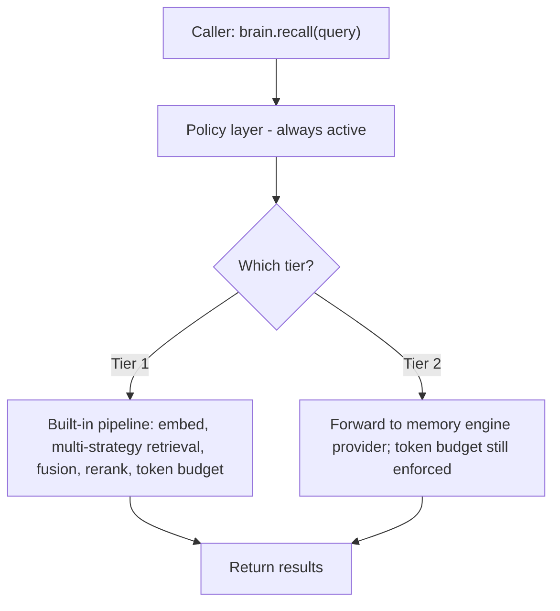
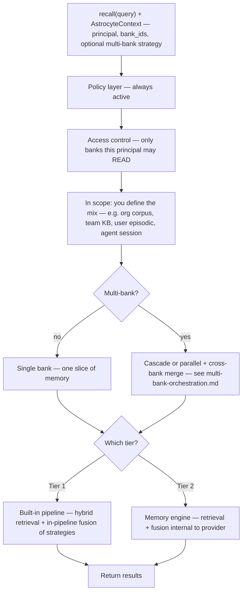
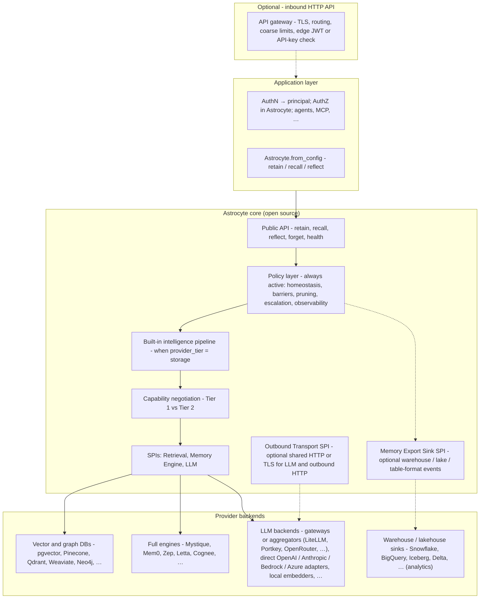
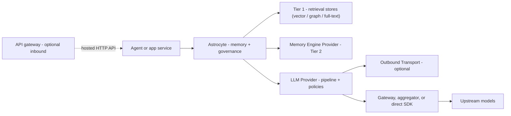
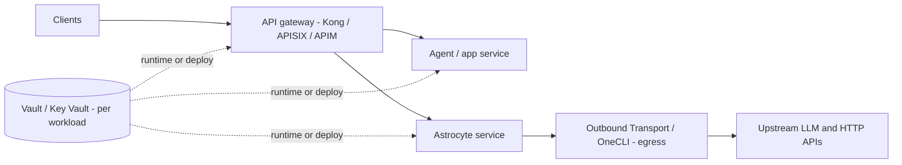
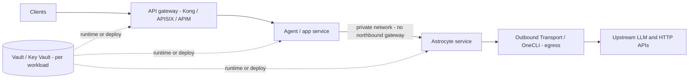

# Astrocyte framework architecture

This document defines the layer boundaries, composition model, and relationship to adjacent systems (memory engines, LLM gateways, storage backends, optional outbound HTTP/credential gateways, **authentication (AuthN)** and **authorization (AuthZ)** integration) for the Astrocyte open-source framework.

**AuthN / AuthZ in one sentence:** proving **who** the caller is (**AuthN**) is the **application’s** job (IdP, tokens, API keys); the app maps credentials to an `AstrocyteContext` (at minimum a **principal** string; optionally structured **`actor`**, **`on_behalf_of`** (**OBO** — *on-behalf-of / delegated access*; standard in OAuth·identity; see [ADR-002](./adr/adr-002-identity-model.md)), **`tenant`**). Deciding **what** that identity may do on each memory bank (**AuthZ**) is enforced **in the framework** via configurable `access_grants` (including **OBO** permission intersection) and, in future, optional external policy engines — see section 4.6.

For the neuroscience foundations, see `neuroscience-astrocyte.md`. For the design principles these layers implement, see `design-principles.md`. For **C4 context/container diagrams**, deployment-model trade-offs, bounded-context map, and sequence diagrams aligned to product milestones, see `architecture-brief.md` and `product-roadmap-v1.md`.

---

## 1. What Astrocyte is

Astrocyte is an **open-source memory framework** that sits between AI agents and memory storage. It provides:

- A **stable API** for agents to store, retrieve, and synthesize memories.
- A **built-in intelligence pipeline** (embedding, entity extraction, multi-strategy retrieval, fusion, reranking) so users get a fully functional memory system with just Astrocyte + any storage backend.
- A **pluggable provider interface** at two tiers: **Tier 1 retrieval adapters** (vector / graph / lexical stores, including **warehouse or lakehouse serving** surfaces when you implement the Retrieval SPI against their query APIs) and **Tier 2 memory engine providers** (Mystique, Mem0, Zep) that bring their own pipeline.
- An **optional outbound transport plugin surface** for credential gateways and enterprise proxies (HTTP/TLS/proxy configuration shared by LLM adapters and other outbound HTTP) - orthogonal to memory tiers; see section 4.5 and `outbound-transport.md`.
- An **optional memory export sink** surface for warehouses, lakehouses, and open table formats (event-oriented durability for BI and compliance—not online `recall`); see section 4.4, `storage-and-data-planes.md`, and `memory-export-sink.md`.
- **AuthN / AuthZ integration:** **Authentication (AuthN)** - external IdPs and middleware map credentials to **`AstrocyteContext`** (opaque **principal** and/or structured fields — [ADR-002](./adr/adr-002-identity-model.md)); Astrocyte does not validate passwords or issue tokens. **Authorization (AuthZ)** - per-bank `read` / `write` / `forget` / `admin` checks run in the core against `access_grants`; an optional **AccessPolicyProvider** can delegate allow/deny to enterprise PDPs (OPA, Cerbos, Casbin, …) — see section 4.6.
- A **policy layer** that enforces neuroscience-inspired governance (homeostasis, barriers, pruning, observability) regardless of which backend is plugged in.

Astrocyte is **not** an LLM gateway. It does not route completion requests, track LLM spend, or normalize chat formats. That is the job of **LLM gateways and model aggregators** — for example LiteLLM, Portkey, OpenRouter, Vercel AI Gateway, or your cloud provider’s unified model APIs — and of **direct** first-party SDKs when you call each vendor without an intermediary.

Astrocyte is **not** an agent runtime. It does **not** define agent orchestration: graphs, steps, tool loops, checkpoints, scheduling, or multi-agent routing. Those concerns belong to **agent frameworks and your application** (LangGraph, CrewAI, Pydantic AI, custom orchestrators, …). The framework contract is **memory**, **governance**, and **provider SPIs**; thin adapters connect frameworks to that API - see `agent-framework-middleware.md`.

### Context engineering vs harness engineering

Two labels often separate **what the model sees** from **how the system runs around it**:

- **Context engineering** — Shaping the **information** that reaches the model when it acts: prompts, message structure, truncation, which retrieval hits to include, how memory snippets are worded in the window, tool observations as text, and token discipline for what is pasted into the next completion. Success is about relevance, faithfulness, and fit inside the context window.

- **Harness engineering** — Building the **runtime shell** around the model: orchestration graphs, steps, tool or MCP wiring, checkpoints, retries, scheduling, multi-agent handoff, sandbox boundaries, edge AuthN, and telemetry. Success is about reliable control flow and safe repeatability.

The harness **calls** memory and tools and **assembles** the next prompt; context engineering **chooses** how results are distilled into that prompt. In practice teams blend both—the split is vocabulary, not a hard wall—but it clarifies what Astrocyte does **not** own (the harness) vs what it **enables** (governed evidence for the prompt).

**Where Astrocyte sits:** It is **not** a harness (see *not an agent runtime* above). It **is** the **memory and retrieval substrate** and **policy layer** that **feeds** context engineering: durable `retain` / `recall` / `reflect`, hybrid retrieval, fusion, reranking, token budgets inside the pipeline, and governance (PII, quotas, access control). Your **application** still owns the final chat layout—how recall hits become system vs user messages—Astrocyte supplies **consistent, auditable memory**, not the entire transcript design.

That boundary is the same “slot” many curricula label the **Context & Memory** plane: governed memory and cognition support—not “vectors only” or ad-hoc RAG. For a vendor-neutral **eight-plane** framing (and how it relates to **control outside the agent loop**), see the [Applied AI Fellowship](https://calvinchengx.github.io/applied-ai/). A **vocabulary crosswalk** between that coursework and Astrocyte primitives is in [Fellowship curriculum mapping](./curriculum-mapping.md).

**Agent cards and catalogs:** Many products describe agents with **agent cards** or registry metadata. Astrocyte does not execute those cards or own the catalog, but it **does** aim to understand them **at the memory boundary**: a small, explicit **mapping** from card identity to **principal + memory bank** (and optional defaults), declared in config and used by integrations, so memory calls stay consistent without one-off logic in every app. See `agent-framework-middleware.md`.

**Sandbox awareness:** Execution sandboxes (containers, gVisor, microVMs, WASM, OS permission fences) limit **code** isolation; they do not by themselves stop **memory APIs** from becoming an **exfiltration** path if recall is mis-scoped or egress is wide open. Astrocyte is **sandbox-aware** in the sense of binding **principal + bank + environment/sandbox context** consistently and documenting **Backend for Frontend (BFF)** and **network** expectations—see `sandbox-awareness-and-exfiltration.md`.

**Implementation language:** Astrocyte ships as **two parallel implementations** in this repository, intended as **drop-in replacements** at the framework contract: **`astrocyte-py/`** (Python, PyPI package `astrocyte`) and **`astrocyte-rs/`** (Rust). Portable DTOs, config, and SPI versioning keep them aligned. See `implementation-language-strategy.md` for constraints and packaging.

Astrocyte is the **tripartite synapse** (Principle 2): an active mediator at the exchange between agents and memory, responsible for both the intelligence pipeline and continuous environmental stewardship.

---

## 2. Two-tier provider model

The central architectural decision: providers come in **two tiers**, and the framework adapts its behavior based on which tier is active.

### Tier 1: Retrieval providers (retrieval backends)

**Tier 1 vs blob storage:** Tier 1 is **not** generic object or blob storage (e.g. S3). The **Retrieval Provider SPI** covers **retrieval backends** - databases you **query** for evidence: **dense** (embedding) search, **sparse** (lexical / keyword) search, and **graph-structured** traversal. Astrocyte splits that into three protocols:

| SPI | Role in hybrid retrieval | Dedicated backends (typical) | Warehouse / lakehouse **serving layers** (adapter targets) |
|-----|--------------------------|------------------------------|---------------------------------------------------------------|
| **VectorStore** (required) | Dense retrieval — similarity over embeddings | Vector database, ANN index, semantic search | **Warehouse** vector columns + distance SQL; **lake query engine** (e.g. [Trino](https://github.com/trinodb/trino)-class SQL over Iceberg/Delta with vector-friendly schemas); **OLAP** serving tier fed from the lake; **embedded SQL** (e.g. DuckDB) over Parquet; **Backend for Frontend (BFF)** wrapping any of these APIs |
| **GraphStore** (optional) | Structured retrieval — entities and links | Knowledge graph, property graph | Few **native** graph traversal APIs in warehouses; common patterns: **Backend for Frontend (BFF)** to a graph database, or **SQL-shaped** entity/edge tables behind a lake/warehouse engine with an adapter that maps graph operations to joins / hops |
| **DocumentStore** (optional) | Sparse retrieval — keywords / full-text | BM25, inverted index, lexical search | **Warehouse** search / JSON / full-text features where available; **sidecar** lexical search (often beside lake exports); **Backend for Frontend (BFF)** to OpenSearch- or Elasticsearch-class indexes |

**Serving layer** is a **deployment pattern**, not a fourth SPI: whatever **query or search API** sits in front of curated tables (native warehouse endpoint, distributed SQL on the lake, OLAP acceleration, embedded analytics SQL, or your own HTTP façade). The three rows above stay the **contract**; the fourth column is **where** vendors often host those operations for warehouse / lakehouse estates.

Together these are the **retrieval substrate** the built-in pipeline orchestrates (multi-strategy retrieval, fusion, reranking). Adapters implement **protocol methods** against those surfaces, not raw object buckets.

**Examples (dedicated retrieval infrastructure):** pgvector, Pinecone, Qdrant, Weaviate, Neo4j, Memgraph. **Plus** custom Tier 1 packages that target **warehouse / lakehouse serving** (vector SQL, Trino-class lake SQL, OLAP, DuckDB-on-Parquet, …) when your adapter implements the protocols above with acceptable recall latency—see the fourth column of the table and **`Lakehouse and warehouse-backed recall`** below.

**When to use:** Users who want a fully functional memory system using their existing **retrieval** database infrastructure, without purchasing a commercial memory engine.

#### Lakehouse and warehouse-backed recall (serving layers)

Tier 1 adapters target **`VectorStore` / `GraphStore` / `DocumentStore`**, not a vendor brand. **Lakehouse- or warehouse-backed `recall`** is in scope when a **serving layer** exposes a query or search surface the adapter can implement: native warehouse vector SQL, a **query engine** on open tables (Trino-class), **OLAP** in front of the lake, or an HTTP **Backend for Frontend (BFF)** that runs the right calls—see `storage-and-data-planes.md` §1.

That online path is **not** the **Memory export sink** SPI: sinks **`emit` / `flush`** governed events for analytics; they do not substitute for `search_similar` unless you **also** operate this Tier 1-style retrieval integration with suitable latency SLOs. Teams often combine both—e.g. Tier 1 recall on pgvector **and** a sink to Iceberg/BigQuery—or Tier 1 backed by warehouse SQL **and** the same sink for long-term tables.

### Tier 2: Memory Engine Providers

Full-stack memory engines that handle the entire pipeline internally - from content ingestion through retrieval and synthesis. When a memory engine provider is active, Astrocyte' built-in pipeline **steps aside**. The framework only applies governance (policy layer), not intelligence.

**Examples:** Mystique (proprietary), Mem0, Zep, Letta, Cognee

**When to use:** Users who want a specialized memory engine with its own retrieval strategies, fusion algorithms, and synthesis capabilities.

### Operational retrieval vs analytical persistence

This frame contrasts **both** agent-time tiers (Tier 1 and Tier 2) with the **export** plane—it is not a Tier-1-only topic.

**Tier 1 / Tier 2** answer **agent-time memory**: indexed `recall` and hybrid retrieval backed by vector, graph, and lexical stores—or a full engine that owns those concerns.

**Analytical persistence** answers **durable history and warehouse-scale analysis**: writing **governed events or snapshots** to **SQL warehouses**, **lakehouse tables** (Iceberg, Delta, Hudi, Paimon, …; Parquet files), and similar systems for BI, compliance, and ML datasets. That path is **orthogonal** to the two-tier model: it does not replace `VectorStore`, and it is **not** generic blob storage for unstructured dumps. It uses a separate **Memory Export Sink** SPI (see §4.4 and `memory-export-sink.md`)—event-oriented (`emit` / `flush`), not `search_similar`.

When the **built-in pipeline** is active (`provider_tier: storage`), warehouse- or lake-backed **online** `recall` is implemented via **Tier 1** Retrieval adapters—see **Lakehouse and warehouse-backed recall (serving layers)** above and `storage-and-data-planes.md` §1. A **Tier 2** memory engine may still use a warehouse or lake **internally**; that storage choice is **opaque** to the Retrieval SPI (the engine replaces Tier 1 from Astrocyte’ perspective).

### How the tiers interact



**Config mapping:** **Tier 1** is `provider_tier: storage` (Retrieval SPI + built-in pipeline). **Tier 2** is `provider_tier: engine` (memory engine provider).

### Organization data vs user / agent context (banks—not tiers)

**Tier 1 vs Tier 2** answers *who runs the recall pipeline*. **Organization-facing corpora** (policies, KBs, team playbooks) vs **user- or agent-scoped context** (episodic traces, preferences, session) is modeled with **`bank_id`s**, **grants**, and optional **multi-bank** orchestration—not by picking Tier 1 for one and Tier 2 for the other.

Typical pattern:

- Declare separate banks (e.g. `org-policies`, `team-docs`, `user-calvin-episodic`, `agent-session`) and grant each **principal** the right **read / write / forget** on the banks they should see (config `access_grants` / per-bank `access`; [ADR-002](./adr/adr-002-identity-model.md) for structured identity and OBO).
- Use **single-bank** recall when only one slice is needed, or **multi-bank** `cascade` / `parallel` so one `recall` fans out across allowed banks and merges hits (`multi-bank-orchestration.md`).
- **Tier 1** still means the built-in pipeline issues retrieval against the stores backing those banks; **Tier 2** means the engine does the same *logical* job using its internal storage—either way, **which** org vs personal vs agent data appears is **which banks are in scope**, filtered by **AuthZ**.



**Cross-bank “fusion”** (parallel multi-bank) merges **evidence from different banks** the principal may read. **In-pipeline “fusion”** on Tier 1 merges **vector / graph / lexical** hits **within** one recall path—the diagram’s diamond and two tier branches are unchanged; this block adds **bank scoping** *above* that split.

---

## 3. Layer model



The dashed link means **omit this box** when callers embed Astrocyte **in-process** (library, local agent) with no HTTP edge.

**Where an API gateway sits (inbound):** An **API gateway** (Kong, AWS API Gateway, Envoy, Azure APIM, …) is **not** part of the Astrocyte core. It appears in the diagram as **optional inbound edge** - in front of your **HTTP or gRPC service** (or **Backend for Frontend (BFF)**) that embeds Astrocyte. Typical roles: TLS termination, path routing, coarse rate limits, and sometimes **JWT or API-key validation at the edge** before requests hit your code. Your service then maps validated identity to an **opaque `principal`** on `AstrocyteContext` (section 4.6). Do **not** confuse this with **LLM gateways** (section 5 - **outbound** to models; see examples there) or **outbound transport** plugins (section 4.5 - how **egress** HTTP is built).

---

## 4. Memory SPIs, optional sinks, and outbound transport

Astrocyte defines **three memory-related** provider interfaces (Retrieval, Memory Engine, LLM), an **optional Memory Export Sink** SPI for warehouse / lakehouse / open table formats (durable export—not online retrieval), plus an **optional** Outbound Transport SPI that does not participate in memory tiers.

### 4.1 Retrieval Provider SPI (Tier 1)

Low-level adapters for **retrieval backends** (see §2 Tier 1 table): dense vector search, optional graph traversal, optional lexical / full-text search. Astrocyte' built-in pipeline orchestrates these.

- **VectorStore**: `store_vectors()`, `search_similar()`, `delete()`
- **GraphStore** (optional): `store_entities()`, `store_links()`, `query_neighbors()`, `query_paths()`
- **DocumentStore** (optional): `store_document()`, `get_document()`, `search_fulltext()`

Users can mix and match: one vector store + one graph store + optional document store. The pipeline coordinates across them for **hybrid retrieval**.

Detailed in `provider-spi.md`.

### 4.2 Memory Engine Provider SPI (Tier 2)

High-level interface for full memory engines. The engine handles its own storage, retrieval, and optionally synthesis.

- **Required**: `retain()`, `recall()`, `health()`, `capabilities()`
- **Optional**: `reflect()`, `forget()`, `consolidate()`

When a memory engine provider is active, the Retrieval SPI and built-in pipeline are not used.

Detailed in `provider-spi.md`.

### 4.3 LLM Provider SPI

A secondary plugin surface for LLM access. Used by the Astrocyte core for:

- **Built-in pipeline operations** (Tier 1): entity extraction, embedding generation, query analysis, reflect synthesis
- **Policy layer** (both tiers): PII classification, signal quality scoring
- **Fallback reflect** (Tier 2): when a memory engine provider lacks `reflect()` and `fallback_strategy: local_llm`

This is **not** an LLM gateway. It is a narrow internal dependency with two methods: `complete()` and `embed()`. Adapters exist for:

- **Unified gateways and aggregators**: products that front many models behind one API or control plane — e.g. **LiteLLM**, **Portkey**, **OpenRouter**, **Vercel AI Gateway**, cloud **AI Gateway** / router services, or comparable layers — not only LiteLLM.
- **Direct SDKs**: OpenAI, Anthropic, Google Gemini, Mistral, Cohere
- **Self-hosted**: Any OpenAI-compatible endpoint (vLLM, Ollama, LM Studio, TGI) via the OpenAI adapter with custom `api_base`
- **Local embeddings**: Built-in sentence-transformers support (no API cost for embeddings)

Completion and embedding providers can be configured **separately** - e.g., Claude for reasoning + local models for embeddings. See `provider-spi.md` section 4 for the full LLM SPI specification and gateway integration patterns.

### 4.4 Memory Export Sink SPI (optional)

**Scope:** Event-oriented adapters that persist **governed memory lifecycle data** to **data warehouses**, **lakehouses**, and **open table formats** (SQL engines, Parquet, Iceberg, Delta, Hudi, Paimon, …) for analytics, compliance, and ML—not to serve low-latency `recall`.

- **MemoryExportSink**: `emit()`, optional `flush()`, `health()`, optional `capabilities()`
- **Orthogonal** to Tier 1 and Tier 2: sinks do not participate in `provider_tier` negotiation and are **not** `VectorStore` implementations over raw object storage

Wired from the policy / observability path (and aligned with `event-hooks.md`) after successful operations. Full specification: `storage-and-data-planes.md` (hub), `memory-export-sink.md`, and `provider-spi.md` section 5.

### 4.5 Outbound Transport SPI (optional)

Credential gateways (OneCLI-class products), corporate HTTP proxies, and TLS inspection stacks need to control **how outbound HTTP leaves the process** - proxies, custom CAs, optional gateway headers. That is **not** the job of the LLM Provider SPI (which defines `complete()` / `embed()`), and **not** a memory tier.

Astrocyte exposes an **optional** `OutboundTransportProvider` interface applied at a **single choke point** when building HTTP clients for LLM adapters and other outbound HTTP. Users who only need standard environment variables (`HTTP_PROXY`, `HTTPS_PROXY`, trust bundles) require **no** plugin. Full specification: `outbound-transport.md` and `provider-spi.md` section 6.

### 4.6 Authentication (AuthN) and authorization (AuthZ)

**Authentication (AuthN)** - Astrocyte is **not** an identity provider. Proving identity (OIDC, SAML, API keys, workload identity, sessions) completes **outside** the framework. The application passes **`AstrocyteContext`** after your middleware or gateway validates credentials: at minimum `principal="user:…"` / `agent:…`, and optionally structured **`actor`**, **`on_behalf_of`**, **`tenant_id`** ([ADR-002](./adr/adr-002-identity-model.md)). Open-source IAMs such as **[Casdoor](https://casdoor.org/)** fit here: you run Casdoor, validate tokens, map claims to principals or structured actors.

**Authorization (AuthZ)** - Who may **read / write / forget / administer** which **memory bank** is decided by Astrocyte: default **declarative grants** in config, enforced before pipeline or engine calls (including **intersection** when **on-behalf-of** is set). Teams may add an optional **`AccessPolicyProvider`** so allow/deny is delegated to remote PDPs (OPA, Cerbos, …) or **in-process [Casbin](https://casbin.org/)** via **`astrocyte-access-policy-*`** packages; the framework still owns **enforcement order** and **audit events**.

---

## 5. Relationship to LLM gateways

Astrocyte and **LLM gateways** (LiteLLM, Portkey, OpenRouter, Vercel AI Gateway, cloud model routers, …) occupy **different layers** with a narrow overlap:

| Concern | LLM gateway / aggregator | Astrocyte |
|---|---|---|
| Normalize LLM provider APIs | Yes (primary job) | No |
| Route completion/embedding requests | Yes | No |
| Track LLM spend (global) | Yes | No ¹ |
| Normalize memory provider APIs | No | Yes (primary job) |
| Built-in memory intelligence pipeline | No | Yes |
| Enforce memory governance policies | No | Yes |
| Memory-layer observability | No | Yes |
| Needs LLM access internally | N/A | Yes (for pipeline + policies) |

> ¹ Astrocyte does **not** track global LLM spend — that is the gateway's job. However, the **evaluation framework** accumulates `Completion.usage` tokens **per eval run** so that `compare_providers()` and regression detection can report cost-efficiency alongside accuracy and latency. These are separate concerns: per-run eval token counts live in `EvalMetrics.total_tokens_used`; global spend, budgets, and per-model cost breakdowns belong to your LLM gateway. See `evaluation.md` §2.2.

**How they compose:**



### 5.1 Deployment options: API gateway placement vs secrets (Vault, OneCLI)

The high-level diagram above collapses **inbound** and **outbound** concerns. In practice, teams choose **where the northbound API gateway sits** relative to Astrocyte. **Secret vaults** (HashiCorp Vault, Azure Key Vault, AWS Secrets Manager, …) and **credential gateways** (OneCLI-class products wired through the **Outbound Transport SPI**) answer **different** questions: vaults **store** credentials; OneCLI / outbound transport controls **how egress HTTPS** is built from a workload. Neither replaces the other.

**Option A - API gateway in front of Astrocyte (and usually the app)**  
Clients (or the app) reach Astrocyte **through the same class of edge** (Kong, APISIX, Azure APIM, …) as other APIs: separate routes or hosts for **app** vs **memory**. The gateway holds **its own** secrets (TLS, validation keys, policy). The **app** and **Astrocyte** each use a **vault or workload identity** for **their** credentials. **OneCLI / Outbound Transport** attaches to **egress** from Astrocyte (and optionally from the app) toward **upstream LLM and HTTP APIs** - not between the client and Astrocyte on the memory request path.



**Option B - API gateway only in front of the agent/app; Astrocyte on a private path**  
External traffic hits **only** the app through the gateway. **Agents and apps** call Astrocyte **over the private network** (cluster DNS, VNet, service mesh, mTLS) **without** that northbound gateway in the path. Astrocyte still uses a **vault** for provider secrets and **Outbound Transport / OneCLI** for **southbound** calls to models and SaaS - same as Option A on the egress side.



Full specification for outbound credential gateways: `outbound-transport.md`.

Skip **API gateway** when the agent embeds Astrocyte **in-process** (no public HTTP edge). **API gateway** (inbound, your API) is unrelated to **LLM gateways** (outbound to model APIs).

**Key distinction**: LLM gateways are **stateless pass-through with policy**. Astrocyte is **stateful intelligence with policy**. It owns the memory pipeline (or delegates it to a memory engine provider) and enforces governance. The gateway pattern does not apply - the tripartite synapse pattern does.

**Credential gateways vs. LLM gateways:** Products that inject API keys into outbound HTTP (OneCLI-class) are **outbound transport** concerns - they sit **under** whatever SDK the LLM adapter uses. They do **not** replace LLM gateways or direct provider adapters; see `outbound-transport.md`.

**LLM gateways vs. multimodal / video / voice APIs:** Gateways such as **LiteLLM**, **OpenRouter**, **Portkey**, and **Vercel AI Gateway** target **text (and embedding) model** routing. **Conversational video** (Tavus, HeyGen, D-ID, …) and **voice** (ElevenLabs, …) products are **presentation or modality layers** - integrate them **next to** Astrocyte in your application, not as drop-in `LLMProvider` implementations unless they expose a **compatible chat/embedding HTTP API** you configure explicitly. See `presentation-layer-and-multimodal-services.md`.

---

## 6. Relationship to storage backends (Vector DBs, Graph DBs, warehouse / lake serving)

Storage backends are **pluggable infrastructure** underneath the Astrocyte pipeline (when Tier 1 + built-in pipeline are active), not a separate integration concern for callers. That includes **dedicated** vector and graph databases **and** **serving-layer** SQL or search APIs over warehouse or lakehouse tables—still behind the same Retrieval SPI (`provider-spi.md` §1, §2 Tier 1 table).

### 6.1 Storage is an implementation detail

When a caller does `brain.recall("What do we know about Calvin?")`, they don't know or care whether the answer came from a pgvector similarity search, a Neo4j graph traversal, a warehouse vector query, or several strategies fused together. That's retrieval strategy—it belongs inside the pipeline (either Astrocyte' built-in or the memory engine provider's).

### 6.2 Two paths to retrieval backends

**Tier 1 (Retrieval providers):** The user configures which vector store and optional graph / document stores to use (dedicated DBs **or** warehouse/lake serving surfaces via adapters). Astrocyte' built-in pipeline manages them.

```yaml
# astrocyte.yaml - Tier 1 example
# provider_tier: storage - legacy keyword for Tier 1 (Retrieval SPI + built-in pipeline), not blob storage
provider_tier: storage
vector_store: pgvector
vector_store_config:
  connection_url: postgresql://localhost/memories
graph_store: neo4j                    # optional
graph_store_config:
  uri: bolt://localhost:7687
```

**Tier 2 (Memory Engine Providers):** The memory engine manages its own storage internally. Users configure database choices through the memory engine's own config, not through Astrocyte.

```yaml
# astrocyte.yaml - Tier 2 example
provider_tier: engine
provider: mystique
provider_config:
  endpoint: https://mystique.company.com
  api_key: ${MYSTIQUE_API_KEY}
  # Mystique configures its own pgvector, entity graph, etc. internally
```

### 6.3 Callers never see storage

The public API (`retain()`, `recall()`, `reflect()`) is identical regardless of tier or storage backend. Callers code against one surface. The framework and providers handle the rest.

---

## 7. What makes the framework load-bearing

A framework that is just a protocol definition + entry points will be skipped. The Astrocyte core provides standalone value at two levels:

### 7.1 Intelligence value (built-in pipeline)

Users get a **fully functional memory system** with just `astrocyte + astrocyte-pgvector`:

| Capability | Built-in pipeline (free) |
|---|---|
| Embedding generation | sentence-transformers (local) or API-based |
| Entity extraction | spaCy NER or LLM-based |
| Semantic retrieval | Vector similarity via any Tier 1 store |
| Graph retrieval | Entity-link traversal (if graph store configured) |
| Keyword retrieval | BM25 full-text search (if document store configured) |
| Fusion | Reciprocal rank fusion |
| Reranking | Basic flashrank or cross-encoder |
| Reflect | recall + LLM synthesis |

This is good enough to build real products.

### 7.2 Governance value (policy layer)

Applies to **both** tiers:

| Policy | Value to every user regardless of backend |
|---|---|
| PII barrier | Catches sensitive data before it reaches any provider |
| Token budgets | Prevents runaway costs regardless of backend pricing |
| Unified OTel traces | Switch providers without rebuilding dashboards |
| Signal quality scoring | Prevent noisy, low-value data from polluting memory |
| Use-case profiles | Production-ready configs out of the box |
| Circuit breakers | Graceful degradation when backends are unavailable |
| Rate limiting | Prevent runaway agent loops from exhausting resources |

Together, intelligence + governance make the framework worth using at any scale.

### 7.3 Platform capabilities

Beyond intelligence and governance, the framework provides capabilities that no individual memory provider offers:

| Capability | Value | Documentation |
|---|---|---|
| Multi-bank orchestration | Query across personal + team + org banks with cascade/parallel strategies | `multi-bank-orchestration.md` |
| Memory portability | Export/import memories between providers; break vendor lock-in | `memory-portability.md` |
| MCP server | Any MCP-capable agent gets memory without code integration | `mcp-server.md` |
| Agent framework middleware | One integration per framework, works with every provider (N+M, not NxM) | `agent-framework-middleware.md` |
| Memory lifecycle | TTL policies, compliance purge (GDPR/PDPA), legal hold, archival, audit trail | `memory-lifecycle.md` |
| AuthZ (access control) | Per-bank read/write/forget/admin; OBO intersection; enforced in core | [ADR-002](./adr/adr-002-identity-model.md), config `access_grants` |
| Event hooks | Webhooks and alerts for retain, PII detection, circuit breaker, lifecycle events | `event-hooks.md` |
| Bank health & utilization | In-process bank health scores, noisy agent detection, utilization reports, quality trends | `memory-analytics.md` |
| Evaluation | Benchmark suites, provider comparison, regression detection | `evaluation.md` |
| Data governance | Classification, PII taxonomy, residency, encryption, DLP, compliance profiles (GDPR/HIPAA/PDPA) | `data-governance.md` |
| Outbound transport | Optional plugins for credential gateways and enterprise HTTP/TLS; env-only path without plugins | `outbound-transport.md` |
| AuthN wiring + external AuthZ | Map IdP claims to principals / `AstrocyteContext`; optional PDP/Casbin adapters beyond config grants | [ADR-002](./adr/adr-002-identity-model.md); external PDP docs TBD |
| Presentation / multimodal (non-LLM API) | How Tavus-class video, voice (e.g. ElevenLabs), and related APIs compose **beside** the LLM SPI | `presentation-layer-and-multimodal-services.md` |
| Multimodal LLM (vision/audio in chat) | `ContentPart`, `Message` extensions, `LLMCapabilities`, adapter mapping for multi-provider gateways (LiteLLM / OpenRouter–class and similar) | `multimodal-llm-spi.md` |

### 7.4 Pipeline innovations

Capabilities inspired by ByteRover (agent-native curation, progressive retrieval) and Hindsight (mental models, utility scoring). All framework-level, provider-agnostic.

| Innovation | Status | Description | Documentation |
|---|---|---|---|
| Recall cache | Implemented | LRU cache by query embedding similarity; 5-10x latency reduction | `innovations.md` §1.1 |
| Memory hierarchy | Implemented | Facts → observations → models with layer-weighted fusion | `innovations.md` §1.2 |
| Utility scoring | Implemented | Per-memory recency × frequency × relevance × freshness composite | `innovations.md` §1.3 |
| Adaptive tiered retrieval | Implemented | 5-tier escalation: cache → fuzzy → BM25 → multi-strategy → agentic | `innovations.md` §2.1 |
| LLM-curated retain | Implemented | LLM decides ADD/UPDATE/MERGE/SKIP/DELETE + classifies layer | `innovations.md` §2.2 |
| Curated recall | Implemented | Post-retrieval re-scoring by freshness, reliability, salience | `innovations.md` §2.3 |
| Progressive retrieval | Implemented | `detail_level: "titles"` for 10x token savings | `innovations.md` §2.4 |
| Cross-source fusion | Implemented | `external_context` for RAG/graph blending | `innovations.md` §2.5 |
| Cross-engine routing | Implemented | Adaptive per-query weights in HybridEngineProvider | `innovations.md` §2.6; implementation and selection rules in `astrocyte.hybrid` (``HybridEngineProvider``, ``AdaptiveRouter``) |

**Open-core principle:** Every innovation listed above is in the open-source framework. Mystique's advantage is **execution quality** (better algorithms for the same operations), not withheld capabilities. See `innovations.md` for the full split rationale.

These capabilities exist at the **framework layer** — they apply regardless of which memory provider is active. They are a major reason to use Astrocyte rather than calling a provider directly.

---

## 8. What lives in each package

| Component | Package | License |
|---|---|---|
| Public API, DTOs, policy layer | `astrocyte` | Apache 2.0 |
| Built-in intelligence pipeline | `astrocyte` | Apache 2.0 |
| Design docs and principles | `astrocyte` (this repo) | Apache 2.0 |
| Retrieval SPI + Memory Engine SPI + LLM SPI + Outbound Transport SPI + optional AccessPolicy SPI | `astrocyte` | Apache 2.0 |
| Use-case profiles | `astrocyte` | Apache 2.0 |
| OTel instrumentation | `astrocyte` | Apache 2.0 |
| **Retrieval providers (Tier 1)** | | |
| pgvector adapter | `astrocyte-pgvector` | Apache 2.0 |
| Pinecone adapter | `astrocyte-pinecone` | Apache 2.0 |
| Qdrant adapter | `astrocyte-qdrant` | Apache 2.0 |
| Weaviate adapter | `astrocyte-weaviate` | Apache 2.0 |
| Neo4j graph adapter | `astrocyte-neo4j` | Apache 2.0 |
| Memgraph graph adapter | `astrocyte-memgraph` | Apache 2.0 |
| **Memory engine providers (Tier 2)** | | |
| Mystique memory engine provider | `astrocyte-mystique` | Proprietary |
| Mem0 memory engine provider | `astrocyte-mem0` | Apache 2.0 |
| Zep memory engine provider | `astrocyte-zep` | Apache 2.0 |
| Letta memory engine provider | `astrocyte-letta` | Apache 2.0 |
| Cognee memory engine provider | `astrocyte-cognee` | Apache 2.0 |
| **LLM providers** | | |
| LiteLLM adapter | `astrocyte-litellm` | Apache 2.0 |
| OpenAI direct adapter | `astrocyte-openai` | Apache 2.0 |
| Anthropic direct adapter | `astrocyte-anthropic` | Apache 2.0 |
| **Outbound transport** | | |
| Example: gateway-specific transport adapter | `astrocyte-transport-{name}` | Apache 2.0 |
| **Memory export sink (warehouse / lake / open tables)** | | |
| Example: Iceberg / warehouse sink adapter | `astrocyte-sink-{target}` | Apache 2.0 |
| **Access policy (external PDP)** | | |
| Example: OPA / Cerbos adapters | `astrocyte-access-policy-{name}` | Apache 2.0 |
| **Identity helpers (optional)** | | |
| Example: web framework → principal wiring | `astrocyte-identity-{framework}` | Apache 2.0 |

Community memory and LLM providers follow the naming convention `astrocyte-{provider}`. Outbound transport plugins use **`astrocyte-transport-{name}`** and the `astrocyte.outbound_transports` entry point group (see `ecosystem-and-packaging.md` and `outbound-transport.md`). Memory export sink packages use **`astrocyte-sink-{target}`** and `astrocyte.memory_export_sinks` (see `memory-export-sink.md` and `ecosystem-and-packaging.md` §2.6 / §3.5). External access policy plugins use **`astrocyte-access-policy-{name}`** and `astrocyte.access_policies` (integration patterns to be documented alongside gateway work).

---

## 9. The open-core competitive model

The two-tier architecture creates a natural upgrade path:

| Stage | Stack | Cost |
|---|---|---|
| Getting started | `astrocyte` + `astrocyte-pgvector` | Free |
| Add graph | `astrocyte` + `astrocyte-pgvector` + `astrocyte-neo4j` | Free |
| Want better retrieval | `astrocyte` + `astrocyte-mystique` | Paid |

**What makes Mystique worth paying for** (beyond the free built-in pipeline):

| Capability | Astrocyte built-in (free) | Mystique (premium) |
|---|---|---|
| Semantic retrieval | Basic vector similarity | HNSW-tuned with partial indexes per fact type |
| Graph retrieval | Basic entity-link traversal | Spreading activation with decay |
| Fusion | Standard RRF | Tuned RRF + cross-encoder reranking |
| Reflect | recall + generic LLM synthesis | Agentic multi-turn with tool use |
| Dispositions | Not supported | Native personality modulation (skepticism, literalism, empathy) |
| Consolidation | Basic dedup + archive | Quality-based loss functions, observation formation |
| Temporal retrieval | Date range filtering | Temporal proximity weighting, temporal link expansion |
| Entity resolution | Basic NER + exact dedup | Canonical resolution with co-occurrence tracking |
| Scale | Single-node | Multi-tenant, distributed, production-grade |

The free tier is **good enough** to build real products. The premium tier is **materially better** in ways that matter at scale.

---

## 10. Design principle traceability

Each framework layer maps to specific neuroscience principles from `design-principles.md`:

| Framework Layer | Principles Applied |
|---|---|
| Public API (stable, mediating) | P2: Tripartite synapse |
| Built-in pipeline (intelligence layer) | P1: Fast signaling (the pipeline) vs. slow regulation (the policies) |
| Policy: homeostasis | P3: Keep the milieu within bounds |
| Policy: barriers | P6: BBB / boundary maintenance |
| Policy: pruning / signal quality | P7: Structured forgetting |
| Policy: escalation / circuit breakers | P8: Inflammation with de-escalation |
| Policy: observability | P9: Observable state |
| Capability negotiation (tier selection) | P5: Metabolic coupling (adapt to supply) |
| Use-case profiles | P4: Heterogeneity (specialized subtypes) |
| Retrieval SPI (pluggable backends) | P6: Barrier maintenance (what crosses boundaries) |
| Outbound Transport SPI (optional proxy / CA path) | P6: Selective control of what crosses the network boundary |
| Multi-bank orchestration | P4: Heterogeneity (specialized subtypes per region) |
| Memory lifecycle (TTL, archival, pruning) | P7: Structured forgetting / phagocytosis |
| AuthZ (access control) | P6: Barrier maintenance (identity boundaries) |
| Optional external PDP (`AccessPolicyProvider`) | P6: Same barrier - delegated decision, framework-enforced audit |
| Bank health & utilization (`memory-analytics.md`) | P9: Observable state (system-level health) |
| Event hooks / escalation alerts | P8: Inflammation with controlled channels |
| Data governance (classification, DLP, residency) | P6: BBB - selective, actively maintained boundary |

The neuroscience principles are not metaphors in this framework. They are **enforcement points** with code behind them.
