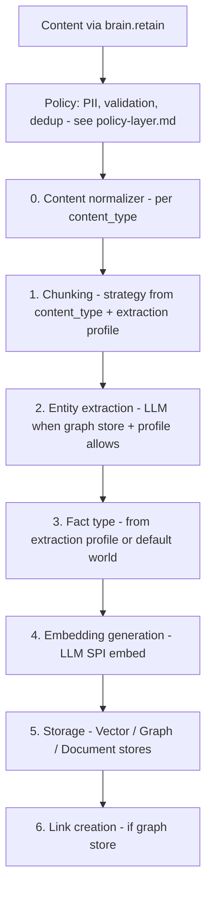
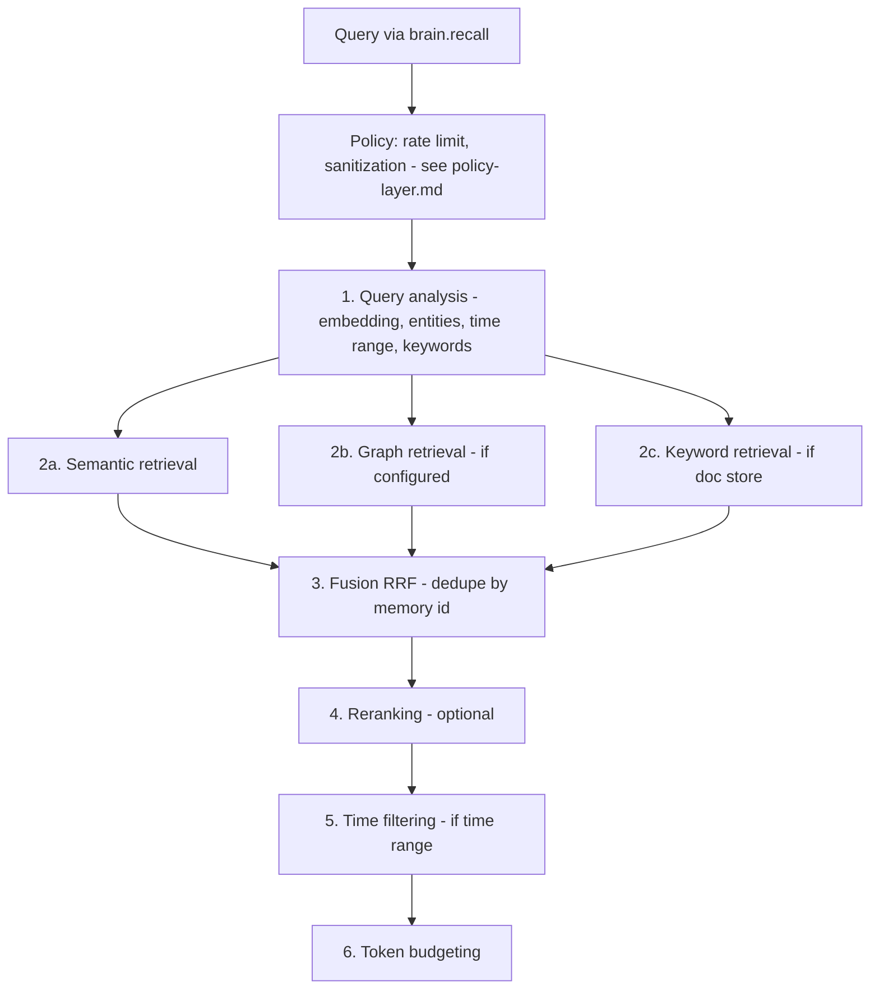
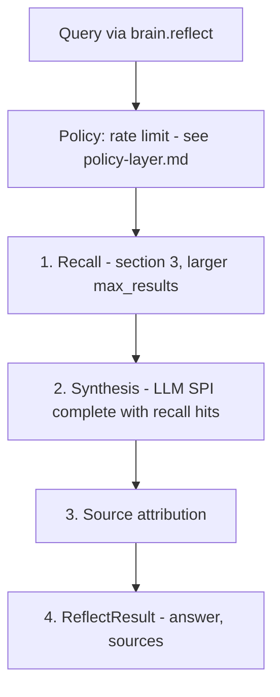
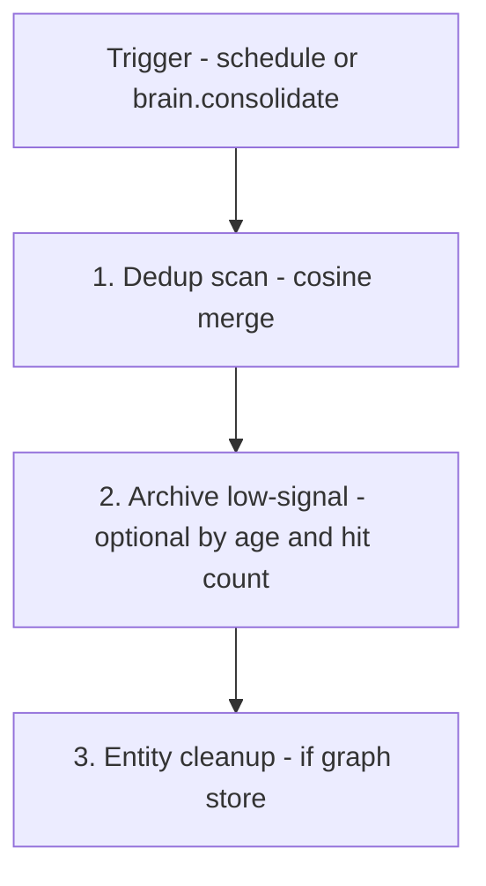

# Built-in intelligence pipeline

This document specifies the open-source intelligence pipeline that ships with the Astrocyte core. The pipeline activates when `provider_tier: storage` - it transforms the Retrieval SPI's CRUD operations into a full memory experience.

For the two-tier architecture this pipeline serves, see `architecture.md`. For the Retrieval SPI it orchestrates, see `provider-spi.md`. For governance policies that wrap the pipeline, see `policy-layer.md`.

---

## 1. Purpose

The built-in pipeline exists so that **users get a fully functional memory system** with just `astrocyte + a vector store adapter + an LLM adapter`. No commercial engine required.

It handles: chunking, entity extraction, embedding generation, multi-strategy retrieval, fusion, reranking, synthesis, and basic consolidation. Retrieval providers (Tier 1) handle the indexed CRUD underneath.

The pipeline is intentionally a **good baseline**, not a competitor to premium engines. It uses standard, well-understood algorithms. Premium engines like Mystique can provide materially better results through proprietary tuning, advanced fusion, agentic reflect, and disposition-aware synthesis.

### Tier 1 (storage-tier) regression coverage

When you change **retain** or **recall** stage ordering, **fusion/rerank** behavior, or **recall trace** fields (`strategies_used`, etc.), treat **`astrocyte-py/tests/test_astrocyte_tier1.py`** as the first line of defense: it runs `Astrocyte` with `provider_tier: storage`, an in-memory `VectorStore`, and a mock LLM, and asserts end-to-end **retain → recall → reflect** plus presence of **semantic** in `RecallTrace.strategies_used`. Update that file together with this document so CI and reviewers see the contract.

---

## 2. Retain pipeline

**M3 (v0.6.0) — explicit extraction chain** (before chunk/embed): **Raw → content normalizer → chunker → entity extraction (optional) → embeddings → storage**. Implementation: `astrocyte.pipeline.extraction` (`normalize_content`, `prepare_retain_input`, `resolve_retain_chunking`) and `PipelineOrchestrator.retain`.



Details: chunking uses sentence, paragraph, dialogue, or fixed-size strategies; entity extraction uses the LLM provider when a graph store is configured and the active **extraction profile** does not set `entity_extraction: false` / `disabled`; **fact type** defaults to `world` and can be set per profile via `ExtractionProfileConfig.fact_type` (not LLM-classified in the baseline path); storage calls `VectorStore`, optional `GraphStore` and `DocumentStore`; link creation adds co-occurrence links when configured.

### M3 — `content_type`, `extraction_profile`, and normalization scope

- **`RetainRequest.content_type`** (string, default `text`) participates in routing after optional **profile** resolution. Supported built-in values used for chunking and normalization: **`text`**, **`conversation`**, **`transcript`**, **`document`**, **`email`**, **`event`**. Unknown values fall back to the orchestrator default chunking strategy (same as `text`).
- **`RetainRequest.extraction_profile`** names an entry under config `extraction_profiles:` **or** a **built-in** profile (`builtin_text`, `builtin_conversation` — merged at runtime with user profiles; user definitions override the same name). Use **`astrocyte.pipeline.extraction.extraction_profile_for_source(source_id, config.sources)`** to resolve a profile from `sources.*.extraction_profile` before calling `retain` (full webhook ingest wiring is M4).
- **`ExtractionProfileConfig`** fields applied on retain: `content_type` (override for routing/normalization), `chunking_strategy`, `chunk_size`, `entity_extraction`, `fact_type`, `metadata_mapping` (JSON `$.path` values plus literal strings), `tag_rules` (`contains` / `match` substring → `tags`). Profile-derived metadata is merged with request metadata; **request metadata wins** on key conflicts.
- **Packaged defaults**: `astrocyte.pipeline.extraction_builtin.yaml` is merged over code constants (`builtin_text`, `builtin_conversation`) and under user `extraction_profiles:` (same merge order as elsewhere: **user wins**). Shipped in the wheel via Hatch `force-include` so integrators can patch the file in a venv if needed.
- **Stable imports**: `from astrocyte import prepare_retain_input, merged_extraction_profiles, extraction_profile_for_source, PreparedRetainInput` (also exposed on `astrocyte.pipeline`).
- **Normalizer** behavior is intentionally shallow: UTF-8 BOM strip, CRLF→LF, transcript/document blank-line collapse, email heuristic (RFC-like header block + body split, `-- ` signature trim). **Not** implemented here: HTML/MIME decoding, full mail parsing, calendar ICS parsing, or binary formats.

### M4 — Webhook ingest (library)

HTTP handlers should pass **raw body bytes** to `astrocyte.ingest.handle_webhook_ingest` with the matching `SourceConfig`. JSON body: `content` or `text`, optional `principal`, `content_type`, `metadata`. **HMAC** when `auth.type: hmac` (`secret`, optional `header`). **Bank**: `target_bank` or `target_bank_template` with `{principal}`. Optional **`astrocyte[gateway]`**: `create_ingest_webhook_app` (Starlette ASGI) exposes `POST /v1/ingest/webhook/{source_id}`. Full gateway (JWT, OpenAPI, Docker) is M6. **M4.1** federated recall (`astrocyte.recall.proxy`, RRF merge) is separate from gateway HTTP; see `product-roadmap-v1.md` §M4.1. OAuth for proxy sources is documented in **`adr-003-config-schema.md`** (proxy `auth`). Not in core today but can be added when needed: a **hosted redirect/callback** flow, **PKCE**, and **device / JWT bearer** grants — see that ADR for the explicit “layered on later” note.

### M4 — Stream ingest (`type: stream`)

**Declarative `sources:`** may use `type: stream` with a **`driver`** string (`kafka`, `redis`, or any driver registered by an installed package). Resolution matches **storage adapters**: Python **entry points** in the group **`astrocyte.ingest_stream_drivers`** (see `astrocyte._discovery.resolve_provider`). The core wheel registers **no** stream drivers; **`astrocyte-ingestion-kafka`** registers **`kafka`**, **`astrocyte-ingestion-redis`** registers **`redis`**. Install **`astrocyte[stream]`** (or the adapter packages individually). Building **`SourceRegistry.from_sources_config`** still requires **`retain=...`** (e.g. `retain_callable_for_astrocyte`). Payload parsing stays in core: **`parse_ingest_kafka_value`** (Kafka message values) and **`parse_ingest_stream_fields`** (Redis stream fields).

### M4 — Poll ingest (`type: poll` / `api_poll`)

**Declarative `sources:`** may use **`type: poll`** (alias **`api_poll`**) with **`driver: github`**. Drivers resolve via **`astrocyte.ingest_poll_drivers`**; **`astrocyte-ingestion-github`** registers **`github`** (Issues REST API, skips PRs). Install **`astrocyte[poll]`** (or that package alone). **`path`** is **`owner/repo`**; **`interval_seconds`** ≥ 60 (minimum validation and recommended baseline for production); **`auth.token`** is a GitHub PAT or fine-grained token. **`SourceRegistry.from_sources_config`** still requires **`retain=...`**.

**Gateway ops:** **`GET /health/ingest`** on **`astrocyte-gateway-py`** returns ingest-only readiness (per-source health). Set **`ASTROCYTE_LOG_FORMAT=json`** for structured ingest lines (supervisor start/stop, GitHub rate-limit warnings, stream failures) via **`astrocyte.ingest.logutil`**. Recipe: **[`poll-ingest-gateway.md`](../_end-user/poll-ingest-gateway.md)**.

### Extraction profiles for issues vs transcripts

- **Ticketing / GitHub issues** — text-heavy, single column: keep **`content_type: text`** (default) or set **`extraction_profile`** to **`builtin_text`** (sentence chunking). Override in **`extraction_profiles:`** if you need different **`chunk_size`** or **`fact_type`**.
- **Conversation transcripts** (multi-turn dialogue) — use **`builtin_conversation`** ( **`content_type: conversation`**, **`chunking_strategy: dialogue`**) or a custom profile that sets the same fields.

Built-in definitions ship in **`astrocyte/pipeline/extraction_builtin.yaml`** and merge with **`extraction_profiles:`** in config.

### Multimodal content (optional)

When **`RetainRequest`** (or the public API) includes **image/audio** as `ContentPart` lists (see `multimodal-llm-spi.md`), the pipeline does **not** assume every stage consumes raw media:

- **`caption_then_embed`** (typical): one multimodal **`complete()`** produces a **text** caption or summary → chunking and **`embed(texts)`** proceed as today.
- **`multimodal_embed`**: requires **`embed_multimodal()`** on the LLM provider; falls back if unsupported.

Query analysis and reflect can pass **multimodal `Message`** lists to **`complete()`** when the configured model supports vision/audio.

### Configuration (what exists today vs. roadmap)

**In `AstrocyteConfig` today (retain-related):**

- **`homeostasis`**: `retain_max_content_bytes`, rate limits / quotas (apply before the pipeline runs).
- **`extraction_profiles`**: named `ExtractionProfileConfig` entries (chunking, entity flags, metadata/tags, `fact_type`, etc.). Merged at runtime with **code + packaged** built-ins (`builtin_text`, `builtin_conversation`; see `astrocyte/pipeline/extraction_builtin.yaml`).
- **`sources`**: `extraction_profile` references validated against merged profiles (ingest wiring is M4).
- **Programmatic `PipelineOrchestrator`**: `chunk_strategy`, `max_chunk_size`, `rrf_k`, `semantic_overfetch`, `extraction_profiles` — used when not overridden by `RetainRequest` / profile resolution.

**Not a single YAML `pipeline:` block yet.** A future top-level `pipeline:` key may unify chunk/entity/embed knobs; until then the above fields and orchestrator constructor arguments are the real surface.

**Multi-system recall (M4.1):** **`sources:`** with **`type: proxy`** federates HTTP recall into **`PipelineOrchestrator.recall`** (RRF merge with local hits). Use when the next retrieval bet is **combining** vector/graph/document stores with an external search or ticket API — see **`product-roadmap-v1.md`** (M4.1) and **`astrocyte.recall.proxy`**.

**Roadmap sketch (not implemented as one nested `pipeline:` tree):**

```yaml
# Future — illustrative only
pipeline:
  chunking:
    strategy: sentence
    max_chunk_size: 512
  entity_extraction:
    mode: llm
  embedding:
    model: null
```

---

## 3. Recall pipeline



Parallel retrieval runs **2a–2c** concurrently where configured; semantic over-fetch is typically 3× `max_results`; RRF uses `k` (default 60); rerank modes are `flashrank`, `llm`, or `disabled`.

### Configuration

**Today:** `PipelineOrchestrator` takes `rrf_k` and `semantic_overfetch` (constructor); other recall tuning lives in code defaults until a unified `pipeline:` section exists.

**Roadmap sketch (illustrative):**

```yaml
pipeline:
  retrieval:
    semantic_overfetch_multiplier: 3
    graph_max_depth: 2
    graph_max_results: 20
  fusion:
    rrf_k: 60
  reranking:
    mode: disabled
    top_n: 20
```

---

## 4. Reflect pipeline



Synthesis uses a memory-agent system prompt and optional disposition hints when `fallback_strategy=local_llm`. Engines like Mystique may add agentic reflect and explicit citations.

### Configuration

**Today:** reflect behavior is driven by `ReflectRequest`, `homeostasis.reflect_max_tokens`, and the orchestrator implementation — not a nested `pipeline.reflect` YAML block.

**Structured recall authority (M7):** When `recall_authority.enabled` and `apply_to_reflect: true` (default), the same formatted block as `RecallResult.authority_context` is **prepended** to the synthesis user message inside `<authority_context>` (before `<memories>`). At retain time, `recall_authority.tier_by_bank` and optional `extraction_profiles.*.authority_tier` set `metadata["authority_tier"]` on stored chunks so recall/reflect can bucket hits. See `docs/_design/adr/adr-004-recall-authority.md`.

**Roadmap sketch (illustrative):**

```yaml
pipeline:
  reflect:
    recall_max_results: 20
    synthesis_max_tokens: 2048
    temperature: 0.1
```

---

## 5. Consolidation pipeline

Basic memory maintenance that runs on a schedule or on-demand.



### Dedup scan implementation

The dedup scan paginates through all vectors in a bank via `VectorStore.list_vectors()`, compares embeddings pairwise using cosine similarity, and deletes near-duplicates (keeping the first occurrence). The scan is safety-capped at 100k vectors to prevent runaway operations.

If the VectorStore does not implement `list_vectors()`, consolidation is skipped with a warning.

### Configuration

```yaml
pipeline:
  consolidation:
    dedup_similarity_threshold: 0.95
    archive_unretrieved_after_days: 90  # null to disable
    entity_dedup_enabled: true
    schedule: "0 3 * * *"               # Cron: 3am daily (or null for manual only)
```

---

## 6. Pipeline vs Mystique: capability comparison

This table captures what users get at each tier, helping them make informed upgrade decisions.

| Capability | Built-in pipeline (Tier 1) | Mystique engine (Tier 2) |
|---|---|---|
| **Chunking** | Sentence/paragraph splitting | Sophisticated content-aware chunking |
| **Entity extraction** | LLM-based extraction (LLM provider SPI) when graph store + profile allow; **spaCy** is optional for **PII policy** scanning, not the default retain-path NER | Multi-pass LLM with normalization and canonical resolution |
| **Embedding** | Standard models via LLM SPI | Tuned HNSW with partial indexes per fact type |
| **Semantic retrieval** | Vector similarity search | Vector similarity with optimized ef_search tuning |
| **Graph retrieval** | Basic neighbor traversal (depth 2) | Spreading activation with configurable decay |
| **Keyword retrieval** | BM25 via DocumentStore | Native BM25 integrated with vector search |
| **Temporal retrieval** | Post-fusion date filtering | Temporal proximity weighting, temporal link expansion |
| **Fusion** | Standard RRF (k=60) | Tuned RRF + cross-encoder reranking |
| **Reranking** | Optional flashrank or LLM | Native cross-encoder, always-on |
| **Reflect** | Single-pass LLM synthesis | Agentic multi-turn with tool use (lookup, recall, learn, expand) |
| **Dispositions** | Basic prompt guidance (limited) | Native personality modulation (skepticism, literalism, empathy) |
| **Consolidation** | Dedup + archive by age | Quality-based loss functions, observation formation, mental models |
| **Entity resolution** | LLM-extracted entities + exact-match dedup | Canonical resolution with co-occurrence tracking, alias management |
| **Scale** | Single process | Multi-tenant, distributed, production-grade |
| **Temporal links** | Not supported | Temporal proximity links between memories |
| **Observations** | Not supported | Synthesized knowledge consolidated from raw facts |

The built-in pipeline is **good enough** to build real products. Mystique is **materially better** in every dimension - particularly reflect (agentic vs single-pass), fusion (tuned vs standard), and consolidation (observation formation vs simple dedup).

---

## 7. Extending the pipeline

The built-in pipeline is designed with clear stage boundaries. Advanced users can override individual stages without replacing the whole pipeline:

```yaml
pipeline:
  entity_extraction:
    mode: custom
    custom_extractor: mypackage.extractors:MyEntityExtractor
```

Custom stage implementations must conform to the internal pipeline stage protocol (documented separately). This is an advanced use case - most users should use the pipeline as-is or upgrade to a Tier 2 memory engine.

---

## 8. When to use Tier 1 vs Tier 2

| Scenario | Recommendation |
|---|---|
| Prototyping / learning | Tier 1 with pgvector - zero cost beyond LLM API |
| Small-scale personal assistant | Tier 1 with pgvector + optional Neo4j |
| Production support agent | Tier 2 with Mystique (native reflect, dispositions, PII) |
| Already using Mem0/Zep | Tier 2 with corresponding memory engine provider |
| Enterprise multi-tenant | Tier 2 with Mystique (bank mapping, tenant isolation) |
| Cost-sensitive, own infrastructure | Tier 1 with your existing databases |
| Need best recall accuracy | Tier 2 with Mystique (SOTA on LongMemEval) |

---

## 9. Pipeline innovations

The following innovations extend the built-in pipeline with capabilities inspired by ByteRover and Hindsight. All are backward-compatible, feature-gated, and independently implementable. Full details in `innovations.md`.

### 9.1 Recall cache (implemented)

LRU cache keyed by query embedding similarity. Avoids redundant retrieval for repeated/similar queries. Invalidated on retain. Resolves ~80% of steady-state queries at near-zero latency.

### 9.2 Memory hierarchy (implemented)

Three-layer model — `fact` → `observation` → `model` — with `layer_weighted_rrf_fusion()` applying multiplicative weights per layer. Higher layers (observations, models) are boosted in recall ranking.

### 9.3 Utility scoring (implemented)

Per-memory composite score combining recency (exponential decay), frequency (recall count), relevance (average match score), and freshness (creation age). Drives TTL decisions, ranking boosts, and bank health metrics.

### 9.4 Adaptive tiered retrieval (implemented)

5-tier **progressive escalation by cost and latency**: cache → fuzzy recent → BM25 → full multi-strategy → agentic recall. Each tier is cheaper than the next. Stops when `min_results` with `min_score` are found. Module: `astrocyte/pipeline/tiered_retrieval.py`. Config: `tiered_retrieval` in `astrocyte.yaml` (including optional `full_recall: hybrid` when using `HybridEngineProvider` — see core docstrings and `product-roadmap-v1.md`).

**Terminology — cost tiers vs truth tiers:** “Tier” here means **how much work recall does**, not **which source is authoritative**. Do **not** confuse this with *precedence-in-the-prompt* RAG patterns (e.g. labeled Priority 1 / 2 / 3 blocks where graph facts override statistics and vectors). That style optimizes **structured precedence and conflict handling at generation time**; Astrocyte’s default story remains **algorithmic fusion** (e.g. RRF) and optional **layer weights**. **Structured recall authority** (**M7**, **v0.8.0**) is **implemented** as optional `recall_authority` in `astrocyte.yaml` (`RecallResult.authority_context`, reflect injection) — see **`adr-004-recall-authority.md`** and **`product-roadmap-v1.md` § M7**. It is **not** the default recall path when disabled.

### 9.5 LLM-curated retain (implemented)

Opt-in mode where the LLM decides ADD/UPDATE/MERGE/SKIP/DELETE instead of mechanical chunk+embed. Also classifies the memory layer (fact/observation/model). Module: `astrocyte/pipeline/curated_retain.py`.

### 9.6 Curated recall (implemented)

Post-retrieval re-scoring by freshness (exponential decay on occurred_at), reliability (fact_type + provenance), and salience (memory_layer boosting). Module: `astrocyte/pipeline/curated_recall.py`.

### 9.7 Progressive retrieval + cross-source fusion (implemented)

`detail_level: "titles"` on RecallRequest for 10x token savings. `external_context` on RecallRequest for fusing external RAG/graph results with memory recall under one token budget. Both are type-level features available to every provider.

### 9.8 Cross-engine routing (implemented)

Adaptive per-query weights in HybridEngineProvider via `AdaptiveRouter`. Classifies queries by temporal signals, entity density, question complexity, and length to route optimally between engine and pipeline backends.
