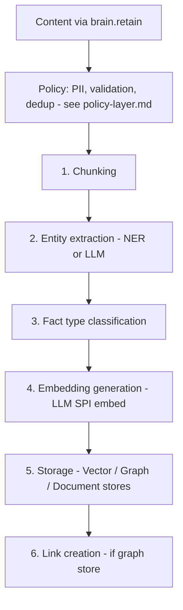
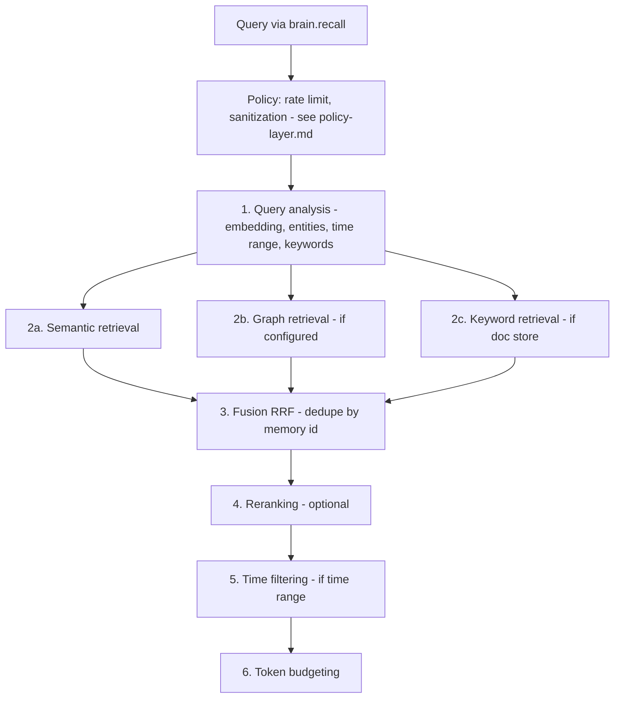
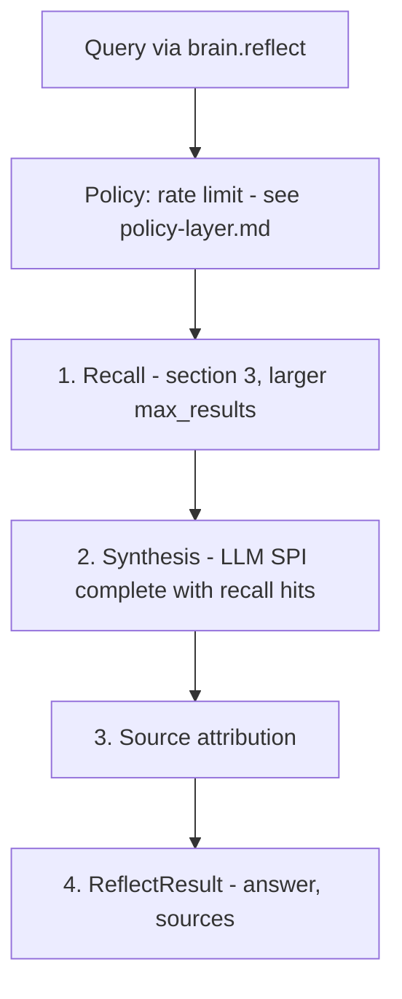
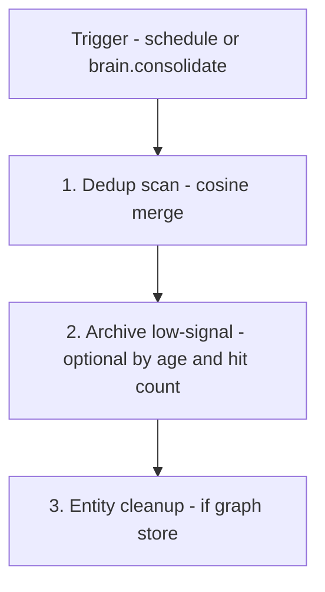

# Built-in intelligence pipeline

This document specifies the open-source intelligence pipeline that ships with the Astrocyte core. The pipeline activates when `provider_tier: storage` - it transforms the Retrieval SPI's CRUD operations into a full memory experience.

For the two-tier architecture this pipeline serves, see `architecture-framework.md`. For the Retrieval SPI it orchestrates, see `provider-spi.md`. For governance policies that wrap the pipeline, see `policy-layer.md`.

---

## 1. Purpose

The built-in pipeline exists so that **users get a fully functional memory system** with just `astrocyte + a vector store adapter + an LLM adapter`. No commercial engine required.

It handles: chunking, entity extraction, embedding generation, multi-strategy retrieval, fusion, reranking, synthesis, and basic consolidation. Retrieval providers (Tier 1) handle the indexed CRUD underneath.

The pipeline is intentionally a **good baseline**, not a competitor to premium engines. It uses standard, well-understood algorithms. Premium engines like Mystique can provide materially better results through proprietary tuning, advanced fusion, agentic reflect, and disposition-aware synthesis.

---

## 2. Retain pipeline



Details: chunking uses sentence or fixed-size strategies; entity modes are `ner` or `llm`; fact types include `world`, `experience`, `observation`; storage calls `VectorStore`, optional `GraphStore` and `DocumentStore`; link creation adds co-occurrence and temporal links when configured.

### Multimodal content (optional)

When **`RetainRequest`** (or the public API) includes **image/audio** as `ContentPart` lists (see `multimodal-llm-spi.md`), the pipeline does **not** assume every stage consumes raw media:

- **`caption_then_embed`** (typical): one multimodal **`complete()`** produces a **text** caption or summary → chunking and **`embed(texts)`** proceed as today.
- **`multimodal_embed`**: requires **`embed_multimodal()`** on the LLM provider; falls back if unsupported.

Query analysis and reflect can pass **multimodal `Message`** lists to **`complete()`** when the configured model supports vision/audio.

### Configuration

```yaml
pipeline:
  chunking:
    strategy: sentence           # "sentence" | "paragraph" | "fixed"
    max_chunk_size: 512          # Characters
    overlap: 50                  # Characters (for "fixed" strategy)

  entity_extraction:
    mode: llm                    # "llm" | "ner" | "disabled"

  fact_classification:
    enabled: true                # If false, all chunks default to "world"

  embedding:
    model: null                  # Uses LLM provider's default if null
    dimensions: null             # Uses model's default if null
```

---

## 3. Recall pipeline



Parallel retrieval runs **2a–2c** concurrently where configured; semantic over-fetch is typically 3× `max_results`; RRF uses `k` (default 60); rerank modes are `flashrank`, `llm`, or `disabled`.

### Configuration

```yaml
pipeline:
  retrieval:
    semantic_overfetch_multiplier: 3   # Fetch 3x max_results for fusion
    graph_max_depth: 2                 # Max hops in graph traversal
    graph_max_results: 20              # Max graph hits before fusion

  fusion:
    rrf_k: 60                          # RRF constant

  reranking:
    mode: disabled                     # "flashrank" | "llm" | "disabled"
    top_n: 20                          # Only rerank top N fused results
```

---

## 4. Reflect pipeline



Synthesis uses a memory-agent system prompt and optional disposition hints when `fallback_strategy=local_llm`. Engines like Mystique may add agentic reflect and explicit citations.

### Configuration

```yaml
pipeline:
  reflect:
    recall_max_results: 20             # More results for synthesis context
    synthesis_max_tokens: 2048         # Max tokens for LLM synthesis output
    temperature: 0.1                   # Low temperature for factual synthesis
```

---

## 5. Consolidation pipeline

Basic memory maintenance that runs on a schedule or on-demand.



### Dedup scan implementation

The dedup scan paginates through all vectors in a bank via `VectorStore.list_vectors()`, compares embeddings pairwise using cosine similarity, and deletes near-duplicates (keeping the first occurrence). The scan is safety-capped at 100k vectors to prevent runaway operations.

If the VectorStore does not implement `list_vectors()`, consolidation is skipped with a warning.

### Configuration

```yaml
pipeline:
  consolidation:
    dedup_similarity_threshold: 0.95
    archive_unretrieved_after_days: 90  # null to disable
    entity_dedup_enabled: true
    schedule: "0 3 * * *"               # Cron: 3am daily (or null for manual only)
```

---

## 6. Pipeline vs Mystique: capability comparison

This table captures what users get at each tier, helping them make informed upgrade decisions.

| Capability | Built-in pipeline (Tier 1) | Mystique engine (Tier 2) |
|---|---|---|
| **Chunking** | Sentence/paragraph splitting | Sophisticated content-aware chunking |
| **Entity extraction** | spaCy NER or single-pass LLM | Multi-pass LLM with normalization and canonical resolution |
| **Embedding** | Standard models via LLM SPI | Tuned HNSW with partial indexes per fact type |
| **Semantic retrieval** | Vector similarity search | Vector similarity with optimized ef_search tuning |
| **Graph retrieval** | Basic neighbor traversal (depth 2) | Spreading activation with configurable decay |
| **Keyword retrieval** | BM25 via DocumentStore | Native BM25 integrated with vector search |
| **Temporal retrieval** | Post-fusion date filtering | Temporal proximity weighting, temporal link expansion |
| **Fusion** | Standard RRF (k=60) | Tuned RRF + cross-encoder reranking |
| **Reranking** | Optional flashrank or LLM | Native cross-encoder, always-on |
| **Reflect** | Single-pass LLM synthesis | Agentic multi-turn with tool use (lookup, recall, learn, expand) |
| **Dispositions** | Basic prompt guidance (limited) | Native personality modulation (skepticism, literalism, empathy) |
| **Consolidation** | Dedup + archive by age | Quality-based loss functions, observation formation, mental models |
| **Entity resolution** | NER + exact-match dedup | Canonical resolution with co-occurrence tracking, alias management |
| **Scale** | Single process | Multi-tenant, distributed, production-grade |
| **Temporal links** | Not supported | Temporal proximity links between memories |
| **Observations** | Not supported | Synthesized knowledge consolidated from raw facts |

The built-in pipeline is **good enough** to build real products. Mystique is **materially better** in every dimension - particularly reflect (agentic vs single-pass), fusion (tuned vs standard), and consolidation (observation formation vs simple dedup).

---

## 7. Extending the pipeline

The built-in pipeline is designed with clear stage boundaries. Advanced users can override individual stages without replacing the whole pipeline:

```yaml
pipeline:
  entity_extraction:
    mode: custom
    custom_extractor: mypackage.extractors:MyEntityExtractor
```

Custom stage implementations must conform to the internal pipeline stage protocol (documented separately). This is an advanced use case - most users should use the pipeline as-is or upgrade to a Tier 2 memory engine.

---

## 8. When to use Tier 1 vs Tier 2

| Scenario | Recommendation |
|---|---|
| Prototyping / learning | Tier 1 with pgvector - zero cost beyond LLM API |
| Small-scale personal assistant | Tier 1 with pgvector + optional Neo4j |
| Production support agent | Tier 2 with Mystique (native reflect, dispositions, PII) |
| Already using Mem0/Zep | Tier 2 with corresponding memory engine provider |
| Enterprise multi-tenant | Tier 2 with Mystique (bank mapping, tenant isolation) |
| Cost-sensitive, own infrastructure | Tier 1 with your existing databases |
| Need best recall accuracy | Tier 2 with Mystique (SOTA on LongMemEval) |

---

## 9. Pipeline innovations

The following innovations extend the built-in pipeline with capabilities inspired by ByteRover and Hindsight. All are backward-compatible, feature-gated, and independently implementable. Full details in `innovations.md`.

### 9.1 Recall cache (implemented)

LRU cache keyed by query embedding similarity. Avoids redundant retrieval for repeated/similar queries. Invalidated on retain. Resolves ~80% of steady-state queries at near-zero latency.

### 9.2 Memory hierarchy (implemented)

Three-layer model — `fact` → `observation` → `model` — with `layer_weighted_rrf_fusion()` applying multiplicative weights per layer. Higher layers (observations, models) are boosted in recall ranking.

### 9.3 Utility scoring (implemented)

Per-memory composite score combining recency (exponential decay), frequency (recall count), relevance (average match score), and freshness (creation age). Drives TTL decisions, ranking boosts, and bank health metrics.

### 9.4 Adaptive tiered retrieval (implemented)

5-tier progressive escalation: cache → fuzzy → BM25 → full multi-strategy → agentic recall. Each tier is cheaper than the next. Stops when `min_results` with `min_score` are found. Module: `astrocyte/pipeline/tiered_retrieval.py`.

### 9.5 LLM-curated retain (implemented)

Opt-in mode where the LLM decides ADD/UPDATE/MERGE/SKIP/DELETE instead of mechanical chunk+embed. Also classifies the memory layer (fact/observation/model). Module: `astrocyte/pipeline/curated_retain.py`.

### 9.6 Curated recall (implemented)

Post-retrieval re-scoring by freshness (exponential decay on occurred_at), reliability (fact_type + provenance), and salience (memory_layer boosting). Module: `astrocyte/pipeline/curated_recall.py`.

### 9.7 Progressive retrieval + cross-source fusion (implemented)

`detail_level: "titles"` on RecallRequest for 10x token savings. `external_context` on RecallRequest for fusing external RAG/graph results with memory recall under one token budget. Both are type-level features available to every provider.

### 9.8 Cross-engine routing (implemented)

Adaptive per-query weights in HybridEngineProvider via `AdaptiveRouter`. Classifies queries by temporal signals, entity density, question complexity, and length to route optimally between engine and pipeline backends.
