# C4, deployment & domain model

This document consolidates **C4 views**, deployment models, **domain modeling** (bounded contexts, aggregates), and **application architecture** (ports, sequences, enforcement) for Astrocyte as a product. It complements the normative framework specification in [`architecture.md`](./architecture.md). **Milestone plan** (M1–M7 through v1.0.0; **M5** and **M7** share **v0.8.0**): [`product-roadmap.md`](./product-roadmap.md).

## System Architecture

### 1. System Context

Astrocyte is a **memory framework** -- not an LLM gateway, not an agent runtime. It sits between AI agents (and their frameworks) and memory storage backends, providing a unified memory API with built-in intelligence (chunking, entity extraction, embedding, retrieval, fusion, reranking) and policy enforcement (PII barriers, access control, rate limiting, homeostasis).

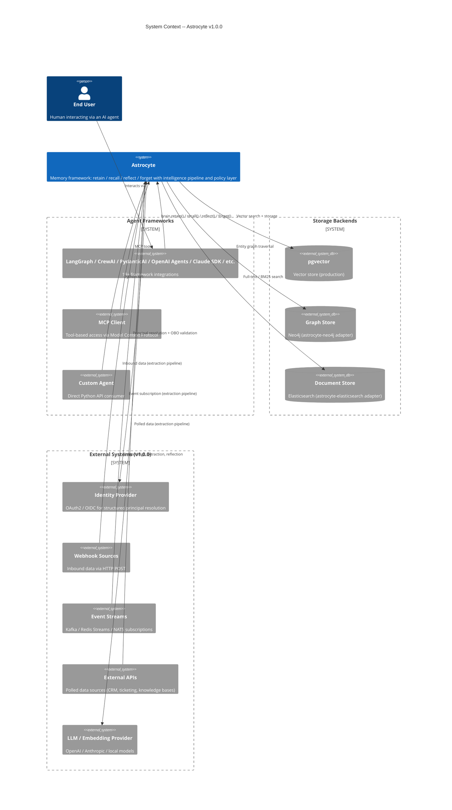

### 2. Container Diagrams by Deployment Model

Astrocyte supports three deployment models. The library model is the **default and primary** deployment -- gateway models are additive for specific use cases.

#### 2a. Library (Embedded)

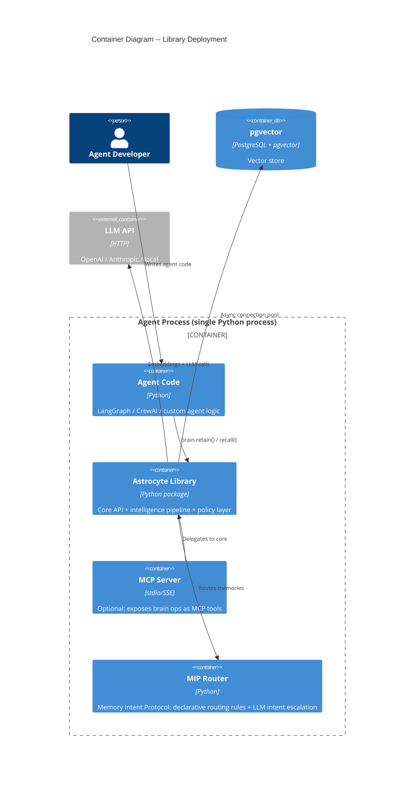

#### 2b. Gateway Plugin (Kong / APISIX / Azure APIM)

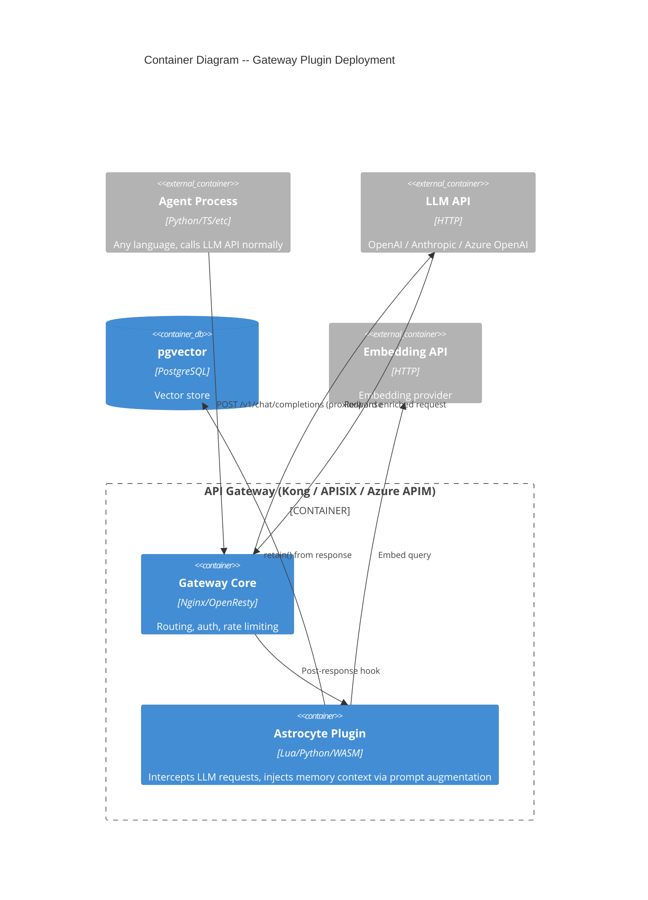

#### 2c. Standalone Gateway (LiteLLM-style)

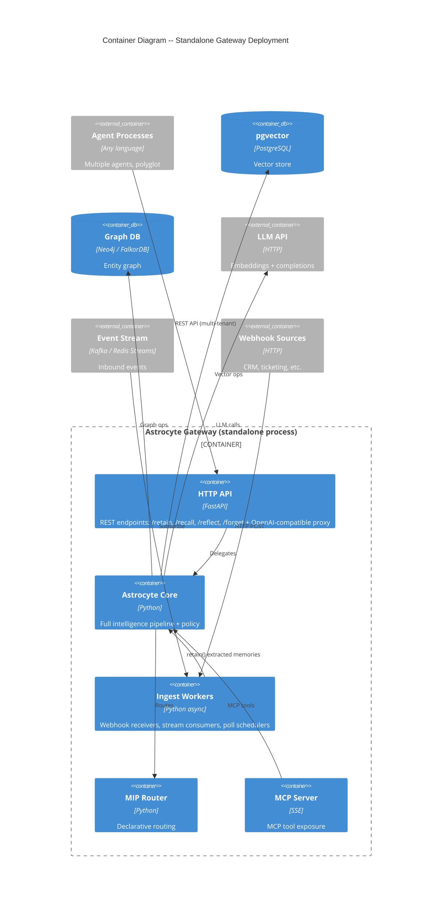

### 3. Deployment Model Analysis

#### 3.1 Back-of-Envelope Estimation (Reference Scenario)

**Assumptions**: Mid-scale deployment, 50 agents, ~100 active users, each generating ~20 memory operations/hour.

```
Write QPS (retain):  50 agents * 20 ops/hr / 3600 = ~0.3 QPS sustained, ~5 QPS peak
Read QPS (recall):   Assume 3:1 read/write = ~1 QPS sustained, ~15 QPS peak
Storage:             100 users * 1000 memories * 1KB avg = ~100 MB text
                     + embeddings: 100K * 1536 dims * 4 bytes = ~600 MB vectors
                     Total: ~1 GB (fits single pgvector instance comfortably)
Embedding latency:   ~100ms per call (OpenAI API)
Recall pipeline:     embedding(100ms) + vector search(10ms) + rerank(50ms) = ~160ms p50
Reflect pipeline:    recall(160ms) + LLM synthesis(800ms) = ~1000ms p50
```

At this scale, a single pgvector instance with async connection pooling handles the load. No sharding, no read replicas, no message queues needed yet.

#### 3.2 Decision Matrix

| Criterion | Library (Embedded) | Gateway Plugin | Standalone Gateway |
|---|---|---|---|
| **Deployment complexity** | None (pip install) | Medium (gateway infra required) | Medium (separate process + config) |
| **Language support** | Python only | Any (transparent proxy) | Any (HTTP API) |
| **Latency overhead** | 0ms (in-process) | ~5-15ms (plugin hook overhead) | ~10-30ms (network hop) |
| **Data flow patterns** | Proxy, federated (natural); webhook, stream, poll (workable via bg thread) | Proxy, webhook, federated (natural); stream, poll (awkward -- plugins lack long-running threads) | All 5 patterns natural |
| **Multi-tenancy** | Single tenant per process | Per-gateway tenant isolation | Full multi-tenant with identity layer |
| **Horizontal scaling** | Scale agent processes | Scale gateway instances | Scale gateway instances independently |
| **Intelligence pipeline** | Full (in-process) | Limited (pre/post hooks only, no reflect) | Full |
| **Operational overhead** | Minimal | Gateway team manages | Dedicated ops |
| **Best for** | Single-agent apps, prototypes, Python-native | Organizations with existing API gateways, polyglot agents needing memory without code changes | Multi-agent platforms, polyglot orgs, production deployments needing inbound data pipelines |

#### 3.3 Trade-off Analysis

**Library vs Standalone Gateway**: The library model adds 0ms latency and zero operational overhead -- but limits you to Python and single-process scope. The standalone gateway adds ~10-30ms per operation (one network hop) but enables polyglot agents, centralized policy, and all 5 data flow patterns. At <50 QPS peak, the gateway's network overhead is negligible. **Trade**: latency + simplicity for language flexibility + centralized control.

**Gateway Plugin vs Standalone Gateway**: The plugin model reuses existing API gateway infrastructure (no new process to manage) but constrains you to pre/post request hooks -- no reflect, no background ingestion, no long-running stream consumers. The standalone gateway requires a new process but provides full pipeline capability. **Trade**: infrastructure reuse for pipeline completeness.

**Recommendation**: Ship library as default (v1.0.0 GA). Ship standalone gateway as the first additive deployment model (v1.0.0 or fast-follow). Gateway plugins for Kong, APISIX, and Azure APIM shipped in v0.8.x -- see `gateway-plugins/`.

### 4. Data Flow Patterns

#### 4.1 Pattern Definitions

| # | Pattern | Direction | Mechanism | Infrastructure Needed |
|---|---|---|---|---|
| 1 | **Proxy Query** | Agent -> Astrocyte -> Backend -> Astrocyte -> Agent | Astrocyte intercepts and enriches LLM calls | None beyond Astrocyte itself |
| 2 | **Webhook Ingest** | External -> Astrocyte | HTTP POST to Astrocyte endpoint, triggers extraction pipeline | HTTP endpoint (library: bg thread + lightweight server; standalone: built-in) |
| 3 | **Event Stream Subscription** | External -> Astrocyte | Consumer subscribes to Kafka/Redis Streams/NATS topic | Stream client library, consumer group management, offset tracking |
| 4 | **API Poll** | Astrocyte -> External | Scheduled polling of external APIs (CRM, ticketing) | Scheduler (library: APScheduler/bg thread; standalone: built-in scheduler) |
| 5 | **Federated Query** | Agent -> Astrocyte -> Multiple Backends -> Astrocyte -> Agent | recall() fans out to multiple stores, fuses results | Multi-store connection config, fusion logic (already exists in pipeline) |

#### 4.2 Deployment Fit Matrix

```
                    Library    Plugin     Standalone
Proxy query         +++        +++        +++
Webhook ingest      ++         +++        +++
Event stream        +          -          +++
API poll            +          -          +++
Federated query     +++        +++        +++

+++ = natural fit, runs idiomatically
++  = workable with background thread / minor workaround
+   = possible but requires careful lifecycle management
-   = awkward, fights the deployment model's constraints
```

#### 4.3 Data Flow Architecture (Inbound Pipeline)

All inbound data (webhooks, streams, polls) flows through the **extraction pipeline** -- a new pipeline complementing the existing retrieval pipeline:

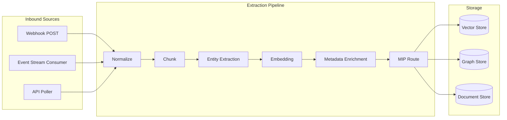

**Key design decision**: Inbound data always enters through `brain.retain()` after extraction. The extraction pipeline normalizes raw content (HTML, JSON, plain text) into structured memories. This means all policy enforcement (PII barriers, access control, rate limiting) applies uniformly regardless of data source.

**Library implementation (M3)**: The Tier 1 orchestrator applies a **normalize → chunk → optional LLM entity extraction → embed → store** sequence. Per-`content_type` normalization is heuristic (line endings, light email body extraction); heavy MIME/HTML/ICS handling remains out of scope until M4+ connectors. Config and builtins are documented in `built-in-pipeline.md` (section 2).

### 5. Infrastructure Requirements by Deployment Model

#### 5.1 Library (Embedded)

| Component | Required | Purpose | Bottleneck Addressed |
|---|---|---|---|
| pgvector | Yes | Vector storage + search | Persistent memory storage |
| LLM/Embedding API | Yes | Embeddings, entity extraction, reflection | Intelligence pipeline |
| asyncio event loop | Yes (Python runtime) | Async I/O for DB + API calls | Non-blocking operations |
| Connection pool (asyncpg) | Yes | DB connection reuse | Connection overhead at >10 QPS |
| Background thread pool | Optional | Webhook/poll support when not standalone | Inbound data without blocking agent |

**No message queue needed**: At library scale (<50 QPS), direct async calls suffice. Adding a queue would add ~5ms latency and operational complexity for zero throughput benefit.

#### 5.2 Standalone Gateway

| Component | Required | Purpose | Bottleneck Addressed |
|---|---|---|---|
| Everything from Library | Yes | Core functionality | -- |
| FastAPI/Uvicorn | Yes | HTTP API surface | Multi-language access |
| Process manager (systemd/Docker) | Yes | Lifecycle management | Crash recovery, restarts |
| Connection pool (per-tenant) | Yes | Tenant-isolated DB access | Noisy neighbor prevention |
| Scheduler (APScheduler or similar) | Conditional | API poll pattern | Periodic data ingestion |
| Stream consumer (aiokafka/aioredis) | Conditional | Event stream pattern | Real-time data ingestion |
| Redis (optional) | Optional | Rate limit counters, recall cache, session state | Stateless horizontal scaling |

**When to add Redis**: When running >1 gateway instance and needing shared rate limit state or recall cache. Single instance can use in-process state. Adds ~1ms per rate limit check but enables horizontal scaling.

**When to add a message queue**: When inbound data volume exceeds what synchronous `retain()` can handle (>500 QPS sustained ingest). Queue buffers spikes -- adds ~5ms latency but prevents backpressure from overwhelming the extraction pipeline.

#### 5.3 Gateway Plugin

| Component | Required | Purpose |
|---|---|---|
| API Gateway (Kong/APISIX/APIM) | Yes | Host infrastructure |
| pgvector (accessible from gateway) | Yes | Memory storage |
| Embedding API (accessible from plugin) | Yes | Query embedding for recall |
| Plugin SDK (Lua/Python/WASM) | Yes | Plugin runtime |

**Constraint**: Plugin cannot run long-lived background tasks. All memory operations must complete within the request lifecycle (pre-hook: recall + inject; post-hook: retain from response). Typical budget: <200ms total for both hooks combined.

### 6. Scalability Considerations

#### 6.1 Scaling Ladder (When to Add What)

Each step below addresses a specific bottleneck. Do not jump ahead.

| Step | Trigger | Action | Bottleneck Addressed |
|---|---|---|---|
| 0 | Baseline | Single pgvector, single Astrocyte process | -- |
| 1 | recall p95 > 200ms | Add recall cache (in-process LRU, 256 entries, 5min TTL) | Repeated similar queries hitting DB |
| 2 | Connection pool exhaustion | Increase pool size or add read replica | DB connection contention |
| 3 | Multiple gateway instances | Add Redis for shared rate limits + recall cache | Stateless scaling |
| 4 | Ingest QPS > 500 sustained | Add message queue (Redis Streams or Kafka) between inbound sources and extraction pipeline | Backpressure from burst ingestion |
| 5 | Storage > 10M vectors | Partition pgvector by bank_id (table-per-bank or schema-per-tenant) | Vector search latency degrades >10M rows with IVFFlat |
| 6 | Global deployment | Multi-region pgvector with read replicas per region | Cross-region latency (>100ms penalty) |

#### 6.2 Multi-Tenancy

**Library mode**: Single-tenant by design. One Astrocyte instance per agent process. Tenant isolation is implicit (separate processes).

**Standalone gateway**: Multi-tenant via structured `AstrocyteContext`:

```
AstrocyteContext:
  user_id: "user:calvin"           # End user identity
  agent_id: "agent:support-bot-1"  # Acting agent identity
  on_behalf_of: "user:calvin"      # OBO: agent acting for user
  tenant_id: "org:acme"            # Tenant boundary
```

**Isolation model**: Tenant isolation at the bank level. Each tenant's memories live in dedicated banks. Permission intersection: `effective_permissions = agent_grants INTERSECT user_grants`. An agent can only access what both the agent AND the user are permitted to access.

**Why bank-level, not database-level isolation**: At <1000 tenants, bank-level isolation in a shared pgvector instance is simpler and cheaper. Database-per-tenant adds ~100MB overhead per tenant (PostgreSQL catalog + pgvector index) and complicates connection pooling. Move to schema-per-tenant or database-per-tenant when: (a) regulatory requirement (data residency), (b) >10M vectors per tenant, or (c) noisy-neighbor DB load issues.

#### 6.3 Connection Pooling

**Problem**: Each recall/retain operation needs a DB connection. At 50 QPS with 160ms avg operation time, you need ~8 concurrent connections. Default asyncpg pool of 10 suffices.

**Scaling formula**: `pool_size = peak_QPS * avg_operation_time_seconds * 1.5 (headroom)`

| Scale | Peak QPS | Avg Latency | Pool Size Needed |
|---|---|---|---|
| Small (single agent) | 5 | 160ms | 2 |
| Medium (10 agents) | 50 | 160ms | 12 |
| Large (100 agents) | 500 | 160ms | 120 (use pgbouncer) |
| Very large (1000+ agents) | 5000 | 160ms | pgbouncer + sharding |

**When to add pgbouncer**: At >100 connections. pgbouncer in transaction mode reduces actual PostgreSQL connections by ~10x (100 pgbouncer connections -> 10 PostgreSQL connections) at the cost of losing prepared statements and LISTEN/NOTIFY.

#### 6.4 Consistency Model

Astrocyte uses **eventual consistency** for memory operations:

- **retain()**: Write is acknowledged after vector store confirms insert. Embedding is computed synchronously (in the request path). Entity extraction and graph updates can be async (fire-and-forget to background task). **Trade**: user gets fast ack (~160ms) but graph relationships may lag by ~500ms.
- **recall()**: Always reads from the vector store's current state. No read-your-own-write guarantee across multiple Astrocyte instances unless sharing the same pgvector connection. **Trade**: simplicity over strong consistency. For most agent memory use cases, a ~1s lag between retain and recall is acceptable.
- **reflect()**: Reads from recall results, then synthesizes via LLM. Consistency is the same as recall.
- **forget()**: Hard delete from vector store. Synchronous confirmation. Must propagate to graph store and document store as well (saga-like compensating actions if graph delete fails).

**Why not strong consistency**: Memory is not a financial ledger. Agents do not depend on read-your-own-write semantics for correctness. The eventual consistency window (typically <1s within a single pgvector instance) is invisible to end users interacting through an AI agent. Adding strong consistency (synchronous replication, distributed transactions) would add ~50-100ms per operation for zero user-visible benefit.

### 7. Identity and Authorization Architecture

#### 7.1 Current State (post–M1–M2 / v0.5.0)

**Gloss:** **OBO** means *on-behalf-of* (**delegated access**): one principal acts for another. The term is **standard in OAuth and IAM**; Astrocyte uses it for memory ACLs (grant intersection), not for a specific OAuth protocol implementation. See [ADR-002](./adr/adr-002-identity-model.md).

The **core** implements structured identity and OBO as in ADR-002:

- `AstrocyteContext` includes optional **`actor`**, **`on_behalf_of`**, **`tenant_id`** (and optional **`claims`** on `ActorIdentity`); **`principal: str`** remains for backwards compatibility and logging.
- **Identity resolution**: explicit `actor` wins; otherwise `principal` is parsed to `ActorIdentity` (`agent:`, `user:`, `service:` prefixes; unprefixed → `user`).
- **OBO**: when `on_behalf_of` is set, **effective permissions** per bank are the **intersection** of the actor’s and delegator’s grant unions (not additive across those two identities).
- **Grants**: for a single identity without OBO, matching rows still **union** as before; wildcards (`bank_id` / `principal` `*`) behave as documented in access control.
- **Thin integrations** (framework adapters, MCP factory): all accept an optional **`context`** / **`astrocyte_context`** and forward it to `retain` / `recall` / `reflect` / `forget` / `clear_bank` when supplied.

**Still application-owned** (not fixed by adapters alone): callers must **construct and pass** `AstrocyteContext` when they want AuthZ — e.g. mapping the hosting framework’s session or JWT to `principal` / `actor` / `on_behalf_of`. **Tenant isolation** using `tenant_id` in core enforcement is **not** implemented yet (field is reserved). **JWT validation** in the OSS library remains out of scope; gateway mode may add it later per ADR-003.

#### 7.2 Reference architecture (v1.0.0+ gateway and docs)

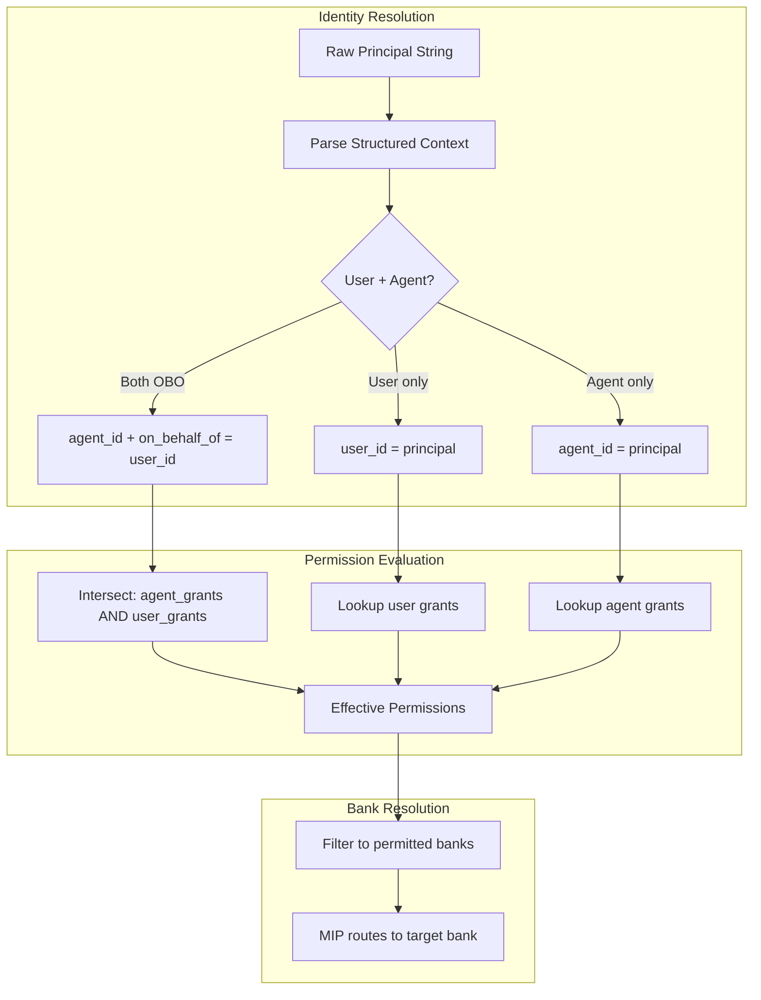

**Permission intersection**: When an agent operates on behalf of a user (`on_behalf_of`), the effective permission set is the intersection of the agent's grants and the user's grants. This prevents privilege escalation -- an agent with admin access cannot escalate a user who only has read access.

### 8. Config Schema Extensions (v1.0.0)

Current `astrocyte.yml` covers internal concerns only. v1.0.0 adds three new top-level sections:

```yaml
# --- Existing (unchanged) ---
provider_tier: storage
vector_store: pgvector
# ... (all existing config)

# --- New: External Sources ---
sources:
  crm_webhooks:
    type: webhook
    path: /ingest/crm
    auth: bearer_token
    extraction_profile: crm_contact
  slack_events:
    type: event_stream
    driver: kafka
    topic: slack-messages
    consumer_group: astrocyte-ingest
    extraction_profile: conversation
  jira_sync:
    type: api_poll
    url: https://jira.example.com/rest/api/3/search
    interval_seconds: 300
    auth: oauth2
    extraction_profile: ticket

# --- New: Agent Registration ---
agents:
  support-bot:
    banks: [customer_memories, kb_articles]
    permissions: [read, write]
    max_retain_per_minute: 60
  analyst-bot:
    banks: [analytics_data]
    permissions: [read]

# --- New: Deployment ---
deployment:
  mode: standalone  # "library" | "plugin" | "standalone"
  host: 0.0.0.0
  port: 8420
  workers: 4
  cors_origins: ["https://app.example.com"]
```

### 9. Known Bottlenecks and Future Work

| Bottleneck | Current Impact | Mitigation Path |
|---|---|---|
| pgvector IVFFlat degrades at >5M vectors per table | p95 search latency increases from ~10ms to ~50ms | HNSW index (higher memory, better recall); table-per-bank partitioning |
| Embedding API is on critical path for retain + recall | Single point of latency (~100ms per call) | Batch embedding, local embedding model fallback, embedding cache for identical queries |
| No graph store production implementation | Entity-aware recall unavailable | Prioritize Neo4j or FalkorDB adapter in v1.0.0 |
| No document store production implementation | BM25/keyword search unavailable | Prioritize Elasticsearch adapter in v1.0.0 |
| Single-process extraction pipeline | Ingest throughput capped at ~100 docs/sec | Worker pool + message queue for horizontal scaling |
| Callers must supply identity for AuthZ | Adapters pass context through, but apps still map IdP/session → `AstrocyteContext` | Document patterns per framework; optional helpers / Phase 2 auto-extraction (ADR-002) |

## Domain Model

### 1. Bounded Context Identification

Astrocyte's domain decomposes into five bounded contexts. Each was identified through language divergence analysis -- the same terms carry different meanings across these boundaries, and each context has a distinct consistency boundary and lifecycle.

#### 1.1 Subdomain Classification

| Bounded Context | Subdomain Type | Rationale |
|---|---|---|
| **Memory Core** | Core | The differentiating value proposition. Retain/recall/reflect/forget with intelligence pipeline (chunking, embedding, fusion, reranking). No competitor solves this the same way -- Astrocyte's layered memory model (fact/observation/model) and MIP routing are unique. |
| **Identity and Access** | Supporting | Enables Memory Core but is not itself a differentiator. Structured principal resolution, OBO delegation, permission intersection. The patterns are well-established (RBAC + delegation); the value is in correct integration, not novelty. |
| **Ingestion** | Supporting | New inbound extraction pipeline (webhook, stream, poll). Transforms raw external content into structured memories. Enables Memory Core but follows standard ETL-like patterns. |
| **Policy** | Supporting | PII barriers, homeostasis (rate limits, quotas, token budgets), signal quality (dedup, noisy bank detection), DLP, lifecycle/TTL. Cross-cutting enforcement that constrains Memory Core operations. |
| **Integration** | Generic | 19+ framework adapters (LangGraph, CrewAI, PydanticAI, etc.), MCP server, gateway plugins. These are thin translation layers conforming to external framework APIs. No domain logic lives here. |

#### 1.2 Language Divergence Evidence

The term **"principal"** is the primary divergence signal:

- In **Memory Core**: principal is irrelevant -- the core cares about `bank_id`, `content`, and `memory_layer`. Memory operations are identity-agnostic at the aggregate level.
- In **Identity and Access**: principal is the central concept -- it decomposes into `actor` (user/agent/service), `on_behalf_of` (delegation), and `effective_permissions` (grant intersection).
- In **Integration**: the adapter passes an optional `AstrocyteContext` through to the core; the app still decides what to put in it (opaque `principal` and/or structured `actor` / `on_behalf_of`). If omitted, behavior matches pre–ACL library usage (subject to `access_control.default_policy`).

The term **"bank"** also diverges:

- In **Memory Core**: a bank is a storage partition containing memories with a lifecycle configuration and layer semantics.
- In **Identity and Access**: a bank is a permission boundary -- the unit to which access grants are attached.
- In **Ingestion**: a bank is a routing target -- where extracted memories land after MIP routing.

The term **"content"** diverges between Ingestion and Memory Core:

- In **Ingestion**: content is raw, unprocessed input (HTML, JSON, plain text, conversation transcripts) from external sources.
- In **Memory Core**: content is processed text with metadata, embeddings, extracted entities, and assigned memory layers.

### 2. Context Map

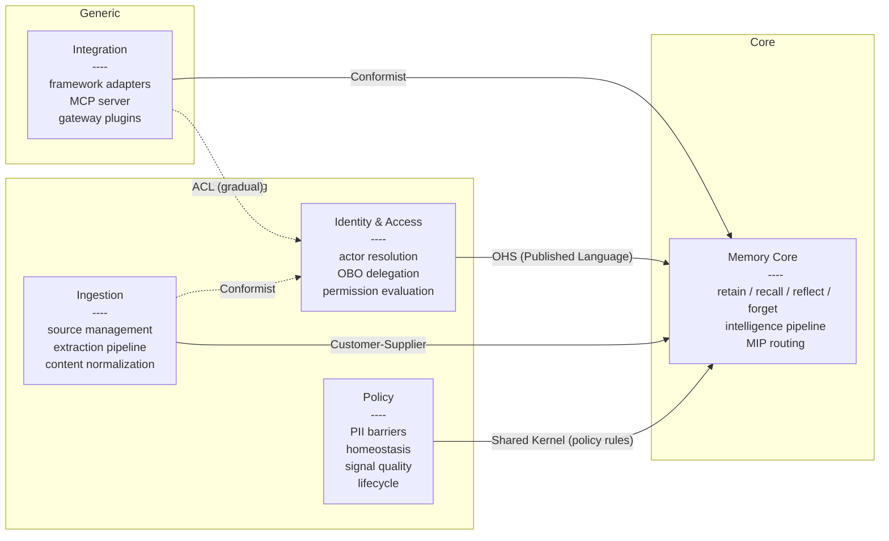

**Relationship rationale:**

| Relationship | Pattern | Why |
|---|---|---|
| Integration -> Memory Core | Conformist | Integrations adopt Memory Core's API verbatim (`brain.retain()`, `brain.recall()`). No translation needed -- the core API is the published language. |
| Integration -> Identity & Access | ACL (gradual) | Adapters can forward optional `AstrocyteContext` to the core. **Phase 2** (ADR-002) adds framework-native extraction (`RunnableConfig`, agent metadata, etc.) into that context automatically where possible; until then, apps pass identity explicitly when enabling ACL. |
| Identity & Access -> Memory Core | OHS + Published Language | Identity exposes a well-defined `AstrocyteContext` type (the published language) that Memory Core consumes for bank resolution and access filtering. Memory Core never queries identity internals -- it receives pre-evaluated `effective_permissions`. |
| Ingestion -> Memory Core | Customer-Supplier | Ingestion is downstream of Memory Core's `retain()` API. Ingestion negotiates what Memory Core accepts (content format, metadata schema, bank targeting). Memory Core does not know or care about ingestion sources. |
| Policy -> Memory Core | Shared Kernel | Policy rules (PII patterns, rate limit configs, TTL settings) are a small shared model. Both contexts depend on `BarrierConfig`, `HomeostasisConfig`, etc. Changes require agreement. The shared kernel is explicitly the `policy` config sub-tree and the `PiiMatch`/`DataClassification` types. |
| Ingestion -> Identity & Access | Conformist | Ingestion adopts Identity's principal model as-is for source authentication. Each `IngestSource` has a `principal` that governs which banks it can write to. |

### 3. Aggregate Design

#### 3.1 MemoryBank Aggregate

**Aggregate root**: `MemoryBank`
**Identity**: `bank_id: str` (opaque, user-assigned, immutable after creation)

```
MemoryBank (Aggregate Root)
  bank_id: BankId (value object — non-empty string, no whitespace)
  lifecycle_config: LifecycleConfig (value object)
  bank_config: BankConfig (value object — per-bank overrides for policy)
  status: BankStatus (value object — "active" | "archived" | "held")
  legal_holds: list[LegalHold] (value objects)
  created_at: datetime
```

**Invariants:**
1. A bank under legal hold cannot be deleted or have memories forgotten (hard invariant, must be transactionally consistent).
2. Bank status transitions are constrained: `active -> archived -> deleted`, `active -> held` (legal hold), `held -> active` (hold released). No skipping.
3. Per-bank config overrides must be a valid subset of top-level config (e.g., per-bank rate limits cannot exceed global maximums).

**Vernon's rules check:**
- Rule 1 (true invariants): Legal hold + status + lifecycle config share a consistency boundary -- a legal hold must atomically prevent deletion. Correct.
- Rule 2 (small aggregate): Root entity + value objects only. No child entities. Correct.
- Rule 3 (reference by identity): Memories reference `bank_id`, not the `MemoryBank` object. Access grants reference `bank_id`. Correct.
- Rule 4 (eventual consistency): Memory operations (retain/recall) do NOT modify the MemoryBank aggregate -- they operate on storage via `bank_id` reference. Bank-level metrics and health are computed asynchronously. Correct.

**Note**: Individual memories (`VectorItem`, `MemoryHit`) are NOT entities within the MemoryBank aggregate. They are stored in the vector/graph/document stores and referenced by `bank_id`. Memories have no cross-memory invariants that require transactional consistency within the bank -- each memory is independently retained, recalled, and forgotten. If memories were inside the aggregate, every `retain()` call would lock the entire bank. This is a deliberate boundary: MemoryBank owns configuration and lifecycle constraints; memories are independent records partitioned by `bank_id`.

#### 3.2 AstrocyteContext (Value Object, not Aggregate)

`AstrocyteContext` is a **value object**, not an aggregate. It has no lifecycle, no persistence, no identity. It is constructed per-request from caller-provided principals and destroyed when the request completes. It is immutable.

**Current structure** (backwards-compatible):

```
AstrocyteContext (Value Object)
  principal: str  # PRESERVED — backwards compatibility

  # v1.0.0 additions (all optional, derived from principal or explicit)
  actor: ActorIdentity | None
  on_behalf_of: ActorIdentity | None
  tenant_id: str | None
```

```
ActorIdentity (Value Object)
  type: ActorType  # "user" | "agent" | "service"
  id: str          # unique within type
  claims: dict[str, str] | None  # JWT claims, OIDC attributes
```

**Backwards compatibility strategy** (see ADR-002):
- If only `principal: str` is provided (current behavior), Astrocyte parses the convention (`agent:X`, `user:X`, `service:X`) to construct `ActorIdentity`. Unknown prefixes default to `type="user"`.
- If `actor` is explicitly provided, `principal` is ignored for identity resolution but remains available for logging and audit.
- `on_behalf_of` is always optional. When absent, `effective_permissions = actor_grants`. When present, `effective_permissions = actor_grants INTERSECT obo_grants`.

**Permission evaluation** (domain service, not aggregate method):

```
PermissionEvaluator (Domain Service)
  evaluate(context: AstrocyteContext, bank_id: str, operation: str) -> bool

  Logic:
    1. Resolve actor grants for bank_id
    2. If on_behalf_of present, resolve OBO grants for bank_id
    3. effective = actor_grants INTERSECT obo_grants (or actor_grants if no OBO)
    4. Return operation in effective
```

This is a domain service because it spans two references (actor grants + OBO grants) and does not belong to any single aggregate. The `AccessGrant` list is configuration data, not an aggregate.

#### 3.3 IngestSource Aggregate

**Aggregate root**: `IngestSource`
**Identity**: `source_id: str` (derived from config key, e.g., `crm_webhooks`)

```
IngestSource (Aggregate Root)
  source_id: SourceId (value object)
  source_type: SourceType ("webhook" | "event_stream" | "api_poll")
  connection_config: ConnectionConfig (value object — driver, URL, auth, topic, etc.)
  extraction_profile: ExtractionProfileId (reference by identity)
  target_bank_id: BankId (reference by identity)
  principal: str (identity for access control — what permissions does this source have?)
  schedule: PollSchedule | None (value object — interval, cron, for api_poll only)
  status: SourceStatus ("active" | "paused" | "errored")
  last_ingested_at: datetime | None
  error_count: int
```

**Invariants:**
1. An errored source must be explicitly reset before resuming (prevents infinite retry loops). After `error_threshold` consecutive failures, status transitions to `errored` and ingestion stops.
2. `schedule` is required when `source_type = "api_poll"` and forbidden for other types (type-specific validation).
3. `target_bank_id` must reference a bank the source's `principal` has `write` permission to (enforced at creation via PermissionEvaluator, not at runtime -- runtime access checks use the normal pipeline).

**Vernon's rules check:**
- Rule 1: Error tracking + status + schedule share a consistency boundary -- error threshold must atomically transition status. Correct.
- Rule 2: Root entity + value objects. No child entities. Correct.
- Rule 3: References `ExtractionProfileId` and `BankId` by identity, not by object. Correct.
- Rule 4: Extraction pipeline processing is eventually consistent -- the source emits raw content, the pipeline processes it asynchronously, memories appear in the target bank eventually. Correct.

#### 3.4 ExtractionProfile (Value Object)

```
ExtractionProfile (Value Object — loaded from config)
  profile_id: str
  content_type: str  # "html" | "json" | "text" | "conversation"
  chunking_strategy: str  # "paragraph" | "sentence" | "fixed_size" | "semantic"
  chunk_size: int | None
  entity_extraction: bool
  metadata_mapping: dict[str, str] | None  # source field -> memory metadata field
  tag_rules: list[TagRule] | None
```

Extraction profiles are configuration, not domain entities. They are defined in `astrocyte.yml` under `sources.*.extraction_profile` and loaded at startup. They have no lifecycle, no state transitions, and no invariants requiring transactional consistency. They are value objects -- two profiles with identical fields are interchangeable.

### 4. Extraction Pipeline Domain Model

The extraction pipeline is the inbound complement to the existing retrieval pipeline. It transforms raw external content into structured memories.

```
Source -> RawContent -> Normalizer -> NormalizedContent -> Chunker -> Chunk[] ->
  EntityExtractor -> EnrichedChunk[] -> Embedder -> EmbeddedChunk[] ->
  MIP Router -> retain() per chunk
```

**Domain events in the extraction pipeline:**

| Event | Trigger | Downstream Effect |
|---|---|---|
| `ContentReceived` | Webhook POST, stream message consumed, poll response returned | Starts extraction pipeline |
| `ContentNormalized` | Raw content converted to plain text with metadata | Next: chunking |
| `ChunksExtracted` | Content split into memory-sized chunks | Next: entity extraction |
| `EntitiesExtracted` | Named entities identified in chunks | Next: embedding |
| `ChunksEmbedded` | Vector embeddings computed for each chunk | Next: MIP routing |
| `MemoryRetained` | Chunk stored via `brain.retain()` in target bank | Terminal event |
| `IngestionFailed` | Any pipeline step fails | Increments `IngestSource.error_count`, may trigger status transition to `errored` |

**Note on ES/CQRS for the extraction pipeline** -- see Section 6.

### 5. Identity Model Evolution

The identity model evolves from an opaque string to a structured context. Full rationale in ADR-002. **Phase 1 is implemented in the OSS Python core** (v0.5.0 / M1–M2): types, ACL evaluation with OBO intersection, optional `identity` config (e.g. bank resolution), optional ADR-003 config sections (`sources`, `agents`, `deployment`, `extraction_profiles`), and optional `context` on all thin adapters.

**Migration path (three phases — version labels are product targets; see ADR-002 for detail):**

| Phase | Change | Breaking? |
|---|---|---|
| Phase 1 | `AstrocyteContext` gains optional `actor`, `on_behalf_of`, `tenant_id` fields. `principal` remains the primary field. If only `principal` is set, Astrocyte parses it to infer `ActorIdentity`. | No — fully additive. **Shipped in core.** |
| Phase 2 | Integrations gain framework-native extraction into `AstrocyteContext` where feasible; `principal` may become derived from `actor` with deprecation when only `principal` is set. | No — deprecation warning only (target v1.1.0). |
| Phase 3 | `principal: str` field removed. `actor: ActorIdentity` becomes required. | Yes — major version bump (v2.0.0). |

**Permission intersection model:**

```
Given:
  agent "support-bot" has grants: [read, write] on bank "customer_memories"
  user "calvin" has grants: [read] on bank "customer_memories"

When:
  AstrocyteContext(actor=agent:support-bot, on_behalf_of=user:calvin)

Then:
  effective_permissions("customer_memories") = {read, write} INTERSECT {read} = {read}
```

The agent can only do what both the agent AND the user are permitted to do. This prevents privilege escalation -- an agent with admin access cannot perform admin operations on behalf of a user who only has read access.

### 6. ES/CQRS Assessment

For each bounded context, assessed whether Event Sourcing and/or CQRS add value.

| Bounded Context | ES Recommended? | CQRS Recommended? | Rationale |
|---|---|---|---|
| **Memory Core** | No | Partial (already present) | Memories are not financial transactions -- there is no business requirement for temporal queries on memory state history or complete audit trails of memory mutations. The existing intelligence pipeline already implements a form of CQRS: the write path (retain with chunking, extraction, embedding) differs structurally from the read path (recall with multi-strategy retrieval, fusion, reranking). Formalizing this as explicit CQRS is unnecessary -- the current pipeline orchestrator handles the asymmetry well. Adding ES would impose event versioning, snapshot, and replay complexity for zero business value. |
| **Identity & Access** | No | No | Simple lookups. Grants are configuration data (CRUD). No audit trail requirement on grant history (if needed later, append-only audit log suffices without full ES). No temporal queries. No multiple views. |
| **Ingestion** | No | No | Pipeline processing is stateless transformation. `IngestSource` state (active/paused/errored) is simple enough for CRUD. If full audit of every ingestion run becomes a requirement, an append-only `ingestion_log` table is sufficient -- it does not warrant ES infrastructure. |
| **Policy** | No | No | Policy evaluation is stateless (config in, decision out). Rate limit counters are ephemeral in-memory state, not domain events. PII scan results are transient. Lifecycle TTL runs produce `AuditEvent` records, but these are already append-only log entries -- not event-sourced aggregates. |
| **Integration** | No | No | Thin translation layer. No domain state. |

**Summary**: Astrocyte does not warrant Event Sourcing in any bounded context for v1.0.0. The domain is fundamentally a memory store with an intelligence pipeline -- it stores and retrieves content, it does not track complex state transitions that benefit from event replay. CQRS is already implicitly present in Memory Core's asymmetric retain/recall pipelines. Making it explicit would add abstraction without value. If a future requirement introduces audit compliance (e.g., "show me exactly how this memory changed over the last 6 months"), ES can be introduced for MemoryBank specifically without affecting other contexts.

### 7. Ubiquitous Language

Terms are scoped per bounded context. When the same word appears in multiple contexts, it has a context-specific definition.

#### Memory Core

| Term | Definition |
|---|---|
| **Memory** | A unit of stored knowledge -- text content with metadata, tags, fact type, memory layer, and a vector embedding. Stored in a bank. |
| **Bank** | A named partition of memories. The primary isolation and configuration boundary. All memory operations require a `bank_id`. |
| **Retain** | The act of storing a memory. Includes embedding computation, entity extraction, deduplication, and MIP routing. |
| **Recall** | The act of retrieving relevant memories given a query. Includes multi-strategy retrieval (vector, keyword, graph, temporal), fusion, and reranking. |
| **Reflect** | The act of synthesizing an answer from recalled memories using an LLM. Adds reasoning, confidence assessment, and source attribution. |
| **Forget** | The act of deleting memories. Subject to legal hold constraints. |
| **Fact Type** | Classification of a memory's epistemic status: `world` (external facts), `experience` (interaction history), `observation` (inferred patterns). |
| **Memory Layer** | Hierarchical classification: `fact` (raw data), `observation` (patterns), `model` (synthesized understanding). Layers have configurable weights during recall. |
| **MIP Route** | A Memory Intent Protocol routing decision -- determines which bank a memory is stored in and what policies apply. Resolved by mechanical rules or LLM intent classification. |
| **Intelligence Pipeline** | The sequence of processing steps applied during retain (chunking, extraction, embedding, enrichment) and recall (retrieval, fusion, reranking). |

#### Identity & Access

| Term | Definition |
|---|---|
| **Actor** | The entity performing an operation. Has a type (user, agent, service), a unique ID, and optional claims from an external IdP. |
| **Principal** | The string representation of an actor. Format: `{type}:{id}`. Legacy: used as the sole identity field. v1.0.0+: derived from `ActorIdentity`. |
| **On-Behalf-Of (OBO)** | *On-behalf-of (delegated) access*: one identity acts for another (e.g. agent for user). Wording is **standard in OAuth and enterprise identity**; here, the agent’s and user’s grants are **intersected** per bank. |
| **Effective Permissions** | The computed permission set for an operation. When OBO is active: `agent_grants INTERSECT user_grants`. Without OBO: `actor_grants`. |
| **Access Grant** | A permission assignment: a principal is granted specific permissions (read, write, forget, admin) on a specific bank. Additive -- no deny rules. |
| **Bank Resolution** | The process of determining which banks an actor can access, given their effective permissions and the requested operation. |

#### Ingestion

| Term | Definition |
|---|---|
| **Source** | An external system providing data to Astrocyte. Configured with connection details, authentication, and an extraction profile. |
| **Extraction Profile** | Configuration defining how raw content from a source is transformed into memories: content type, chunking strategy, entity extraction settings, metadata mapping. |
| **Raw Content** | Unprocessed input from an external source (HTML, JSON, plain text, conversation transcript). |
| **Normalized Content** | Raw content converted to a standard format (plain text with structured metadata) for pipeline processing. |
| **Chunk** | A segment of normalized content sized appropriately for memory storage. Produced by the chunker stage of the extraction pipeline. |

#### Policy

| Term | Definition |
|---|---|
| **Barrier** | A policy enforcement gate that validates or transforms content before it enters memory. Three types: PII scanner, content validator, metadata sanitizer. |
| **Homeostasis** | Self-regulating constraints that keep memory operations within healthy bounds: rate limits, quotas, token budgets. |
| **Signal Quality** | Assessment of whether incoming memories add value: deduplication detection, noisy bank detection (high volume + low quality). |
| **Legal Hold** | An immutable constraint preventing deletion of memories in a specific bank. Overrides all other lifecycle policies. Set by compliance actors, not end users. |
| **Lifecycle** | Time-based memory management: archival after N days without recall, deletion after N days since creation. Subject to legal holds and tag exemptions. |
| **Escalation** | Degraded mode behavior when providers fail: circuit breaker patterns, empty recall fallbacks, cached responses. |

#### Integration

| Term | Definition |
|---|---|
| **Adapter** | A thin translation layer that maps a framework's API conventions to Astrocyte's core API. One adapter per framework. |
| **Brain** | The public-facing API object that framework adapters and end users interact with. Wraps `Astrocyte` core with ergonomic methods (`brain.retain()`, `brain.recall()`). |

## Application Architecture

### 1. Component Boundary Diagram

The following C4 Component diagram (Level 3) shows Astrocyte's internal structure within the library container (from the L2 Library Deployment diagram in Section 2a). This level of detail is warranted because Astrocyte has 6+ internal subsystems with distinct responsibilities and dependency directions.

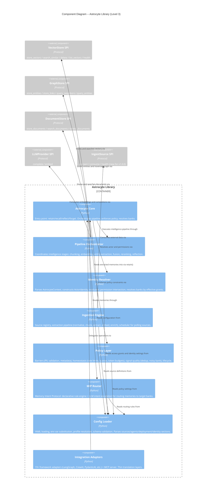

### 2. Hexagonal Architecture Analysis

Astrocyte already follows a ports-and-adapters pattern, though not always named as such. This section maps the existing codebase to explicit port/adapter terminology and identifies new ports required for v1.0.0.

#### 2.1 Primary Ports (Driving -- Inbound)

Primary ports define how external actors drive Astrocyte. These are the interfaces that agent frameworks, MCP clients, and gateway HTTP APIs call into.

| Port | Current Implementation | Driving Actors |
|---|---|---|
| **Core API** (`retain`, `recall`, `reflect`, `forget`) | `_astrocyte.py` -- `Astrocyte` class methods | All 19 integration adapters, direct Python callers, gateway HTTP API |
| **MCP Tools** | `mcp.py` -- exposes core API as MCP tool calls | MCP clients (Claude Desktop, any MCP-compatible tool consumer) |
| **Gateway HTTP API** (v1.0.0) | Not yet implemented | Non-Python agents, polyglot clients via REST |
| **Webhook Receiver** (v1.0.0) | Not yet implemented | External systems pushing data (CRM, Slack, CI/CD) |

**Key observation**: The `Astrocyte` class in `_astrocyte.py` is both the primary port and the orchestrator. This is acceptable in a library -- the class IS the public API. In standalone gateway mode, a thin HTTP layer (FastAPI routes) will delegate to the same `Astrocyte` instance, preserving the single orchestration path.

#### 2.2 Secondary Ports (Driven -- Outbound)

Secondary ports define how Astrocyte calls out to infrastructure. These are defined as Python `Protocol` classes in `provider.py`, making them explicit SPI contracts.

| Port (Protocol) | Current Adapters | Status |
|---|---|---|
| **VectorStore** | `astrocyte_pgvector.PgVectorStore`, `InMemoryVectorStore` (testing) | Production-ready |
| **GraphStore** | `astrocyte_neo4j.Neo4jGraphStore`, `InMemoryGraphStore` (testing) | Production-ready |
| **DocumentStore** | `astrocyte_elasticsearch.ElasticsearchDocumentStore`, `InMemoryDocumentStore` (testing) | Production-ready |
| **LLMProvider** | `OpenAIProvider` (`providers/openai.py`) | Production-ready |
| **EmbeddingProvider** | Shared with `LLMProvider.embed()` | Production-ready via OpenAI |

**SPI versioning**: Each Protocol has a `SPI_VERSION: ClassVar[int]` checked at registration time. This allows forward-compatible evolution -- new optional methods can be added in version 2+ without breaking existing adapters.

#### 2.3 New Ports for v1.0.0

| Port | Direction | Purpose | Protocol Shape |
|---|---|---|---|
| **IngestSource** | Secondary (driven) | Connect to external data sources (Kafka, Redis Streams, HTTP poll targets) | `connect()`, `consume() -> AsyncIterator[RawContent]`, `health()`, `close()` |
| **ExtractionPipeline** | Internal (domain service) | Transform raw content into structured memories | Not a port -- this is a domain service within the Ingestion bounded context. Uses existing pipeline stages (chunking, embedding, entity extraction) but with a different entry point (raw content vs agent-provided content). |
| **IdentityResolver** | Internal (domain service) | Parse principal strings, resolve ActorIdentity, evaluate permission intersection | Not a port -- this is a domain service within the Identity bounded context. Consumes `AstrocyteConfig.access_grants` and `AstrocyteConfig.agents` config. |

**Design decision**: `IngestSource` is a true secondary port (SPI) because source drivers are infrastructure-specific (Kafka client, HTTP client, Redis client). Different deployments need different drivers. `ExtractionPipeline` and `IdentityResolver` are NOT ports -- they are domain services that compose existing pipeline stages. Making them ports would over-abstract internal logic that has no reason to be swapped.

#### 2.4 Adapter Inventory

```
Primary Adapters (driving):
  astrocyte/integrations/langgraph.py      -> AstrocyteMemory (LangGraph/LangChain)
  astrocyte/integrations/crewai.py         -> AstrocyteCrewMemory (CrewAI)
  astrocyte/integrations/pydantic_ai.py    -> AstrocytePydanticMemory (PydanticAI)
  astrocyte/integrations/openai_agents.py  -> AstrocyteOpenAIMemory (OpenAI Agents SDK)
  astrocyte/integrations/claude_agent_sdk.py -> AstrocyteClaudeMemory (Claude Agent SDK)
  ... (14 more framework adapters)
  astrocyte/mcp.py                         -> MCP tool server

Secondary Adapters (driven):
  astrocyte_pgvector/store.py              -> PgVectorStore (PostgreSQL + pgvector)
  astrocyte/providers/openai.py            -> OpenAIProvider (LLM + embedding)
  astrocyte/testing/in_memory.py           -> InMemory{Vector,Graph,Document}Store (test doubles)
  astrocyte_kafka/consumer.py               -> KafkaIngestSource (planned)
  astrocyte_neo4j/store.py                  -> Neo4jGraphStore (shipped v0.8.0)
  astrocyte_elasticsearch/store.py          -> ElasticsearchDocumentStore (shipped v0.8.0)
```

#### 2.5 Dependency Direction

All dependencies point inward. The core (`_astrocyte.py`, `pipeline/`, `policy/`, `mip/`) depends only on `types.py` (DTOs) and `provider.py` (Protocol definitions). It never imports from `integrations/`, `providers/`, or any `astrocyte_*` adapter package. This is enforced by the package structure:

```
astrocyte/              (core package -- no infrastructure imports)
  _astrocyte.py         depends on: types, config, policy, pipeline, mip
  provider.py           depends on: types (Protocol definitions only)
  types.py              depends on: nothing (pure DTOs)
  pipeline/             depends on: types, provider (Protocols)
  policy/               depends on: types, config
  mip/                  depends on: types, provider (LLMProvider for intent)
  integrations/         depends on: _astrocyte (inward dependency, correct)
  config.py             depends on: types

astrocyte_pgvector/     (separate package -- adapter)
  depends on: astrocyte.provider.VectorStore, astrocyte.types

astrocyte_neo4j/        (shipped v0.8.0 -- separate package)
  depends on: astrocyte.provider.GraphStore, astrocyte.types
```

**Enforcement recommendation**: Use `import-linter` (MIT license, Python) to codify these dependency rules as automated checks in CI. Rules:

1. `astrocyte.pipeline` must not import from `astrocyte.integrations`
2. `astrocyte.policy` must not import from `astrocyte.integrations`
3. `astrocyte._astrocyte` must not import from any `astrocyte_*` adapter package
4. `astrocyte.types` must not import from any other `astrocyte` submodule

### 3. Config Schema Evolution

Full rationale and alternatives analysis in ADR-003 (`./adr/adr-003-config-schema.md`).

#### 3.1 New Top-Level Sections

Four new optional sections are added to `AstrocyteConfig`. All default to `None`, preserving backwards compatibility.

```yaml
# --- Existing (unchanged) ---
provider_tier: storage
vector_store: pgvector
homeostasis:
  rate_limits:
    retain_per_minute: 120
barriers:
  pii:
    mode: regex
    action: redact
# ... all existing config fields unchanged ...

# --- New: External Data Sources ---
sources:
  crm_webhooks:
    type: webhook                    # "webhook" | "event_stream" | "api_poll"
    path: /ingest/crm               # Webhook endpoint path
    auth:
      method: bearer_token
      token_env: CRM_WEBHOOK_TOKEN  # Env var indirection for secrets
    extraction_profile: crm_contact  # References extraction_profiles section
    target_bank: customer_data       # Default bank (MIP can override per-memory)
    principal: service:crm-integration  # Identity for access control

  slack_events:
    type: event_stream
    driver: kafka                    # "kafka" | "redis_streams" | "nats"
    topic: slack-messages
    consumer_group: astrocyte-ingest
    extraction_profile: conversation
    target_bank: team_conversations
    principal: service:slack-integration

  jira_sync:
    type: api_poll
    url: https://jira.example.com/rest/api/3/search
    interval_seconds: 300
    auth:
      method: oauth2
      token_url_env: JIRA_TOKEN_URL
      client_id_env: JIRA_CLIENT_ID
      client_secret_env: JIRA_CLIENT_SECRET
    extraction_profile: ticket
    target_bank: project_tickets
    principal: service:jira-integration

# --- New: Extraction Profiles ---
extraction_profiles:
  crm_contact:
    content_type: json               # "json" | "html" | "text" | "conversation"
    chunking_strategy: semantic       # "paragraph" | "sentence" | "fixed_size" | "semantic"
    entity_extraction: true
    metadata_mapping:
      "$.name": contact_name
      "$.email": contact_email
    tag_rules:
      - match: "$.type == 'lead'"
        tags: [lead, prospect]

  conversation:
    content_type: text
    chunking_strategy: paragraph
    entity_extraction: true

  ticket:
    content_type: json
    chunking_strategy: fixed_size
    chunk_size: 1000
    entity_extraction: true
    metadata_mapping:
      "$.key": ticket_id
      "$.fields.summary": title

# --- New: Agent Registration ---
agents:
  support-bot:
    banks: [customer_memories, kb_articles]
    permissions: [read, write]
    max_retain_per_minute: 60        # Overrides global rate limit for this agent
    max_recall_per_minute: 120

  analyst-bot:
    banks: [analytics_data, customer_memories]
    permissions: [read]
    max_recall_per_minute: 200

# --- New: Deployment Mode ---
deployment:
  mode: library                      # "library" | "standalone"
  # Fields below only apply when mode = "standalone"
  host: 0.0.0.0
  port: 8420
  workers: 4
  cors_origins: ["https://app.example.com"]

# --- New: Identity Configuration ---
identity:
  default_actor_type: user           # When principal has no type prefix
  allow_anonymous: false             # Require principal on every operation
  trusted_issuers:                   # JWT/OIDC validation (standalone mode only)
    - issuer: https://auth.example.com
      audience: astrocyte
      jwks_uri: https://auth.example.com/.well-known/jwks.json
```

#### 3.2 Composition Rules

**Sources + MIP**: A source's `target_bank` is the default routing destination. When MIP rules exist, extracted memories pass through MIP routing after extraction. MIP can override the target bank based on content analysis, tags, or metadata. This means:

1. Source config defines WHERE data comes FROM and HOW it is extracted.
2. MIP config defines WHERE memories are ROUTED TO.
3. If no MIP rules match, the source's `target_bank` is used as fallback.

**Agents + Access Grants**: Agent definitions in the `agents:` section auto-generate `AccessGrant` entries at config load time. These are merged with explicit `access_grants:` entries. If both define grants for the same agent-bank pair, the union of permissions is taken (additive model, consistent with existing semantics).

**Deployment + Identity**: When `deployment.mode = "standalone"`, the `identity.trusted_issuers` config is used for JWT validation on incoming HTTP requests. In library mode, identity resolution relies solely on the `AstrocyteContext` passed by the caller -- no JWT validation is performed.

#### 3.3 Dataclass Mapping

Each new config section maps to a new sub-dataclass added to `AstrocyteConfig`:

```
AstrocyteConfig (extended)
  ... existing fields ...
  sources: dict[str, SourceConfig] | None = None
  extraction_profiles: dict[str, ExtractionProfileConfig] | None = None
  agents: dict[str, AgentConfig] | None = None
  deployment: DeploymentConfig | None = None
  identity: IdentityConfig | None = None
```

**Backwards compatibility**: All five new fields default to `None`. The existing `load_config()` function in `config.py` uses `_substitute_env_vars()` for env var resolution and constructs dataclasses from YAML dicts. New sections are parsed only if present in the YAML. Missing sections produce `None` values, and all code paths check for `None` before accessing these configs.

### 4. Integration Pattern Evolution

#### 4.1 Current State

All thin integration adapters follow the same pattern:

1. Wrap an `Astrocyte` instance.
2. Map framework-specific operations to `brain.retain()` / `brain.recall()` / etc.
3. Accept an **optional** `AstrocyteContext` (keyword `context` on class constructors or tool factories; MCP uses `astrocyte_context` on `create_mcp_server`). If omitted, calls behave as before — no identity on the wire unless the app adds it later.

Example (LangGraph adapter):
```
AstrocyteMemory.__init__(brain, bank_id, context=None)
AstrocyteMemory.save_context(inputs, outputs)
  -> brain.retain(content, bank_id, context=self._context)
AstrocyteMemory.search(query)
  -> brain.recall(query, bank_id, context=self._context)
```

#### 4.2 Migration Strategy

**Phase 1 (shipped)** — optional context on adapters is **done** in OSS; callers opt in when they enable access control or need OBO.

Further evolution follows ADR-002:

**Phase 2 (target v1.1.0) — Framework-native context extraction**: Each adapter may extract identity from the framework's native context mechanism (not implemented yet in OSS — apps pass `AstrocyteContext` explicitly for now):

- **LangGraph**: Extract from `RunnableConfig` (`config["configurable"]["user_id"]`)
- **CrewAI**: Extract from `Agent.metadata`
- **PydanticAI**: Extract from `RunContext.deps`
- **OpenAI Agents SDK**: Extract from tool call metadata
- **Claude Agent SDK**: Extract from managed agent context

Each adapter implements a `_resolve_context()` method that maps framework-specific identity to `AstrocyteContext`. This is the ACL (Anti-Corruption Layer) from the context map in the Domain Model section.

**Phase 3 (v2.0.0) -- Context required**: `context` parameter becomes required (major version bump). Adapters that cannot extract context from the framework must require it in the constructor.

#### 4.3 Adapter Interface Contract

All adapters must satisfy these behavioral contracts (not enforced by type system, but by acceptance tests):

1. **Passthrough**: Adapter must not modify memory content. Policy enforcement happens in core.
2. **Context propagation**: If context is available, adapter must pass it to every core operation.
3. **Error transparency**: Adapter must surface core exceptions (AccessDenied, RateLimited) to the framework, not swallow them.
4. **Bank resolution**: Adapter may map framework concepts to bank IDs (e.g., LangGraph thread -> bank) but must not bypass core's bank resolution.

### 5. Technology Stack

#### 5.1 Primary Language: Python

Python is the primary implementation language. The codebase uses Python 3.11+ with:
- `asyncio` for non-blocking I/O (all provider SPIs are async)
- `dataclasses` for DTOs and configuration (FFI-safe, no `Any` types)
- `Protocol` classes for SPI definitions (structural subtyping, no inheritance required)
- Type hints throughout (`types.py` is fully typed)

**Rationale**: The target user base is AI agent developers, overwhelmingly Python-first. All 19 supported frameworks are Python. The library deployment model requires same-language embedding.

#### 5.2 Rust Strategy

The existing architecture documents reference a Rust strategy for performance-critical paths. This remains unchanged:
- **Core types** (`types.py`) are designed to be FFI-safe (no `Any`, no callables, no generators) to enable future Rust reimplementation of hot paths via PyO3.
- **Candidate modules for Rust**: embedding cache, vector similarity computation, PII pattern matching (regex engine), chunking.
- **Timeline**: Post-v1.0.0. Performance profiling will identify actual bottlenecks before committing to Rust.

#### 5.3 Key Dependencies (v1.0.0)

| Dependency | Version | License | Purpose | Alternatives Considered |
|---|---|---|---|---|
| **asyncpg** | 0.30+ | Apache 2.0 | PostgreSQL async driver (pgvector) | psycopg3 (async mode) -- viable but asyncpg has better raw performance for bulk vector ops |
| **PyYAML** | 6.0+ | MIT | Config file parsing | tomli (TOML) -- YAML is more human-friendly for complex nested config with list structures |
| **FastAPI** | 0.115+ | MIT | HTTP API for standalone gateway | Litestar -- viable, less ecosystem adoption; Starlette -- too low-level for auto-docs |
| **Uvicorn** | 0.34+ | BSD-3 | ASGI server | Hypercorn -- viable alternative, FastAPI docs recommend Uvicorn |
| **pact-python** | 2.2+ | MIT | Consumer-driven contract testing (external integrations) | None at this maturity level for Python |
| **import-linter** | 2.1+ | BSD-2 | Architecture dependency rule enforcement | pytest-archon -- less mature; manual review -- not automated |
| **structlog** | 24.0+ | Apache 2.0 | Structured logging (observability) | stdlib logging -- insufficient structure for production observability |
| **opentelemetry-api** | 1.28+ | Apache 2.0 | Distributed tracing (optional) | Datadog/New Relic SDKs -- proprietary, violates OSS-first principle |
| **aiokafka** | 0.12+ | Apache 2.0 | Kafka consumer for event stream ingestion | confluent-kafka-python -- C extension, harder to install; kafka-python -- no async |
| **APScheduler** | 4.0+ | MIT | Scheduling for API poll sources | Celery -- too heavy for in-process scheduling; cron -- external dependency |

#### 5.4 Planned Adapter Packages (separate from core)

| Package | Purpose | License | Notes |
|---|---|---|---|
| `astrocyte-pgvector` | PostgreSQL + pgvector vector store | MIT | Already exists |
| `astrocyte-neo4j` | Neo4j graph store | MIT | Shipped v0.8.0 |
| `astrocyte-elasticsearch` | Elasticsearch document store | MIT | Shipped v0.8.0 |
| `astrocyte-falkordb` | FalkorDB graph store (Redis-based) | MIT | Post-v1.0.0 |
| `astrocyte-kafka` | Kafka ingest source adapter | MIT | Planned v1.0.0 |
| `astrocyte-redis-streams` | Redis Streams ingest source adapter | MIT | Planned v1.0.0 |

### 6. Component Interaction Sequences

#### 6.1 Retain with Structured Identity (OBO)

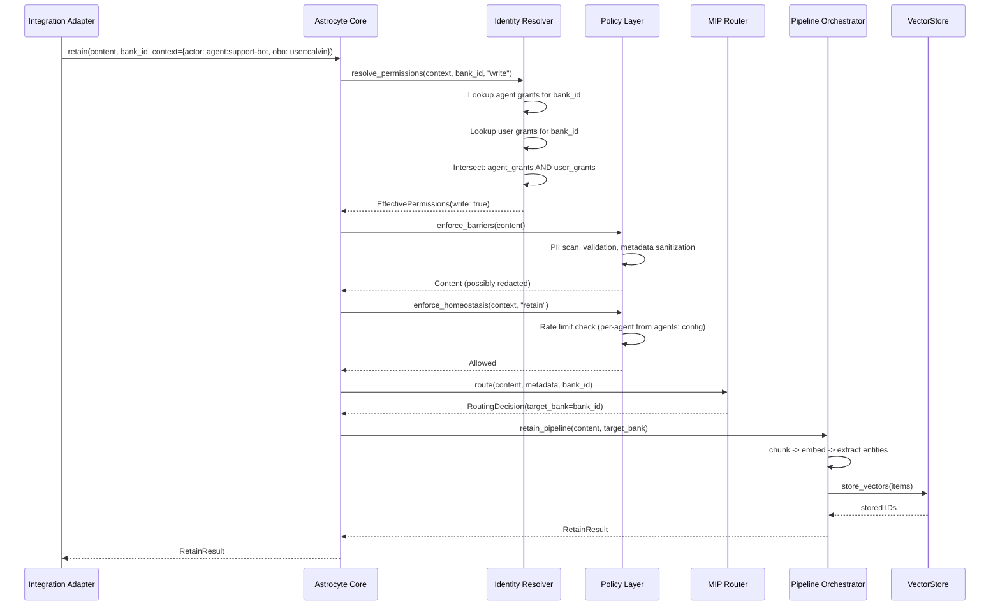

#### 6.2 Ingest from Webhook to Extraction to Retain

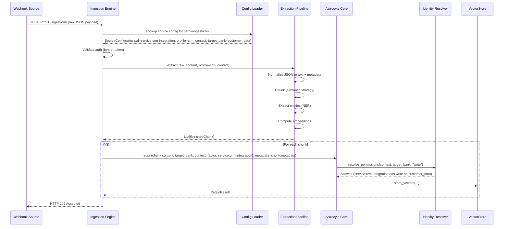

#### 6.3 Recall with Identity-Driven Bank Resolution

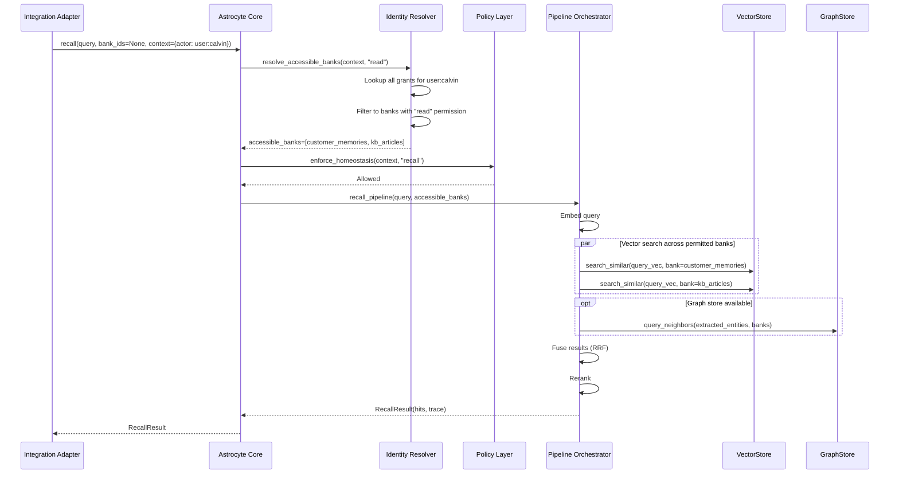

**Key behavior in 6.3**: When `bank_ids=None` (no explicit bank specified), the Identity Resolver determines which banks the actor can access. This is **identity-driven bank resolution** -- the caller does not need to know which banks exist, only their identity. The system resolves access automatically from grants. When `bank_ids` is explicitly provided, the Identity Resolver validates that the actor has read permission on each specified bank and rejects unauthorized ones.

### 7. Architectural Enforcement

To prevent architecture erosion over time, the following automated rules are recommended for CI enforcement using `import-linter` (BSD-2 license):

```ini
# .importlinter configuration (pyproject.toml or setup.cfg)

[importlinter]
root_packages = astrocyte

[importlinter:contract:core-no-adapters]
name = Core must not import from integration adapters
type = forbidden
source_modules =
    astrocyte._astrocyte
    astrocyte.pipeline
    astrocyte.policy
    astrocyte.mip
forbidden_modules =
    astrocyte.integrations

[importlinter:contract:types-independence]
name = Types module must not import from other astrocyte modules
type = independence
modules =
    astrocyte.types

[importlinter:contract:adapters-depend-inward]
name = Integration adapters depend only on core API and types
type = layers
layers =
    astrocyte.integrations
    astrocyte._astrocyte
    astrocyte.types
```

Additionally, each `astrocyte_*` adapter package (pgvector, neo4j, elasticsearch) must be validated to import only from `astrocyte.provider` and `astrocyte.types` -- never from `astrocyte._astrocyte` or other internal modules. This is enforced by the separate-package boundary (adapter packages have their own `pyproject.toml` and cannot accidentally import internal modules unless they explicitly add the core package to their dependency list).

### 8. External Integration Annotations

The following external integrations require contract testing annotation for handoff to platform-architect:

```
External Integrations Requiring Contract Tests:

- OpenAI API (REST): Astrocyte consumes /v1/embeddings and /v1/chat/completions
  for embedding generation, entity extraction, and reflection synthesis.
  Recommended: consumer-driven contracts via pact-python in CI acceptance stage.

- Identity Provider / OIDC (REST): Standalone gateway validates JWT tokens via
  JWKS endpoint (/.well-known/jwks.json) and token introspection.
  Recommended: consumer-driven contracts via pact-python in CI acceptance stage.

- Kafka Brokers (binary protocol): Event stream ingestion sources consume
  from Kafka topics. Schema changes in upstream producers can break extraction.
  Recommended: Schema Registry integration with compatibility checks.

- Webhook Sources (HTTP POST): Inbound webhooks from CRM, Slack, Jira, etc.
  carry payloads that extraction profiles depend on.
  Recommended: consumer-driven contracts via pact-python. Each source's
  extraction_profile defines the expected payload schema -- this IS the contract.

- pgvector / PostgreSQL (SQL): Vector store operations depend on pgvector
  extension behavior (HNSW/IVFFlat index semantics, distance functions).
  Recommended: integration tests against pinned PostgreSQL + pgvector versions
  in CI. Not a contract test candidate (SQL is the stable contract).
```

### 9. Quality Attribute Strategies

| Quality Attribute | Strategy | Implementation Boundary |
|---|---|---|
| **Maintainability** | Ports-and-adapters with enforced dependency rules (import-linter). Separate packages for vendor adapters. Modular config sub-dataclasses. | Core package + adapter packages |
| **Testability** | All secondary ports are `Protocol` classes -- test doubles via `InMemory*` implementations in `testing/`. Integration adapters testable against core API without infrastructure. | `astrocyte.testing` package |
| **Security** | PII barriers on all write paths. Permission intersection for OBO. JWT validation in standalone mode. Env var indirection for secrets in config. DLP scanning on recall/reflect output. | `policy/` + `identity/` |
| **Reliability** | Circuit breaker on LLM/embedding calls (existing `escalation.py`). Degraded mode fallbacks. IngestSource error threshold with automatic pause. | `policy/escalation.py` + `ingestion/` |
| **Performance** | Async I/O throughout. Connection pooling (asyncpg). Recall cache (LRU, configurable). Parallel multi-bank search. Embedding batching. | `pipeline/` + provider adapters |
| **Portability** | FFI-safe types (no `Any`, no callables). SPI Protocol pattern. Separate adapter packages. Rust-ready type system. | `types.py` + `provider.py` |
| **Interoperability** | 19+ framework adapters. MCP server. REST API (standalone). YAML config. OpenTelemetry for observability. | `integrations/` + `mcp.py` + gateway HTTP |

### 10. Handoff Summary

**For platform-architect (DEVOPS wave)**:

- **Architecture style**: Modular monolith with ports-and-adapters (dependency inversion). Single deployable unit (library or standalone gateway). No microservices.
- **Component boundaries**: Core | Pipeline | Identity | Ingestion | Policy | MIP | Config | Integrations. Dependencies flow inward to Core and Types.
- **Technology stack**: Python 3.11+, asyncio, asyncpg, FastAPI (standalone), PyYAML. See Section 5.3 for full dependency table.
- **Development paradigm**: Object-oriented with Protocol-based structural subtyping (Python Protocols, not ABC inheritance). Dataclasses for DTOs. Async/await throughout.
- **ADRs**: [ADR-001](./adr/adr-001-deployment-models.md) (Deployment Models), [ADR-002](./adr/adr-002-identity-model.md) (Identity Model), [ADR-003](./adr/adr-003-config-schema.md) (Config Schema Evolution).
- **Quality attributes**: Maintainability (primary), testability, security, reliability, performance. See Section 9.
- **Integration patterns**: Sync in-process calls (library mode), HTTP REST (standalone mode), async event consumption (ingestion). See Section 6 for sequence diagrams.
- **External integrations**: OpenAI API, Identity Provider (OIDC), Kafka, webhook sources, pgvector/PostgreSQL. Contract tests recommended for OpenAI and OIDC via pact-python. See Section 8.
- **Architectural enforcement**: import-linter for dependency rules in CI. See Section 7.
