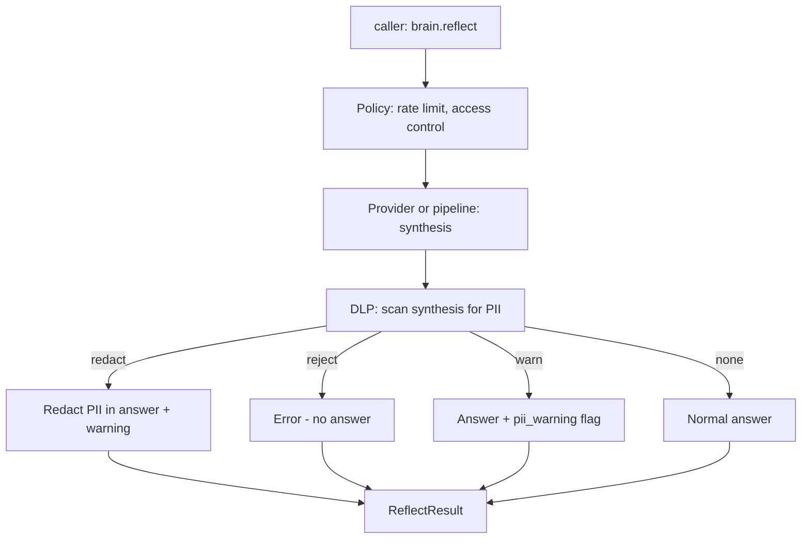

# Data governance and privacy

This document defines Astrocytes' unified approach to data classification, PII handling, data residency, encryption, regulatory compliance, data lineage, and data loss prevention. It consolidates and extends the scattered governance features across the policy layer (`policy-layer.md`), lifecycle management (`memory-lifecycle.md`), access control (`access-control.md`), and event hooks (`event-hooks.md`).

This maps to **Principle 6 (Barrier maintenance)** - the blood-brain barrier is not just a wall, it is a **selective, actively maintained boundary** that classifies what crosses, enforces rules per-substance, and adapts to threats.

---

## 1. Data classification

### 1.1 Classification levels

Every piece of content entering the retain path is classified into a sensitivity level. Classification drives all downstream governance decisions.

| Level | Label | Description | Examples |
|---|---|---|---|
| 0 | `public` | No restrictions. Safe to store, synthesize, export. | Product docs, public FAQs, general knowledge |
| 1 | `internal` | Not sensitive, but not for external sharing. | Internal processes, team preferences, project context |
| 2 | `confidential` | Business-sensitive. Restricted access, audit required. | Customer data, financial metrics, trade secrets, strategic plans |
| 3 | `restricted` | Regulated data. Legal requirements govern handling. | PII, PHI, PCI, ITAR, legal privilege |

### 1.2 Classification mechanisms

Classification can be assigned three ways, in priority order:

1. **Explicit**: caller sets `classification` in retain metadata
2. **Rule-based**: pattern matching against configured rules (regex, keyword lists)
3. **Automatic**: LLM-based classification on the retain path

```yaml
governance:
  classification:
    default_level: internal              # When no classifier matches
    auto_classify: true                  # Enable automatic classification
    auto_classify_mode: rules            # "rules" | "llm" | "rules_then_llm"
```

### 1.3 Sub-classification: data categories

Within the `restricted` level, data is categorized by regulatory domain:

| Category | Code | Regulatory context |
|---|---|---|
| Personally Identifiable Information | `PII` | GDPR, PDPA, CCPA, LGPD |
| Protected Health Information | `PHI` | HIPAA, local health data laws |
| Payment Card Industry data | `PCI` | PCI-DSS |
| Financial data | `FIN` | SOX, MAS regulations |
| Legal privilege | `LEGAL` | Attorney-client privilege |
| Trade secrets | `TRADE` | Trade secret law, NDA obligations |
| Children's data | `COPPA` | COPPA, age-gated processing |

```python
@dataclass
class DataClassification:
    level: int                           # 0-3
    label: str                           # "public", "internal", "confidential", "restricted"
    categories: list[str]                # ["PII", "PHI", etc.] - for restricted data
    classified_by: str                   # "caller", "rules", "llm"
    classified_at: datetime
```

---

## 2. PII detection and handling

### 2.1 Detection taxonomy

The PII barrier (introduced in `policy-layer.md` section 2.1) detects specific PII types:

| PII type | Detection method | Examples |
|---|---|---|
| `email` | Regex | user@example.com |
| `phone` | Regex | +1-555-0123, (555) 012-3456 |
| `ssn` | Regex | 123-45-6789 |
| `credit_card` | Regex + Luhn check | 4111-1111-1111-1111 |
| `passport` | Regex (country-specific) | A12345678 |
| `ip_address` | Regex | 192.168.1.1, 2001:db8::1 |
| `date_of_birth` | Regex + context | 1990-01-15, "born on January 15" |
| `address` | NER / LLM | "123 Main St, Anytown, CA 90210" |
| `name` | NER / LLM | Personal names in context |
| `medical_record` | LLM | Diagnosis, treatment, conditions |
| `financial_account` | Regex | Bank account numbers, routing numbers |
| `national_id` | Regex (country-specific) | NRIC (SG), Aadhaar (IN), etc. |

### 2.2 Detection modes

| Mode | How it works | Cost | Accuracy |
|---|---|---|---|
| `regex` | Pattern matching against configured patterns | Zero (CPU only) | High for structured PII (email, SSN), low for unstructured (names, addresses) |
| `ner` | Named entity recognition via spaCy or similar | Low (local model) | Good for names, orgs, locations. Misses context-dependent PII. |
| `llm` | LLM classifies content for sensitive data | Medium (API call) | Best. Catches context-dependent PII ("my mother's maiden name is Smith"). |
| `rules_then_llm` | Regex first, LLM only if regex finds nothing | Medium | Best coverage with cost optimization. |

### 2.3 Actions per PII type

Different PII types can have different actions:

```yaml
governance:
  pii:
    mode: rules_then_llm
    default_action: redact
    type_overrides:
      email:
        action: redact
        replacement: "[EMAIL_REDACTED]"
      credit_card:
        action: reject                   # Never store credit cards
      name:
        action: warn                     # Names are often needed for context
      medical_record:
        action: reject
      address:
        action: redact
        replacement: "[ADDRESS_REDACTED]"
```

### 2.4 Redaction strategy

When `action: redact`:

```
Input:  "Calvin's email is calvin@example.com and he lives at 123 Main St"
Output: "Calvin's email is [EMAIL_REDACTED] and he lives at [ADDRESS_REDACTED]"
```

Redaction is **applied before the content reaches the memory provider**. The provider never sees the original content. This is the BBB - the barrier is at the boundary, not inside the brain.

**Reversible redaction** (optional, for authorized recovery):

```yaml
governance:
  pii:
    redaction:
      reversible: true                   # Store encrypted original alongside redacted
      encryption_key_ref: ${PII_ENCRYPTION_KEY}
```

When `reversible: true`, the original PII is encrypted and stored in a separate, access-controlled field. Only principals with `admin` permission and explicit `pii_access` grant can decrypt.

---

## 3. Data residency

### 3.1 The problem

Regulations require certain data to stay within geographic boundaries:
- GDPR: EU personal data must be processed within the EU (or with adequate safeguards)
- PDPA: Singapore personal data has cross-border transfer restrictions
- China PIPL: personal data often must remain in China

Memory systems involve two data flows that cross boundaries:
1. **Storage**: where the memory provider stores vectors and metadata
2. **LLM processing**: where retain (entity extraction) and reflect (synthesis) send content

### 3.2 Residency zones

```yaml
governance:
  residency:
    zones:
      eu:
        regions: [eu-west-1, eu-central-1]
        regulations: [gdpr]
      sg:
        regions: [ap-southeast-1]
        regulations: [pdpa]
      us:
        regions: [us-east-1, us-west-2]
        regulations: [ccpa, hipaa]

    bank_assignments:
      "user-eu-*":                       # Wildcard matching
        zone: eu
      "user-sg-*":
        zone: sg
      default:
        zone: us
```

### 3.3 Residency enforcement

When a bank is assigned to a residency zone:

- **Tier 1 (retrieval)**: the framework validates that the configured retrieval provider's region matches the zone. Misconfiguration is a **startup error** (fail-fast).
- **LLM calls**: the framework routes LLM provider calls to region-appropriate endpoints.

```yaml
governance:
  residency:
    llm_routing:
      eu:
        llm_provider: litellm
        llm_provider_config:
          model: azure/gpt-4o
          api_base: https://eu-west.openai.azure.com  # EU endpoint
      sg:
        llm_provider: litellm
        llm_provider_config:
          model: bedrock/anthropic.claude-sonnet-4-20250514-v1:0
          aws_region: ap-southeast-1                     # Singapore
```

### 3.4 Cross-border transfer controls

Multi-bank recall across zones requires explicit configuration:

```yaml
governance:
  residency:
    cross_border:
      allowed: false                     # Default: no cross-zone recall
      exceptions:
        - from: eu
          to: us
          requires: [adequacy_decision]  # Document the legal basis
          log: true                      # Audit every cross-border access
```

When `allowed: false` and a multi-bank recall spans zones, the framework either:
- Excludes banks from other zones (with a warning in the result)
- Returns `CrossBorderViolation` error (if `strict: true`)

---

## 4. Encryption

### 4.1 In-transit

All provider communication must use TLS. The framework validates:
- Tier 1 retrieval provider endpoints use `https://` or encrypted database connections (SSL mode)
- LLM provider endpoints use `https://`
- MCP server SSE transport uses TLS when exposed externally

```yaml
governance:
  encryption:
    require_tls: true                    # Reject non-TLS provider endpoints
    min_tls_version: "1.2"
```

### 4.2 At-rest

At-rest encryption is **the provider's responsibility** (database-level encryption, cloud KMS). Astrocytes validates that the provider reports encryption capability:

```python
class EngineCapabilities:
    # ... existing fields ...
    encryption_at_rest: bool = False      # Does the provider encrypt stored data?

class VectorStore(Protocol):
    def storage_info(self) -> StorageInfo:
        """Report storage characteristics including encryption."""
        ...

@dataclass
class StorageInfo:
    encrypted_at_rest: bool
    encryption_method: str | None        # "AES-256", "AWS KMS", etc.
    region: str | None                   # Where data is physically stored
```

If `governance.encryption.require_at_rest: true` and the provider reports `encrypted_at_rest: false`, the framework refuses to initialize.

### 4.3 Field-level encryption

For sensitive metadata fields, the framework can encrypt specific values before passing to the provider:

```yaml
governance:
  encryption:
    field_level:
      enabled: true
      key_ref: ${FIELD_ENCRYPTION_KEY}
      encrypted_metadata_keys:
        - customer_id
        - account_number
        - internal_reference
```

Encrypted fields are stored as opaque ciphertext in the provider. They can be decrypted by the framework on recall. The provider cannot read them.

---

## 5. Regulatory compliance profiles

### 5.1 Pre-built compliance configurations

Like use-case profiles (`use-case-profiles.md`), compliance profiles configure governance policies for specific regulatory regimes:

```yaml
governance:
  compliance_profile: gdpr               # "gdpr" | "hipaa" | "pdpa" | "ccpa" | "pci" | "none"
```

### 5.2 Profile definitions

**GDPR profile:**

```yaml
# governance.compliance_profiles.gdpr
classification:
  auto_classify: true
  auto_classify_mode: rules_then_llm
pii:
  mode: rules_then_llm
  default_action: redact
  type_overrides:
    name: { action: redact }
    email: { action: redact }
    phone: { action: redact }
    address: { action: redact }
lifecycle:
  right_to_forget: true                  # brain.forget(compliance=True) available
  ttl:
    archive_unretrieved_after_days: 365
    delete_archived_after_days: 730      # 2 years max retention
  audit:
    enabled: true
    retention_days: 2555                 # 7 years for audit records
residency:
  cross_border:
    allowed: false                       # Default deny cross-border
encryption:
  require_tls: true
  require_at_rest: true
access_control:
  enabled: true
  default_policy: deny                   # Explicit grants required
dlp:
  enabled: true
  block_pii_in_reflect: true             # Don't synthesize PII into answers
  block_pii_in_export: true
```

**HIPAA profile:**

```yaml
# governance.compliance_profiles.hipaa
classification:
  auto_classify: true
  auto_classify_mode: llm               # LLM is best at detecting PHI
pii:
  mode: llm
  default_action: reject                 # HIPAA: don't store PHI unless explicitly designed for it
  type_overrides:
    medical_record: { action: reject }
    name: { action: redact }
lifecycle:
  audit:
    enabled: true
    retention_days: 2555
    include_content_hash: true           # Audit record includes content hash (not content)
encryption:
  require_tls: true
  require_at_rest: true
  field_level:
    enabled: true
access_control:
  enabled: true
  default_policy: deny
dlp:
  enabled: true
  block_phi_in_reflect: true
```

**PDPA (Singapore) profile:**

```yaml
# governance.compliance_profiles.pdpa
classification:
  auto_classify: true
  auto_classify_mode: rules_then_llm
pii:
  mode: rules_then_llm
  default_action: redact
  type_overrides:
    national_id: { action: reject }      # NRIC must not be stored
lifecycle:
  right_to_forget: true
  ttl:
    delete_archived_after_days: 1825     # 5 years max retention (common PDPA guidance)
  audit:
    enabled: true
residency:
  cross_border:
    allowed: true                        # PDPA allows with safeguards
    requires: [transfer_impact_assessment]
    log: true
encryption:
  require_tls: true
access_control:
  enabled: true
  default_policy: owner_only
```

### 5.3 Composing compliance profiles

Multiple profiles can be composed (strictest rule wins):

```yaml
governance:
  compliance_profile: [gdpr, pci]        # Both GDPR and PCI-DSS
```

When profiles conflict, the **more restrictive** rule applies. For example, if GDPR says `redact` and PCI says `reject` for the same PII type, the result is `reject`.

---

## 6. Data lineage

### 6.1 The problem

For compliance and debugging, you need to answer:
- Where did this memory come from? (source)
- What transformations were applied? (pipeline actions)
- Where has this memory been sent? (consumption)
- Who accessed it? (audit)

### 6.2 Lineage metadata

Every memory carries lineage metadata, automatically maintained by the framework:

```python
@dataclass
class DataLineage:
    source: LineageSource
    transformations: list[LineageTransformation]
    access_log: list[LineageAccess]       # Populated on recall/reflect/export

@dataclass
class LineageSource:
    origin: str                          # "api:retain", "import:ama", "integration:langgraph"
    principal: str                       # Who stored it
    timestamp: datetime
    classification: DataClassification
    source_system: str | None            # External system identifier
    external_id: str | None              # ID in source system

@dataclass
class LineageTransformation:
    action: str                          # "pii_redacted", "classified", "consolidated", "re_embedded"
    timestamp: datetime
    details: dict[str, str]              # e.g., {"pii_type": "email", "action": "redact"}

@dataclass
class LineageAccess:
    operation: str                       # "recall", "reflect", "export"
    principal: str
    timestamp: datetime
    bank_id: str
```

### 6.3 Lineage in practice

```python
# Query lineage for a specific memory
lineage = await brain.get_lineage(bank_id="user-123", memory_id="mem_001")

# Query all memories from a specific source
memories = await brain.recall(
    "all memories",
    bank_id="user-123",
    metadata_filters={"_lineage_source": "integration:crewai"},
)
```

### 6.4 Lineage storage

Lineage metadata is stored alongside memory metadata. It is:
- Included in AMA exports (`memory-portability.md`)
- Included in audit trail events (`memory-lifecycle.md`)
- Queryable via metadata filters on recall
- Never deleted by TTL policies (lineage of deleted memories is retained in the audit log)

---

## 7. Data Loss Prevention (DLP)

### 7.1 The problem

Even with PII redaction on the retain path, sensitive data can leak through:
- **Reflect synthesis**: the LLM might reconstruct PII from surrounding context
- **Export**: bulk export could extract sensitive data from the memory provider
- **Recall results**: returning raw memories to unauthorized callers
- **Cross-bank leakage**: multi-bank recall exposing data across isolation boundaries

### 7.2 DLP controls

```yaml
governance:
  dlp:
    enabled: true

    # Reflect output scanning
    scan_reflect_output: true            # Scan synthesis for PII before returning
    reflect_pii_action: redact           # "redact" | "reject" | "warn"

    # Export controls
    require_export_approval: false       # If true, exports require admin principal
    block_restricted_in_export: true     # Don't include restricted-level memories in exports
    strip_metadata_on_export:            # Remove sensitive metadata fields from exports
      - customer_id
      - account_number

    # Recall output scanning
    scan_recall_output: false            # Usually off (high cost); enable for regulated workloads
    recall_pii_action: warn

    # Cross-bank controls
    enforce_classification_boundary: true  # Don't fuse restricted + public bank results
```

### 7.3 Reflect output scanning

When `scan_reflect_output: true`, the framework runs PII detection on the LLM's synthesis output **before** returning it to the caller:



This catches cases where the LLM reconstructs PII from context even though the stored memories were redacted.

### 7.4 Classification boundary enforcement

When `enforce_classification_boundary: true` and a multi-bank recall spans banks with different classification levels:

- Results are **partitioned by classification level** before fusion
- `restricted` memories are only included if the caller has appropriate access grants
- Cross-level fusion can be configured:

```yaml
governance:
  dlp:
    classification_fusion:
      allow_cross_level: false           # Don't mix restricted + internal in results
      # OR
      allow_cross_level: true
      downgrade_restricted: true         # Redact restricted content before fusing
```

---

## 8. Governance observability

### 8.1 Governance-specific metrics

| Metric | Type | Labels |
|---|---|---|
| `astrocytes_classification_total` | Counter | `bank_id`, `level`, `classified_by` |
| `astrocytes_pii_detected_total` | Counter | `bank_id`, `pii_type`, `action` |
| `astrocytes_pii_redacted_total` | Counter | `bank_id`, `pii_type` |
| `astrocytes_pii_rejected_total` | Counter | `bank_id`, `pii_type` |
| `astrocytes_dlp_reflect_blocked_total` | Counter | `bank_id` |
| `astrocytes_dlp_export_blocked_total` | Counter | `bank_id` |
| `astrocytes_residency_violation_total` | Counter | `from_zone`, `to_zone` |
| `astrocytes_compliance_forget_total` | Counter | `bank_id`, `regulation` |
| `astrocytes_legal_hold_active` | Gauge | `bank_id` |
| `astrocytes_classification_distribution` | Gauge | `bank_id`, `level` |

### 8.2 Governance dashboard

Key panels for a governance dashboard:

- **Classification distribution**: what percentage of memories are public/internal/confidential/restricted per bank
- **PII detection rate**: how often is PII detected, what types, what actions taken
- **DLP blocks**: how often is reflect/export blocked by DLP
- **Compliance operations**: forget requests, legal holds, cross-border access attempts
- **Residency compliance**: all banks mapped to zones, any violations

### 8.3 Governance audit events

All governance actions are emitted as audit events (see `memory-lifecycle.md` section 5):

| Event | Description |
|---|---|
| `governance.classified` | Content classified at a sensitivity level |
| `governance.pii_detected` | PII detected in content |
| `governance.pii_redacted` | PII redacted before storage |
| `governance.pii_rejected` | Retain rejected due to PII policy |
| `governance.dlp_reflect_blocked` | Reflect output blocked by DLP |
| `governance.dlp_export_blocked` | Export blocked by DLP |
| `governance.residency_violation` | Cross-border access attempted |
| `governance.residency_routed` | LLM call routed to region-specific endpoint |
| `governance.encryption_validated` | Provider encryption validated at startup |
| `governance.compliance_forget` | Compliance-driven forget executed |
| `governance.legal_hold_set` | Legal hold placed on bank |
| `governance.legal_hold_released` | Legal hold released from bank |

---

## 9. Configuration reference

Complete governance configuration:

```yaml
governance:
  # Compliance profile (sets defaults for everything below)
  compliance_profile: gdpr               # "gdpr" | "hipaa" | "pdpa" | "ccpa" | "pci" | "none" | list

  # Data classification
  classification:
    default_level: internal
    auto_classify: true
    auto_classify_mode: rules_then_llm   # "rules" | "llm" | "rules_then_llm"
    rules:
      - pattern: "credit card|card number|CVV"
        level: restricted
        categories: [PCI]
      - pattern: "diagnosis|treatment|medication|patient"
        level: restricted
        categories: [PHI]

  # PII detection and handling
  pii:
    mode: rules_then_llm
    default_action: redact
    type_overrides: {}                   # Per-type action overrides
    custom_patterns: []                  # Additional regex patterns
    redaction:
      reversible: false
      encryption_key_ref: null

  # Data residency
  residency:
    zones: {}
    bank_assignments: {}
    llm_routing: {}
    cross_border:
      allowed: false
      strict: false
      exceptions: []

  # Encryption
  encryption:
    require_tls: true
    min_tls_version: "1.2"
    require_at_rest: false
    field_level:
      enabled: false
      key_ref: null
      encrypted_metadata_keys: []

  # Data Loss Prevention
  dlp:
    enabled: false
    scan_reflect_output: false
    reflect_pii_action: redact
    require_export_approval: false
    block_restricted_in_export: false
    strip_metadata_on_export: []
    scan_recall_output: false
    enforce_classification_boundary: false

  # Per-bank overrides
  bank_overrides:
    sensitive-customer:
      compliance_profile: [gdpr, hipaa]
      pii:
        mode: llm
        default_action: reject
      dlp:
        enabled: true
        scan_reflect_output: true
```

---

## 10. Governance and the two-tier model

| Governance feature | Tier 1 (Storage) | Tier 2 (Memory Engine) |
|---|---|---|
| Data classification | Framework classifies on retain path | Framework classifies on retain path |
| PII detection | Framework scans before pipeline processes | Framework scans before forwarding to engine |
| PII redaction | Framework redacts before embedding/storage | Framework redacts before engine.retain() |
| Residency enforcement | Framework validates retrieval provider region | Framework validates engine endpoint region |
| LLM routing by region | Framework routes LLM SPI calls per zone | Engine handles its own LLM calls (residency must be configured in engine) |
| Encryption validation | Framework checks retrieval provider | Framework checks engine capabilities |
| DLP on reflect | Framework scans pipeline synthesis output | Framework scans engine reflect output |
| Audit trail | Framework logs all governance events | Framework logs all governance events |
| Compliance forget | Framework calls retrieval SPI delete | Framework calls engine.forget() |

**Key point**: governance is enforced at the **framework layer**, not delegated to providers. This ensures consistent data protection regardless of which backend is active.

---

## 11. Relationship to other docs

| Concern | Primary doc | How this doc extends it |
|---|---|---|
| PII scanning mechanism | `policy-layer.md` section 2.1 | Adds classification taxonomy, per-type actions, reversible redaction, DLP |
| Use-case PII presets | `use-case-profiles.md` | Adds compliance profiles (GDPR, HIPAA, PDPA, CCPA, PCI) |
| Compliance forget, legal hold | `memory-lifecycle.md` | Adds regulatory context, retention minimums/maximums, cross-border controls |
| Access control | `access-control.md` | Adds classification-based access (restricted data requires explicit grant) |
| Audit events | `event-hooks.md` | Adds governance-specific event types |
| Memory export | `memory-portability.md` | Adds DLP controls on export (strip metadata, block restricted) |
| Reflect synthesis | `built-in-pipeline.md` | Adds DLP scanning on reflect output |
| Portable DTO constraints | `implementation-language-strategy.md` | DataClassification and DataLineage DTOs follow portable-type rules |
