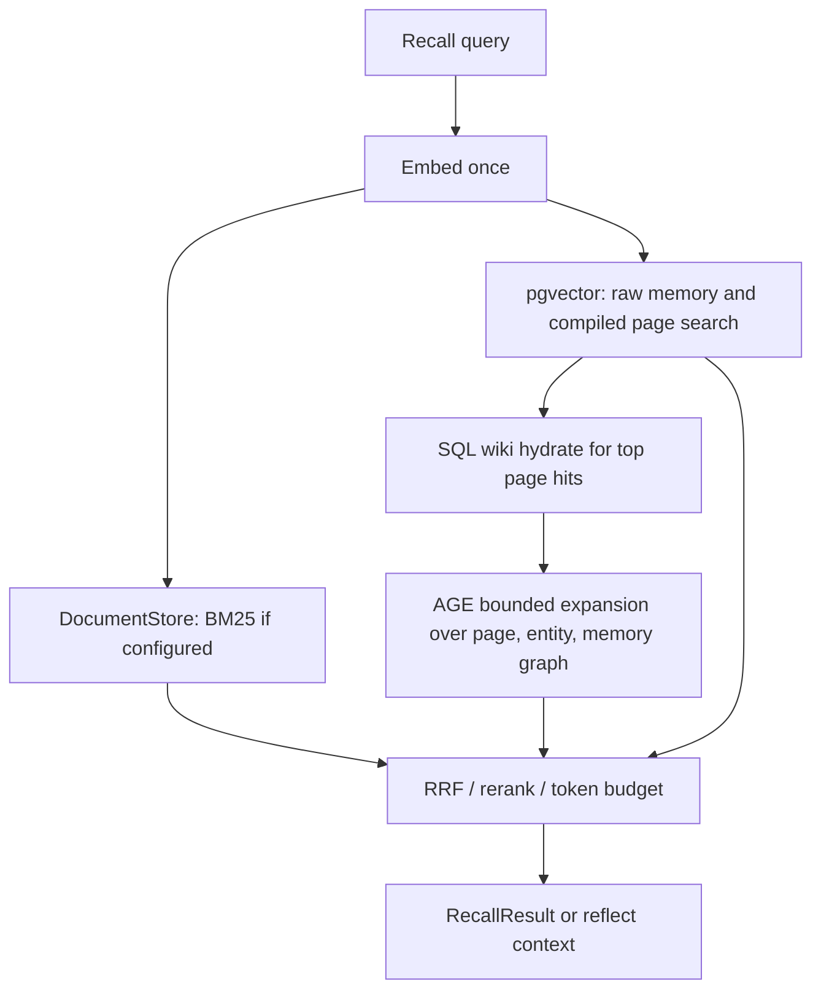

# Hindsight-Informed Astrocyte Capabilities

This note records the implementation stance after evaluating Hindsight as a comparable agent-memory product.

## What To Copy

Hindsight's strongest lessons are operational and ergonomic:

- A one-command self-hosted stack with PostgreSQL as the main operating substrate.
- A low-friction wrapper around LLM calls for teams that want automatic recall and retain.
- Hybrid recall as the default quality story: vector, graph, lexical, temporal filters, fusion, and reranking.
- Async retain-adjacent work for expensive consolidation so the hot path stays fast.
- Benchmark gates that make memory quality claims reproducible.

## What Not To Copy

Astrocyte remains a framework boundary, not a generic LLM gateway or agent runtime. The Hindsight-style wrapper belongs in `adapters-integration-py/astrocyte-integration-llm-wrapper/`, while the core continues to expose memory operations and provider SPIs.

## Capability Priority

The Hindsight-equivalent path is:

1. M8 wiki compile: synthesize durable `WikiPage` memory from raw memories and surface those pages ahead of fragments during recall.
2. M9 time travel: keep `retained_at`, `forgotten_at`, `as_of`, and `history()` coherent across adapters.
3. M11 entity resolution: write evidence-backed `alias_of` links into the graph store at retain time.
4. M10 gap analysis: run `audit()` on top of recall authority, time-aware memory, and entity-linked evidence.

This sequence preserves the existing roadmap while making the Hindsight comparison concrete: observations/mental models map to M8, temporal recall maps to M9, entity/path reasoning maps to M11, and "what don't we know?" maps to M10.

## LoCoMo Benchmark Roadmap

The current Hindsight-learned LoCoMo work is benchmark-driven rather than architecture-only:

- Phase 0: serialize per-question records, group failed LoCoMo questions into actionable buckets, and keep a stable 200-question slice for quick regression runs.
- Phase 1: improve precision before broadening recall through configurable `llm_pairwise` reranking, wrong-person penalties, and context diversity.
- Phase 2: retain LoCoMo sessions with speaker, turn, session, conversation, person, and temporal metadata instead of relying only on raw dialogue text.
- Phase 3: normalize relative temporal facts such as "last week", "yesterday", and "previous Friday" against session timestamps and surface resolved dates in reflect context.
- Phase 4: compile per-person persona pages with source provenance so open-domain and inference questions see stable preference/identity evidence before raw fragments.
- Phase 5: add entity-path recall, including a metadata-backed fallback when no graph store is configured, then pass path-labeled sections into reflect.
- Phase 6: gate claims on category deltas, not only overall accuracy: short-slice LoCoMo after every phase, full LoCoMo after rerank, temporal, and entity-path milestones.

## Reference Stack

The reference self-hosted stack is:

- `astrocyte-gateway-py` for REST, OpenAPI, MCP-compatible deployment, health, and auth.
- PostgreSQL with pgvector and Apache AGE in the same container image.
- SQL tables for durable memory records, banks, wiki pages, wiki revisions, provenance, and async task state.
- `astrocyte-pgvector` for dense retrieval and compiled-page search projections.
- `astrocyte-age` for graph traversal projections over pages, entities, and cited memories.
- Optional `DocumentStore` for BM25 when a lexical backend is configured.
- `wiki_store: pgvector` and `wiki_compile.auto_start` for durable background compilation in the gateway lifecycle. `wiki_store: in_memory` is test/demo-only.
- Benchmark reports from LoCoMo and LongMemEval before making external accuracy claims.

## Database Comparison

Hindsight uses PostgreSQL with pgvector as its durable operating substrate: memory banks, memory records, vectors, lexical indexes, graph-like entity/link tables, tenant or bank configuration, and async task state all live in Postgres. Its graph behavior is implemented primarily through relational tables and bounded SQL link expansion rather than a dedicated graph extension.

Astrocyte should copy the operational lesson while preserving its SPIs:

| Concern | Hindsight pattern | Astrocyte reference stack |
|---|---|---|
| Durable truth | PostgreSQL tables | PostgreSQL tables |
| Dense retrieval | pgvector | `astrocyte-pgvector` |
| Graph retrieval | SQL entity/link tables | `astrocyte-age` projection, with SQL still owning truth |
| Async queue | PostgreSQL rows claimed by workers | PgQueuer jobs carrying the Astrocyte `MemoryTask` payload |
| Memory isolation | Banks / tenant schema support | Banks + `AstrocyteContext` + access grants |

Rule of thumb for Astrocyte: **SQL owns truth, pgvector owns similarity, AGE owns traversal, Postgres tasks own durable background work**.

## Recall Data Flow

Recall should fan out from cheap indexed retrieval, then hydrate and expand only the top candidates:

Do not start every recall with AGE traversal or SQL page scans. Start with top-K vector and lexical retrieval, then batch-hydrate SQL wiki rows by `page_id`, then run bounded AGE expansion only for the top pages or entities. This keeps normal recall fast while allowing `reflect()` to opt into deeper expansion.

## Performance And Write Tradeoffs

- Latency risk comes from extra round trips. Mitigate with staged recall, batched SQL hydration, and AGE expansion only for top N candidates.
- AGE fanout must be capped by traversal depth, neighbor limit, and timeout; user-facing recall must never run unbounded Cypher.
- Wiki compile causes write amplification: SQL page/revision/provenance, pgvector projection, AGE projection. Keep it async so `retain()` stays fast.
- SQL is the commit point. pgvector and AGE projections can be repaired by queued tasks if they lag.
- Compiled-page vectors should represent the current revision by default. SQL keeps full revision history; old revisions should not stay indexed unless time-travel wiki recall explicitly needs them.
- Concurrent compiles need per-bank/page locking, unique `(bank_id, slug)`, and monotonic revision numbers.

## Postgres Task Plan

The reference stack should run an `astrocyte-worker-py` process using [PgQueuer](https://janbjorge.github.io/pgqueuer/) on PostgreSQL. PgQueuer supplies transactional enqueue, `FOR UPDATE SKIP LOCKED` claiming, `LISTEN/NOTIFY` wakeups, retry/heartbeat mechanics, scheduling, and in-memory testing. The current framework implementation lives in `astrocyte.pipeline.tasks`; `astrocyte.pipeline.pgqueuer_tasks` adapts those `MemoryTask` handlers to PgQueuer entrypoints.

Benchmark-improvement task types:

- `compile_bank`: create or refresh wiki pages for LongMemEval multi-session and knowledge-update questions.
- `compile_persona_page`: create `person:{name}` pages for LoCoMo open-domain and inference questions.
- `index_wiki_page_vector`: index the current compiled page revision into pgvector so recall can find mental-model pages before raw fragments.
- `project_entity_edges`: write person/session/turn co-occurrence edges into the graph store so multi-hop recall can expand along evidence paths.
- `normalize_temporal_facts`: attach deterministic temporal metadata to retained chunks so temporal questions do not rely only on prompt instructions.
- `lint_wiki_page`: detect stale/orphan/contradictory compiled pages and feed recompile decisions for LongMemEval knowledge updates.
- `analyze_benchmark_failures`: turn per-question LoCoMo/LME output into ranked failure buckets and stable short-slice gates.

For LoCoMo, run `normalize_temporal_facts`, `compile_persona_page`, `project_entity_edges`, and `index_wiki_page_vector` after retain and before evaluation. For LME, run `compile_bank`, `lint_wiki_page`, and `index_wiki_page_vector`, then rerun gates against category deltas.

The benchmark integration test surface should include a Postgres-backed PgQueuer run gated by `ASTROCYTE_PGQUEUER_TEST_DSN`, so local/CI environments with Postgres can verify the real worker path before comparing LoCoMo or LongMemEval scores.

## Release Gate

Do not claim Hindsight-level parity from architecture alone. Parity requires benchmark output from `astrocyte-py/scripts/run_benchmarks.py` and threshold checks from `astrocyte-py/scripts/check_benchmark_gates.py` under documented configs.
