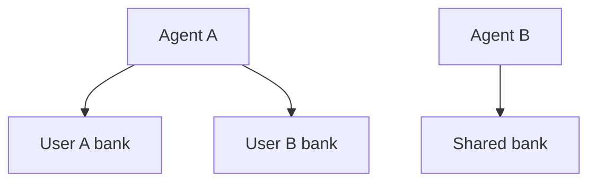
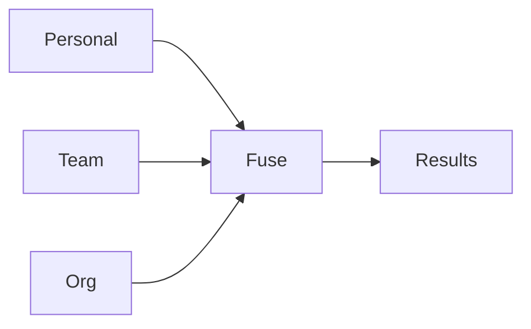

# Multi-bank orchestration

Agents don't have one memory - they have several. A support agent has personal context about the current user, shared team knowledge, and org-wide policies. Astrocytes orchestrates across these banks because it sits above the provider layer.

For the core API and provider architecture, see `architecture-framework.md`.

---

## 1. The problem

A single bank per agent is limiting:

- An agent serving multiple users needs per-user banks plus shared knowledge.
- A team of agents needs individual memory plus a shared team bank.
- Enterprise agents need personal + team + org-wide policy banks.

Without multi-bank orchestration, callers must query each bank individually, merge results, and handle per-bank policies themselves. That logic belongs in the framework.

The same patterns support **human–agent collaboration**: an agent’s `bank_groups` often include a **per-user** bank plus **team** and **org** banks. That is only safe when **access control** grants the **agent principal** read (and optionally write) on those banks; see `access-control.md` §1.4 and `sandbox-awareness-and-exfiltration.md` for wiring identity so this stays **intentional**, not **cross-environment bleed**.

---

## 2. Bank topology

Astrocytes supports three bank relationship patterns:

### 2.1 Isolated banks

Each bank is independent. No cross-bank queries. Default behavior.



### 2.2 Layered banks (cascade)

Banks are ordered by specificity. Query the most specific first; widen if results are thin.


### 2.3 Parallel banks (fan-out)

Query all banks simultaneously, fuse results across banks.



### 2.4 Shared banks (multi-principal, same data)

**Sharing** does not mean two principals in one API call. Each request has one `AstrocyteContext.principal`. **Shared memory** means the **same `bank_id`** appears in two principals’ effective grants—for example `user:calvin` and `agent:support-bot-1` both have **read** (and possibly **write**) on `user-calvin`.

Implications:

- **Recall:** When the **user** runs a recall against `user-calvin` and when the **agent** runs a recall against `user-calvin` (with its own principal), both see **consistent** content subject to **their** permission bits (e.g. agent without **forget**).
- **Multi-bank recall:** Strategies like `cascade` / `parallel` only include banks the **current** principal may read. A user might have **admin** on personal + team + org; an agent might be limited to personal **read** + team **read**—orchestration config must match those grant shapes or calls will **AccessDenied** mid-query.
- **Retain:** Writes target one `bank_id`; provenance and audit should record **which** principal retained (see `access-control.md` §6 and `memory-lifecycle.md`).

---

## 3. API surface

### 3.1 Single-bank (existing, unchanged)

```python
hits = await brain.recall("What does Calvin prefer?", bank_id="user-calvin")
```

### 3.2 Multi-bank recall

```python
hits = await brain.recall(
    "What does Calvin prefer?",
    banks=["user-calvin", "team-support", "org-policies"],
    strategy="cascade",
)
```

### 3.3 Strategy options

Implemented in `astrocyte-py`: `Astrocyte.recall(..., banks=[...], strategy=...)` accepts a string (`"parallel"` \| `"cascade"` \| `"first_match"`) or a `MultiBankStrategy` instance. Omitting `strategy` with multiple banks keeps **parallel** merge (backward compatible). Cross-bank deduplication keeps the **highest-scoring** hit per distinct text.

```python
@dataclass
class MultiBankStrategy:
    mode: Literal["cascade", "parallel", "first_match"] = "parallel"

    # Cascade-specific
    min_results_to_stop: int = 3      # Stop widening when we have enough
    cascade_order: list[str] | None = None  # Explicit order (default: banks= list order)

    # Parallel-specific
    bank_weights: dict[str, float] | None = None  # Weight results by bank
    dedup_across_banks: bool = True
```

| Strategy | Behavior | Use case |
|---|---|---|
| `cascade` | Query banks in order; stop when `min_results_to_stop` reached | Personal → team → org (most specific first) |
| `parallel` | Query all banks concurrently; fuse results with optional weights | Agent needs breadth across all knowledge |
| `first_match` | Query banks in order; return first bank's results if non-empty | Fallback pattern (try primary, fall back to secondary) |

### 3.4 Multi-bank retain

Retain targets a single bank (you always know where to store). But metadata can reference other banks:

```python
await brain.retain(
    "Calvin prefers dark mode",
    bank_id="user-calvin",
    metadata={"also_relevant_to": ["team-support"]},
)
```

### 3.5 Multi-bank reflect

Multi-bank `reflect` is not yet on the `Astrocyte` API; call `recall` with the desired `banks` / `strategy`, then synthesize out-of-band, or run `reflect` on a single `bank_id`. A first-class `reflect(..., banks=...)` can follow the same strategy machinery as recall.

---

## 4. Cross-bank fusion

When using `parallel` strategy, results from different banks are fused:

1. **Per-bank recall**: run recall against each bank concurrently.
2. **Deduplicate**: remove identical memories that appear in multiple banks (by content hash).
3. **Weight**: apply per-bank weights (e.g., personal bank gets 2x weight over org bank).
4. **Re-score**: normalize scores across banks (different banks may use different scoring scales).
5. **RRF fusion**: merge weighted, normalized results using reciprocal rank fusion.
6. **Token budget**: truncate to fit the overall token budget.

```python
# Configuration
multi_bank:
  default_strategy: cascade
  bank_groups:
    support_agent:
      banks: ["user-{user_id}", "team-support", "org-policies"]
      strategy: cascade
      cascade_order: ["user-{user_id}", "team-support", "org-policies"]
      bank_weights:
        "user-{user_id}": 2.0
        "team-support": 1.5
        "org-policies": 1.0
```

---

## 5. Per-bank policy enforcement

Each bank can have its own policy overrides (see `use-case-profiles.md`). Multi-bank orchestration respects per-bank policies:

- **Rate limits**: applied per-bank, not aggregated. A cascade across 3 banks counts as 3 rate-limited operations.
- **PII barriers**: applied to the query before it reaches any bank. Applied once, not per-bank.
- **Token budgets**: the overall budget is split across banks (proportional to weight, or configurable).
- **Access control**: the caller must have read access to every bank in the query (see `access-control.md`).

---

## 6. Bank templates

For applications that create banks dynamically (one per user), templates define the default configuration:

```yaml
bank_templates:
  user:
    name_pattern: "user-{user_id}"
    profile: personal
    auto_create: true
    access:
      - principal: "user:{user_id}"
        permissions: [read, write, forget, admin]
      - principal: "agent:{agent_id}"
        permissions: [read, write]
  team:
    name_pattern: "team-{team_id}"
    profile: support
    auto_create: false
```

When `brain.recall(bank_id="user-123")` is called and the bank doesn't exist, the matching template creates it with the specified profile and access settings.

---

## 7. Principle traceability

| Feature | Principle |
|---|---|
| Multiple bank types (personal, team, org) | P4: Heterogeneity - specialized subtypes |
| Cascade strategy (widen when thin) | P5: Metabolic coupling - adapt retrieval depth to supply |
| Per-bank policy enforcement | P3: Homeostasis - per-region regulation |
| Cross-bank fusion | P2: Tripartite synapse - mediate the exchange |
| Shared banks (users + agents) | P6: Barrier maintenance - explicit who may cross which bank |

---

## 8. Hybrid Tier-2 engine + Tier-1 pipeline (same `bank_id`)

When both a hosted **engine** and a local **pipeline** (vector / graph / document path) should answer for the **same** logical bank, use `HybridEngineProvider` (`astrocyte-py`). It implements `EngineProvider`: `recall` fans out to both backends, applies optional per-source weights, dedupes by text (highest score wins), then ranks and applies the request token budget. `retain` targets exactly one backend via `retain_target="engine"` or `"pipeline"`.

```python
from astrocyte import Astrocyte, HybridEngineProvider
from astrocyte.pipeline.orchestrator import PipelineOrchestrator

engine = ...  # Tier-2 EngineProvider
pipeline = PipelineOrchestrator(vector_store=..., llm_provider=...)
hybrid = HybridEngineProvider(
    engine=engine,
    pipeline=pipeline,
    retain_target="engine",
    engine_recall_weight=1.0,
    pipeline_recall_weight=1.0,
)
brain = Astrocyte.from_config("astrocyte.yaml")
brain.set_engine_provider(hybrid)
```

`MemoryHit.source` is set to `tier2_engine` or `tier1_pipeline` when not already present, for observability.
