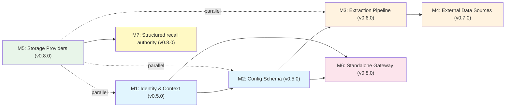

# Astrocyte v1.0.0 Roadmap

This roadmap organizes **8** identified architectural gaps into milestones, ordered by dependency and impact. Each milestone is a shippable increment — earlier milestones unblock later ones.

**Architecture references**: See `architecture-brief.md` (System Architecture, Domain Model, Application Architecture), ADR-001 (Deployment Models), ADR-002 (Identity Model), ADR-003 (Config Schema).

---

## Milestone Overview

| # | Milestone | Version | Gaps Addressed | Dependencies | Scope |
|---|-----------|---------|---------------|--------------|-------|
| M1 | Identity & Context | v0.5.0 | Gap 1, Gap 5 | None | Core |
| M2 | Config Schema Evolution | v0.5.0 | Gap 4 | M1 (same release) | Core |
| M3 | Extraction Pipeline | v0.6.0 | Gap 7 | M2 | Core |
| M4 | External Data Sources | v0.7.0 | Gap 2 | M2, M3 | Core + Adapters |
| M5 | Production Storage Providers | v0.8.0 | Gap 6 | None (parallel) | Adapters |
| M6 | Standalone Gateway | v0.8.0 | Gap 3 | M1, M2 | Shipped in-repo (`astrocyte-gateway`); **v0.8.x** tags (see § Release numbering) |
| M7 | Structured recall authority | v0.8.0 | Gap 8 | M5 | Core |

**Release pairing:** **M1 and M2 ship together in a single v0.5.0 tag** (identity + structured context first; config schema immediately after in the same minor). Later milestones renumber as above.

**v0.8.0 ships three milestones:** **M5** (production storage adapters), **M6** (standalone gateway — deployment models / Gap 3), and **M7** (structured recall authority). M7 depends on multi-store hybrid recall from M5; **M6** is logically last but ships on the **same v0.8.x line** as M5/M7. **v1.0.0** general availability **requires M1–M7** complete.

**Release numbering (project policy):** Prefer **v0.8.x** git tags for this era (storage + authority + standalone gateway). The team **does not plan a separate v0.9.0 semver tag** for marketing; use **v0.8.1**, **v0.8.2**, … for follow-on work (streams, poll, gateway plugins) until **v1.0.0** GA, unless semver policy changes.

**v0.7.4** closes out pre-**v0.8** standalone gateway and repository packaging (image workflows, Helm, CI gates, docs alignment) before **v0.8.0** milestone work.

---

## M1: Identity & Context

**Gap**: Identity & Authorization Protocol (Gap 1) + User-Scoped Memory (Gap 5)

**Why first**: Every other milestone depends on structured identity. You can't route ingest to the right bank without knowing who the data belongs to. You can't scope memory without knowing user vs agent vs OBO.

### Deliverables

1. **Structured `AstrocyteContext`** (backwards-compatible)
   - Add `actor: ActorIdentity | None` (type, id, claims)
   - Add `on_behalf_of: ActorIdentity | None` (OBO delegation)
   - Keep `principal: str` working — derive from `actor.id` when actor is set
   - Add `effective_permissions()` → intersection of actor + OBO grants
   - File: `astrocyte-py/astrocyte/types.py`

2. **Identity-driven bank resolution**
   - `BankResolver` that maps `(actor, on_behalf_of)` → `bank_id`
   - Default: `user:{id}` → `user-{id}` bank (convention-based)
   - Configurable via `identity:` config section
   - File: new `astrocyte-py/astrocyte/identity.py`

3. **Integration adapter migration (Phase 1)**
   - Add optional `context` parameter to all 19 adapters
   - No breaking changes — `context=None` uses current behavior
   - Files: `astrocyte-py/astrocyte/integrations/*.py`

### Acceptance Criteria

- [x] `AstrocyteContext(principal="user:123")` still works unchanged
- [x] `AstrocyteContext(actor=ActorIdentity(type="user", id="123"))` resolves principal automatically
- [x] OBO: `context.effective_permissions(bank_id)` returns intersection
- [x] Bank resolver maps identity to bank_id with configurable rules
- [x] All existing tests pass without modification (`tests/test_identity_m1.py`, `tests/test_types.py`, etc.)
- [x] ADR-002 implementation validated (library surface; HTTP JWT/OIDC mapping lives in **`astrocyte-gateway`** — § M6)

---

## M2: Config Schema Evolution

**Gap**: Config Schema for External World (Gap 4)

**Why second**: M3 and M4 need config sections to declare sources, agents, and extraction profiles. M6 needs the `deployment:` section.

### Deliverables

1. **New config sections** (all optional, backwards-compatible)
   ```yaml
   sources:              # External data source definitions
     tavus-transcripts:
       type: webhook
       extraction_profile: conversation
       target_bank_template: "user-{principal}"
       auth:
         type: hmac
         secret: ${TAVUS_WEBHOOK_SECRET}

   agents:               # Agent registration and default bank mapping
     support-bot:
       principal: "agent:support-bot"
       default_bank: "shared-support"
       allowed_banks: ["shared-*", "user-*"]

   deployment:           # Deployment mode configuration
     mode: library       # "library" | "standalone" | "plugin"

   identity:             # Identity resolution configuration
     resolver: convention  # "convention" | "config" | "custom"
     obo_enabled: false

   extraction_profiles:  # Reusable extraction configurations
     conversation:
       chunking_strategy: dialogue
       entity_extraction: llm
       metadata_mapping:
         speaker: "$.participant_name"
   ```

2. **Config dataclass extensions**
   - New dataclasses: `SourceConfig`, `AgentRegistrationConfig`, `DeploymentConfig`, `IdentityConfig`, `ExtractionProfileConfig`
   - Added to `AstrocyteConfig` as optional fields
   - File: `astrocyte-py/astrocyte/config.py`

3. **Config validation**
   - Validate source references to extraction profiles exist
   - Validate agent bank patterns against declared banks
   - Validate deployment mode prerequisites

### Acceptance Criteria

- [x] Loading a config with no new sections produces identical `AstrocyteConfig` to current
- [x] New sections parse correctly with type validation
- [x] `${ENV_VAR}` substitution works in new sections
- [x] Profile merge order preserved (compliance → profile → user config)
- [x] ADR-003 implementation validated

---

## M3: Extraction Pipeline

**Gap**: Extraction Pipeline (Gap 7)

**Why third**: External data sources (M4) push raw content through the extraction pipeline. Building the pipeline before the connectors means M4 just needs to wire sources to an existing pipeline.

### Deliverables

1. [x] **Extraction pipeline** (inbound complement to retrieval pipeline)
   ```
   Raw Content → Content Normalizer → Chunker → Entity Extractor → brain.retain()
   ```
   - Content normalizer: handles different content types (transcript, email, document, event)
   - Routes to appropriate chunking strategy (sentence, paragraph, dialogue, fixed)
   - Applies extraction profile from config
   - File: new `astrocyte-py/astrocyte/pipeline/extraction.py`

2. [x] **Dialogue chunking strategy**
   - Detect turn boundaries (`Speaker: text` pattern)
   - Keep complete turns together
   - Group consecutive turns up to max_chunk_size
   - Fallback to sentence splitting for single oversized turns
   - File: extend `astrocyte-py/astrocyte/pipeline/chunking.py`

3. [x] **Content type routing**
   - `content_type` field on `RetainRequest`
   - Routes to appropriate chunking strategy
   - Extraction profile can override defaults
   - File: extend `astrocyte-py/astrocyte/pipeline/orchestrator.py`

4. [x] **Extraction profile resolution**
   - Load from config `extraction_profiles:` section
   - Source → profile mapping
   - Default profiles for common content types

### Acceptance Criteria

- [x] Dialogue chunker preserves speaker attribution in chunks (see `chunking._chunk_dialogue` + tests in `tests/test_chunking.py`)
- [x] Content type routing selects chunking strategy; optional `extraction_profile` overrides (`astrocyte.pipeline.extraction.resolve_retain_chunking`, `PipelineOrchestrator.retain`)
- [x] Extraction profiles load from YAML `extraction_profiles:`; built-ins `builtin_text` / `builtin_conversation` merged at runtime (`merged_extraction_profiles` / `merged_user_and_builtin_profiles`)
- [x] Inbound chain: normalize → chunk → optional entity extract → embed → store; profile-driven `metadata_mapping`, `tag_rules`, and `entity_extraction` applied on retain (`prepare_retain_input`)
- [x] Default `RetainRequest.content_type` remains `text`; omitting `extraction_profile` preserves prior behavior aside from light normalization and builtin profile table merge inside the orchestrator

---

## M4: External Data Sources

**Gap**: External Data Sources / Inbound Connectors (Gap 2)

**Why fourth**: Requires M2 (config schema for source definitions) and M3 (extraction pipeline to process inbound data).

### Deliverables

1. **IngestSource SPI** (Protocol class)
   ```python
   class IngestSource(Protocol):
       source_id: str
       source_type: str  # "webhook" | "stream" | "poll"

       async def start(self) -> None: ...
       async def stop(self) -> None: ...
       async def health_check(self) -> HealthStatus: ...
   ```
   File: new `astrocyte-py/astrocyte/ingest/source.py`

2. **Webhook receiver** (first implementation)
   - HTTP endpoint that receives POST payloads
   - HMAC signature validation
   - Routes to extraction pipeline based on source config
   - File: new `astrocyte-py/astrocyte/ingest/webhook.py`

3. **Source registry**
   - Register/deregister sources at runtime
   - Load from config `sources:` section
   - Health monitoring and error thresholds
   - File: new `astrocyte-py/astrocyte/ingest/registry.py`

4. **Proxy query adapter** (for federated recall) — **M4.1** (see below)
   - Forward recall queries to external APIs
   - Merge results with local recall hits
   - Configurable via `sources:` with `type: proxy`

### Acceptance Criteria

- [x] Webhook ingest validates HMAC (when `auth.type: hmac`), parses JSON body, resolves target bank, calls `brain.retain()` — library API: `astrocyte.ingest.handle_webhook_ingest` (HTTP server binding is M6 / app-specific)
- [x] Source registry loads `type: webhook` entries from `sources:` and manages start/stop/health (`SourceRegistry`, `WebhookIngestSource`)
- [x] Proxy query adapter merges external recall with local recall — **M4.1 / federated recall** (`astrocyte.recall.proxy`, RRF in `PipelineOrchestrator.recall`; optional `RecallRequest.external_context`)
- [x] Source health available via `IngestSource.health_check()` → `HealthStatus` (wire to metrics in gateway)
- [x] Ingest uses `brain.retain()` so policy (PII, validation, rate limits, quotas) applies on the same path as interactive retains

### M4.1 (implemented): Federated / proxy recall

**Scope**: `sources:` entries with `type: proxy`, `url` (query template with `{query}`), and `target_bank` forward recall queries to external HTTP APIs (JSON `hits` / `results` arrays). Hits merge with local vector/graph recall via **RRF** in `PipelineOrchestrator.recall`; callers may also pass `RecallRequest.external_context`. Tier-2 engine-only recall merges proxy hits by score without double-counting `HybridEngineProvider`.

**Implementation**: `astrocyte.recall.proxy` (`fetch_proxy_recall_hits`, `gather_proxy_hits_for_bank`, `merge_manual_and_proxy_hits`); config validation in `validate_astrocyte_config`; dependency **httpx** for outbound GET.

**Later (when we need them)**: a **hosted redirect/callback server** (or tighter gateway integration) for full browser OAuth UX, **PKCE**, and **device** / **JWT bearer** token grants — not required for the current library surface; see **`adr-003-config-schema.md`** (design note under proxy OAuth).

**Relation to releases**: Shipped after **v0.7.0** (webhook ingest); see **CHANGELOG** `[Unreleased]` / next patch tag.

**Thin HTTP binding (library)**: optional `astrocyte[gateway]` provides `create_ingest_webhook_app` (Starlette ASGI) → `POST /v1/ingest/webhook/{source_id}` forwarding raw body/headers to `handle_webhook_ingest`. **Standalone** JWT/OIDC, OpenAPI, Docker/Helm, and ops packaging are **`astrocyte-gateway`** (§ M6 — shipped in-repo).

### Deferred to v0.8.x connector track (see § Release Strategy)

- Event stream subscription (Kafka, Redis Streams, NATS) — async consumer + worker process
- API poll scheduler — background task infrastructure
- These pair naturally with a **long-running gateway / worker** deployment (same ops model as § M6) and are **in scope from v0.8.0 toward v1.0.0** on **v0.8.x** tags — not deferred to post-GA only.

---

## M5: Production Storage Providers

**Gap**: Production Storage Providers (Gap 6)

**Parallel track**: No dependency on M1-M4. Can be developed concurrently.

### Deliverables

1. **Graph store: Neo4j adapter** — PyPI package **`astrocyte-neo4j`** (`adapters-storage-py/astrocyte-neo4j/`)
   - Implements `GraphStore` SPI
   - Entity and relationship CRUD
   - Neighborhood traversal for graph-enhanced recall
   - Cypher query generation

2. **Document store: Elasticsearch/OpenSearch adapter** — **`astrocyte-elasticsearch`** (`adapters-storage-py/astrocyte-elasticsearch/`)
   - Implements `DocumentStore` SPI
   - BM25 full-text search
   - Keyword retrieval for hybrid recall
   - Index lifecycle management

3. **Vector stores** — **`astrocyte-pgvector`** (PostgreSQL + pgvector), **`astrocyte-qdrant`** (Qdrant); both under `adapters-storage-py/`
   - Implement `VectorStore` SPI (pgvector may also expose document-oriented helpers where applicable)
   - Payload / collection management per backend

### Acceptance Criteria

- [x] Each adapter has integration tests exercising the `VectorStore` / `GraphStore` / `DocumentStore` API (see each package’s `tests/`; optional: authors may also run shared suites from `astrocyte.testing`)
- [x] Hybrid recall (vector + graph + document) produces fused results — core E2E: `tests/test_m5_hybrid_recall_e2e.py`, `tests/test_astrocyte_tier1.py` (in-memory); production adapters validated in `adapters-storage-ci.yml`
- [x] Each adapter ships as a separate PyPI package (`astrocyte-pgvector`, `astrocyte-qdrant`, `astrocyte-neo4j`, `astrocyte-elasticsearch`)
- [x] Integration tests run against containerized instances in CI (`.github/workflows/adapters-storage-ci.yml`; pgvector also covered from root `ci.yml`)
- [x] README with quick-start — `adapters-storage-py/README.md` plus per-adapter READMEs

**Same release — v0.8.0:** This milestone shares the **v0.8.0** line with **M6** (standalone gateway) and **M7** (structured recall authority). Hybrid adapters, gateway, and precedence config ship on the same minor family; see **§ M6** and **§ M7**.

---

## M6: Standalone Gateway

**Gap**: Deployment Models (Gap 3)

**Implementation status (as of 2026-04-12):** The standalone gateway is **shipped in this repository** under **`astrocyte-services-py/astrocyte-gateway/`** — FastAPI routes, auth modes, webhook ingest, health/admin, multi-stage **Dockerfile**, **Compose** + runbook, **Helm** chart, **example configs**, CI gates, **GHCR** publish with attestations, and observability hooks (request IDs, JSON access logs, optional OpenTelemetry extra). Release **tagging** follows the **v0.8.x** policy above (not a separate **v0.9.0** tag for gateway-only).

**Why last**: Requires M1 (identity) and M2 (deployment config). The gateway is a thin HTTP adapter over the same `Astrocyte` core — all intelligence stays in the library.

### Deliverables

1. **FastAPI-based standalone gateway** (`astrocyte-gateway` package)
   - REST API: `/v1/retain`, `/v1/recall`, `/v1/reflect`, `/v1/forget`
   - JWT validation middleware (consumes tokens from external IdP)
   - Maps JWT claims → `AstrocyteContext` with structured identity
   - OpenAPI spec auto-generated

2. **Webhook receiver endpoint**
   - `/v1/ingest/webhook/{source_id}` — routes to IngestSource registry
   - HMAC validation per source config

3. **Health and admin endpoints**
   - `/health` — gateway + storage backend health
   - `/v1/admin/sources` — source registry status
   - `/v1/admin/banks` — bank listing and health

4. **Docker packaging**
   - Multi-stage Dockerfile
   - `docker-compose.yml` with pgvector + gateway
   - Helm chart (basic) for Kubernetes

### Acceptance Criteria

- [x] Gateway exposes the **Tier 1** core memory API via REST (`/v1/retain`, `/recall`, `/reflect`, `/forget`; OpenAPI at `/docs`). *(Tier 2 engine HTTP surface remains library-first / product-specific.)*
- [x] AuthN maps to structured **`AstrocyteContext`**: **`api_key`**, **`jwt`/`jwt_hs256`**, **`jwt_oidc`** (JWKS, RS256) with **`ActorIdentity`** / claims — see `astrocyte-gateway` README and ADR-002.
- [x] Webhook ingest works end-to-end through the gateway (`/v1/ingest/webhook/{source_id}`; CI + tests).
- [x] Docker Compose + runbook bring up a working stack (`astrocyte-services-py/`; see services README).
- [ ] **Performance:** < 10ms gateway-only overhead vs core latency — **not benchmarked in-repo**; treat as a follow-up measurement / load test, not a blocker for “M6 shipped.”
- [x] **ADR-001:** Standalone gateway deployment path is **documented and implemented** (package, container, Helm, ops docs). Full organizational “validated” sign-off stays a **release / operator** checklist outside this file.

### Deferred (post–core gateway; scheduled from v0.8.x onward)

Gateway **plugin** integration (Kong, APISIX, Azure API Management, and similar), **event stream** connectors, and **poll** schedulers are **in scope from the v0.8.0 baseline toward v1.0.0**, shipped incrementally on **v0.8.x** tags per § Release numbering — see **§ v0.8.x — Connector & gateway integration track** and **§ Stability: SPI, adapters, and config files**.

- gRPC transport — wait for demand signal (may remain post–v1.0.0)

---

## M7: Structured recall authority

**Gap**: Structured **truth / authority precedence** across heterogeneous stores (Gap 8) — orthogonal to **`tiered_retrieval`** (cost / latency tiers) and to **MIP** (retain routing in `mip.yaml`).

**Why with M5**: Precedence across **graph vs document vs vector** (and optional proxy tiers) requires **production** `GraphStore` / `DocumentStore` / `VectorStore` adapters and validated **hybrid recall** behavior. M7 layers **declarative authority** and **prompt- or code-enforced conflict policy** on top. **Release:** **v0.8.0**, **same line as M5 and M6** (adapters + gateway + authority on one minor family).

**Product stance:** **Optional** in config (default off). The **default** Astrocyte recall path remains multi-strategy fusion (RRF, weights). Naming and docs must keep **cost tiers** (`tiered_retrieval`) and **truth tiers** (this milestone) distinct. See `built-in-pipeline.md` §9.4.

### Deliverables

1. [x] **`astrocyte.yaml` schema** — optional `recall_authority:` (`RecallAuthorityConfig`: tiers, `tier_by_bank`, `rules_inline` / `rules_path`, `apply_to_reflect`). Phase 1 formats fused hits and injects `authority_context`; per-backend binding and **strategy** (`parallel_all` / `sequential_stop`) remain future if we add multi-query tier retrieval.
2. [x] **Runtime** — `apply_recall_authority` on recall; pipeline / `Astrocyte.reflect` optional injection; retain-time `metadata["authority_tier"]` via `tier_by_bank` / extraction profiles. Code-side demotion of hits is not required for Phase 1 (see ADR-004).
3. [x] **Documentation** — `docs/_design/adr/adr-004-recall-authority.md`; cross-links in `built-in-pipeline.md` and roadmap.
4. [x] **Tests** — `tests/test_recall_authority.py`, `tests/test_m7_reflect_authority.py`, `tests/test_m5_hybrid_recall_e2e.py` (interaction with hybrid recall).

### Acceptance Criteria

- [x] Disabled by default; enabling does not change behavior for existing configs without the new section
- [x] Clear separation from `tiered_retrieval` in code, config keys, and docs (ADR-004 + `built-in-pipeline.md` §9.4)
- [x] At least one end-to-end path: multi-store recall → `authority_context` / reflect injection — see tests above
- [x] Performance and token-budget implications documented (ADR-004 — authority blocks add prompt tokens; combine with `homeostasis` / reflect limits)

---

## Dependency Graph



**Critical path**: M1 → M2 → M3 → M4 (M1 and M2 are one **v0.5.0** release; order is logical / doc sequencing)

**Parallel track**: M5 (storage providers) can proceed independently

**Gateway track**: v0.5.0 (M1+M2) → M6 (can start after M2, parallel with M3/M4). **M6** ships on the **v0.8.0** line **with M5/M7** (see § Milestone Overview).

**Authority track**: **M5 → M7** (both ship **v0.8.0**)

---

## Stability: SPI, adapters, and config files

This section is the **single place** for stability expectations ahead of **v1.0.0**. It applies to the **v0.8.x** connector/plugin track and to GA.

### Core SPIs (library)

Protocols and abstract surfaces that third-party code implements or calls — including **`VectorStore`**, **`GraphStore`**, **`DocumentStore`**, **`IngestSource`**, integration adapter hooks, and pipeline entrypoints documented as public API.

- **Through v1.0.0:** Prefer **additive** changes (new optional fields, new methods with defaults). **Breaking** changes require a **documented deprecation** in release notes and, where applicable, an ADR; after **v1.0.0**, **1.x** keeps SPIs **backwards-compatible** except in a **major** semver bump.
- **Tier distinction:** **Tier 1** memory API and documented SPIs are stability-guaranteed; **Tier 2** engine-only or experimental surfaces stay explicitly labeled in code/docs until promoted.

### Adapter packages (`adapters-storage-py/`, PyPI `astrocyte-*`)

- Adapters **implement** core SPIs; they release on their **own PyPI versions** but declare a **supported `astrocyte` core range** in each package README.
- A **breaking SPI change** in core triggers coordinated **minor/major** adapter releases; CI (e.g. `adapters-storage-ci.yml`) is the enforcement backstop.

### Ingest transport packages (`adapters-ingestion-py/`)

- **Ingest transport** adapters split from core (**`astrocyte-ingestion-kafka`**, **`astrocyte-ingestion-redis`**, …). Version and test like storage adapters when published; CI uses **`adapters-ingestion-ci.yml`**.

### Vendor integration packages (`adapters-integration-py/`)

- Reserved for **vendor / product** integrations (outbound API clients, bidirectional flows, gateway-related shims) that are **not** storage SPIs and **not** generic ingest transports. Empty until packages land.

### `astrocyte.yaml` / `astrocyte.yml` (declarative config)

- **Schema evolution is additive-first:** new sections and keys ship as **optional** with defaults that preserve behavior for existing files.
- **Renames/removals** of supported keys go through **deprecation** (warn → major) as described in ADR-003; validation errors should name the migration path.
- Cross-references (`sources` → `extraction_profiles`, `recall_authority`, etc.) stay validated so invalid configs fail at load time.

### `mip.yaml` (Memory Intent Protocol)

- **Routing contracts** (intents, bank patterns, tool routing) are **stable for integrators** in the same sense as config: **additive** evolution; breaking changes require version bump of the MIP **schema or file format** if we introduce a version field, or deprecation of prior behavior.
- **Orthogonality:** MIP controls **where** retain/recall routes; **`tiered_retrieval`**, **`recall_authority`**, and hybrid fusion are separate knobs — docs must not overload names (see **§ M7** and `built-in-pipeline.md`).

---

## Release Strategy

### v0.4.2 (current)
- Library-only deployment
- pgvector as sole production vector store
- Opaque principal identity (`principal: str`)
- 19+ framework integrations (no context propagation)
- Built-in intelligence pipeline (chunking, entity extraction, embedding, retrieval, fusion, reranking, reflect)
- Policy layer (PII barriers, homeostasis, rate limiting, access control)
- MIP (Memory Intent Protocol) with declarative routing
- MCP server exposure
- Claude Agent SDK + Claude Managed Agents integrations
- LoCoMo + LongMemEval benchmark suite

### v0.5.0 — Identity & Context (M1) + Config Schema (M2)
- **M1:** Structured `AstrocyteContext` with `ActorIdentity` (backwards-compatible, `principal: str` still works)
- **M1:** OBO delegation with permission intersection
- **M1:** Identity-driven bank resolution (`BankResolver`)
- **M1:** Phase 1 integration adapter migration (optional `context` parameter on all 19 adapters)
- **M2:** New optional config sections: `sources`, `agents`, `deployment`, extended `identity`, `extraction_profiles`
- **M2:** Config validation for cross-references (source → extraction profile, agent → bank patterns)
- **M2:** No breaking changes to existing `astrocyte.yml` files

### v0.6.0 — Extraction Pipeline (M3)
- Inbound extraction pipeline: raw content → normalize → chunk → extract → retain
- Dialogue chunking strategy (speaker-aware, turn-preserving)
- Content type routing on `RetainRequest`
- Extraction profile resolution from config

### v0.7.0 — External Data Sources (M4, ingest)
- `IngestSource` SPI (Protocol class)
- Webhook receiver with HMAC validation
- Source registry with health monitoring

### v0.7.1 — Federated recall (M4.1)
- Proxy recall: `sources:` with `type: proxy` + HTTP merge with local RRF (`astrocyte.recall.proxy`, `httpx`)
- Optional manual federated hits via `RecallRequest.external_context`

### v0.8.0 — Production storage (M5) + standalone gateway (M6) + structured recall authority (M7)
- **M5 — adapters:** Neo4j (`astrocyte-neo4j`), Elasticsearch (`astrocyte-elasticsearch`), Qdrant (`astrocyte-qdrant`), PostgreSQL/pgvector (`astrocyte-pgvector`) — packages under `adapters-storage-py/`; hybrid recall validated end-to-end (vector + graph + document)
- **M6 — gateway:** FastAPI **`astrocyte-gateway`** (implemented in repo): Tier 1 REST, JWT/OIDC → `AstrocyteContext`, webhook ingest, health/admin, Docker/Compose/Helm, GHCR — **§ M6**
- **M7 — precedence:** Optional `astrocyte.yaml` `recall_authority:` (ADR-004); labeled `authority_context` for recall/reflect; **not** the default recall path — full spec **§ M7**

### v0.8.x — Connector & gateway integration track (toward v1.0.0)

**Scope:** Implemented **from the v0.8.0 baseline** toward **v1.0.0**. You can describe this as the **“v0.9-era”** feature wave (streams, poll, gateway plugins) in planning docs; **git tags** stay **v0.8.1**, **v0.8.2**, … — **no v0.9.0 tag** — see § Release numbering.

- Event stream connectors (Kafka, Redis Streams, NATS, …)
- API poll scheduler and long-running ingest workers
- Gateway **plugin** mode and integration kits (**Kong**, **APISIX**, **Azure API Management**, other API gateways / service meshes as needed)
- Hardening: CORS, body limits, admin auth, rate limits at the edge (as product requires)

SPI, adapter, and **astrocyte.yaml** / **mip.yaml** stability rules for this track — **§ Stability: SPI, adapters, and config files**.

### v1.0.0 — General Availability
- Milestones **M1–M7** complete (storage, gateway, structured recall authority — **§ M5–M7**)
- Documentation complete for operators and integrators; **no v0.4 → v1.0 migration guide required** while there are no active external production users (revisit if adoption grows)
- **SPI and config stability** per **§ Stability** (1.x avoids breaking changes to documented SPIs and config contracts)
- Phase 2 integration adapter migration (framework-native identity extraction)
- Benchmark validation across storage backends as appropriate

### v1.1.0+ (post-GA)
- Additional storage adapters (Pinecone, Weaviate, Memgraph)
- Multi-region / global deployment patterns
- Tavus CVI integration (bidirectional)
- Phase 3 identity migration (context required, principal-only deprecated)

---

## Gap-to-Milestone Mapping

| Gap | Description | Milestone | Version | Status |
|-----|-------------|-----------|---------|--------|
| Gap 1 | Identity & Authorization Protocol | M1 | v0.5.0 | Implemented in core (ADR-002 Phase 1); JWT/`tenant_id` enforcement = later milestones |
| Gap 2 | External Data Sources | M4 + M4.1 | v0.7.0 / v0.7.1 | Shipped: webhook ingest, source registry, proxy federated recall (`astrocyte.recall.proxy`) |
| Gap 3 | Deployment Models | M6 | v0.8.0 | **Shipped in-repo:** `astrocyte-gateway`, Docker/Compose/Helm, CI, GHCR (ADR-001 standalone path). **v0.8.x** tags per § Release numbering (no separate v0.9.0 tag). |
| Gap 4 | Config Schema Evolution | M2 | v0.5.0 | Implemented in core (ADR-003); ships with M1 in same tag |
| Gap 5 | User-Scoped Memory | M1 | v0.5.0 | Implemented in core (`BankResolver`, ACL, optional adapter `context`); HTTP UX via **`astrocyte-gateway`** auth + config |
| Gap 6 | Production Storage Providers | M5 | v0.8.0 | Implemented: `adapters-storage-py/` packages + CI + publish workflows |
| Gap 7 | Extraction Pipeline | M3 | v0.6.0 | Implemented (`pipeline/extraction`, chunking, profiles) |
| Gap 8 | Structured recall authority (truth precedence vs cost-tiered retrieval) | M7 | v0.8.0 | Implemented (`recall_authority`, `astrocyte.recall.authority`, ADR-004) |

---

## Next milestone focus (toward v1.0.0)

**M6 (standalone gateway) is implemented in the repository** — see § M6. **Tagging** follows **v0.8.x** (not a standalone v0.9.0 release for gateway-only).

**Primary engineering line — v0.8.x through v1.0.0**

- **Streams, poll connectors, and gateway plugins** (Kong, APISIX, Azure API Management, others): implement on **v0.8.x** cadence per **§ v0.8.x — Connector & gateway integration track**.
- **SPI, adapter, `astrocyte.yaml`, and `mip.yaml` stability:** follow **§ Stability**; encode deprecations before breaking changes.
- Optional **gateway overhead benchmark** (M6 perf criterion) and **OpenAPI contract** tests for `/v1` if you want CI guarantees.

**v1.0.0 GA**

- **No v0.4 → v1.0 migration guide** required until there are active external users (see **§ v1.0.0**).
- **Phase 2** integration adapters (framework-native identity) as in release strategy.

**After GA (v1.1+):** additional backends, multi-region patterns, Phase 3 identity — see **§ v1.1.0+**; **gRPC** may remain optional longer.
