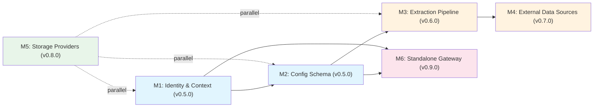

# Astrocyte v1.0.0 Roadmap

This roadmap organizes the 7 identified architectural gaps into milestones, ordered by dependency and impact. Each milestone is a shippable increment — earlier milestones unblock later ones.

**Architecture references**: See `architecture-brief.md` (System Architecture, Domain Model, Application Architecture), ADR-001 (Deployment Models), ADR-002 (Identity Model), ADR-003 (Config Schema).

---

## Milestone Overview

| # | Milestone | Version | Gaps Addressed | Dependencies | Scope |
|---|-----------|---------|---------------|--------------|-------|
| M1 | Identity & Context | v0.5.0 | Gap 1, Gap 5 | None | Core |
| M2 | Config Schema Evolution | v0.5.0 | Gap 4 | M1 (same release) | Core |
| M3 | Extraction Pipeline | v0.6.0 | Gap 7 | M2 | Core |
| M4 | External Data Sources | v0.7.0 | Gap 2 | M2, M3 | Core + Adapters |
| M5 | Production Storage Providers | v0.8.0 | Gap 6 | None (parallel) | Adapters |
| M6 | Standalone Gateway | v0.9.0 | Gap 3 | M1, M2 | New package |

**Release pairing:** **M1 and M2 ship together in a single v0.5.0 tag** (identity + structured context first; config schema immediately after in the same minor). Later milestones renumber as above.

---

## M1: Identity & Context

**Gap**: Identity & Authorization Protocol (Gap 1) + User-Scoped Memory (Gap 5)

**Why first**: Every other milestone depends on structured identity. You can't route ingest to the right bank without knowing who the data belongs to. You can't scope memory without knowing user vs agent vs OBO.

### Deliverables

1. **Structured `AstrocyteContext`** (backwards-compatible)
   - Add `actor: ActorIdentity | None` (type, id, claims)
   - Add `on_behalf_of: ActorIdentity | None` (OBO delegation)
   - Keep `principal: str` working — derive from `actor.id` when actor is set
   - Add `effective_permissions()` → intersection of actor + OBO grants
   - File: `astrocyte-py/astrocyte/types.py`

2. **Identity-driven bank resolution**
   - `BankResolver` that maps `(actor, on_behalf_of)` → `bank_id`
   - Default: `user:{id}` → `user-{id}` bank (convention-based)
   - Configurable via `identity:` config section
   - File: new `astrocyte-py/astrocyte/identity.py`

3. **Integration adapter migration (Phase 1)**
   - Add optional `context` parameter to all 19 adapters
   - No breaking changes — `context=None` uses current behavior
   - Files: `astrocyte-py/astrocyte/integrations/*.py`

### Acceptance Criteria

- [ ] `AstrocyteContext(principal="user:123")` still works unchanged
- [ ] `AstrocyteContext(actor=ActorIdentity(type="user", id="123"))` resolves principal automatically
- [ ] OBO: `context.effective_permissions(bank_id)` returns intersection
- [ ] Bank resolver maps identity to bank_id with configurable rules
- [ ] All existing tests pass without modification
- [ ] ADR-002 implementation validated

---

## M2: Config Schema Evolution

**Gap**: Config Schema for External World (Gap 4)

**Why second**: M3 and M4 need config sections to declare sources, agents, and extraction profiles. M6 needs the `deployment:` section.

### Deliverables

1. **New config sections** (all optional, backwards-compatible)
   ```yaml
   sources:              # External data source definitions
     tavus-transcripts:
       type: webhook
       extraction_profile: conversation
       target_bank_template: "user-{principal}"
       auth:
         type: hmac
         secret: ${TAVUS_WEBHOOK_SECRET}

   agents:               # Agent registration and default bank mapping
     support-bot:
       principal: "agent:support-bot"
       default_bank: "shared-support"
       allowed_banks: ["shared-*", "user-*"]

   deployment:           # Deployment mode configuration
     mode: library       # "library" | "standalone" | "plugin"

   identity:             # Identity resolution configuration
     resolver: convention  # "convention" | "config" | "custom"
     obo_enabled: false

   extraction_profiles:  # Reusable extraction configurations
     conversation:
       chunking_strategy: dialogue
       entity_extraction: llm
       metadata_mapping:
         speaker: "$.participant_name"
   ```

2. **Config dataclass extensions**
   - New dataclasses: `SourceConfig`, `AgentRegistrationConfig`, `DeploymentConfig`, `IdentityConfig`, `ExtractionProfileConfig`
   - Added to `AstrocyteConfig` as optional fields
   - File: `astrocyte-py/astrocyte/config.py`

3. **Config validation**
   - Validate source references to extraction profiles exist
   - Validate agent bank patterns against declared banks
   - Validate deployment mode prerequisites

### Acceptance Criteria

- [ ] Loading a config with no new sections produces identical `AstrocyteConfig` to current
- [ ] New sections parse correctly with type validation
- [ ] `${ENV_VAR}` substitution works in new sections
- [ ] Profile merge order preserved (compliance → profile → user config)
- [ ] ADR-003 implementation validated

---

## M3: Extraction Pipeline

**Gap**: Extraction Pipeline (Gap 7)

**Why third**: External data sources (M4) push raw content through the extraction pipeline. Building the pipeline before the connectors means M4 just needs to wire sources to an existing pipeline.

### Deliverables

1. **Extraction pipeline** (inbound complement to retrieval pipeline)
   ```
   Raw Content → Content Normalizer → Chunker → Entity Extractor → brain.retain()
   ```
   - Content normalizer: handles different content types (transcript, email, document, event)
   - Routes to appropriate chunking strategy (sentence, paragraph, dialogue, fixed)
   - Applies extraction profile from config
   - File: new `astrocyte-py/astrocyte/pipeline/extraction.py`

2. **Dialogue chunking strategy**
   - Detect turn boundaries (`Speaker: text` pattern)
   - Keep complete turns together
   - Group consecutive turns up to max_chunk_size
   - Fallback to sentence splitting for single oversized turns
   - File: extend `astrocyte-py/astrocyte/pipeline/chunking.py`

3. **Content type routing**
   - `content_type` field on `RetainRequest`
   - Routes to appropriate chunking strategy
   - Extraction profile can override defaults
   - File: extend `astrocyte-py/astrocyte/pipeline/orchestrator.py`

4. **Extraction profile resolution**
   - Load from config `extraction_profiles:` section
   - Source → profile mapping
   - Default profiles for common content types

### Acceptance Criteria

- [x] Dialogue chunker preserves speaker attribution in chunks (see `chunking._chunk_dialogue` + tests in `tests/test_chunking.py`)
- [x] Content type routing selects chunking strategy; optional `extraction_profile` overrides (`astrocyte.pipeline.extraction.resolve_retain_chunking`, `PipelineOrchestrator.retain`)
- [x] Extraction profiles load from YAML `extraction_profiles:`; built-ins `builtin_text` / `builtin_conversation` merged at runtime (`merged_extraction_profiles` / `merged_user_and_builtin_profiles`)
- [x] Inbound chain: normalize → chunk → optional entity extract → embed → store; profile-driven `metadata_mapping`, `tag_rules`, and `entity_extraction` applied on retain (`prepare_retain_input`)
- [x] Default `RetainRequest.content_type` remains `text`; omitting `extraction_profile` preserves prior behavior aside from light normalization and builtin profile table merge inside the orchestrator

---

## M4: External Data Sources

**Gap**: External Data Sources / Inbound Connectors (Gap 2)

**Why fourth**: Requires M2 (config schema for source definitions) and M3 (extraction pipeline to process inbound data).

### Deliverables

1. **IngestSource SPI** (Protocol class)
   ```python
   class IngestSource(Protocol):
       source_id: str
       source_type: str  # "webhook" | "stream" | "poll"

       async def start(self) -> None: ...
       async def stop(self) -> None: ...
       async def health_check(self) -> HealthStatus: ...
   ```
   File: new `astrocyte-py/astrocyte/ingest/source.py`

2. **Webhook receiver** (first implementation)
   - HTTP endpoint that receives POST payloads
   - HMAC signature validation
   - Routes to extraction pipeline based on source config
   - File: new `astrocyte-py/astrocyte/ingest/webhook.py`

3. **Source registry**
   - Register/deregister sources at runtime
   - Load from config `sources:` section
   - Health monitoring and error thresholds
   - File: new `astrocyte-py/astrocyte/ingest/registry.py`

4. **Proxy query adapter** (for federated recall) — **M4.1** (see below)
   - Forward recall queries to external APIs
   - Merge results with local recall hits
   - Configurable via `sources:` with `type: proxy`

### Acceptance Criteria

- [x] Webhook ingest validates HMAC (when `auth.type: hmac`), parses JSON body, resolves target bank, calls `brain.retain()` — library API: `astrocyte.ingest.handle_webhook_ingest` (HTTP server binding is M6 / app-specific)
- [x] Source registry loads `type: webhook` entries from `sources:` and manages start/stop/health (`SourceRegistry`, `WebhookIngestSource`)
- [x] Proxy query adapter merges external recall with local recall — **M4.1 / federated recall** (`astrocyte.recall.proxy`, RRF in `PipelineOrchestrator.recall`; optional `RecallRequest.external_context`)
- [x] Source health available via `IngestSource.health_check()` → `HealthStatus` (wire to metrics in gateway)
- [x] Ingest uses `brain.retain()` so policy (PII, validation, rate limits, quotas) applies on the same path as interactive retains

### M4.1 (implemented): Federated / proxy recall

**Scope**: `sources:` entries with `type: proxy`, `url` (query template with `{query}`), and `target_bank` forward recall queries to external HTTP APIs (JSON `hits` / `results` arrays). Hits merge with local vector/graph recall via **RRF** in `PipelineOrchestrator.recall`; callers may also pass `RecallRequest.external_context`. Tier-2 engine-only recall merges proxy hits by score without double-counting `HybridEngineProvider`.

**Implementation**: `astrocyte.recall.proxy` (`fetch_proxy_recall_hits`, `gather_proxy_hits_for_bank`, `merge_manual_and_proxy_hits`); config validation in `validate_astrocyte_config`; dependency **httpx** for outbound GET.

**Later (when we need them)**: a **hosted redirect/callback server** (or tighter gateway integration) for full browser OAuth UX, **PKCE**, and **device** / **JWT bearer** token grants — not required for the current library surface; see **`adr-003-config-schema.md`** (design note under proxy OAuth).

**Relation to releases**: Shipped after **v0.7.0** (webhook ingest); see **CHANGELOG** `[Unreleased]` / next patch tag.

**Thin HTTP binding (ahead of M6)**: optional `astrocyte[gateway]` provides `create_ingest_webhook_app` (Starlette ASGI) → `POST /v1/ingest/webhook/{source_id}` forwarding raw body/headers to `handle_webhook_ingest`. Full JWT, OpenAPI packaging, and Docker are **M6**.

### Deferred to post-v1.0.0

- Event stream subscription (Kafka, Redis Streams, NATS) — needs async consumer framework
- API poll scheduler — needs background task infrastructure
- These require the standalone gateway (M6) for natural deployment

---

## M5: Production Storage Providers

**Gap**: Production Storage Providers (Gap 6)

**Parallel track**: No dependency on M1-M4. Can be developed concurrently.

### Deliverables

1. **Graph store: Neo4j adapter** (`astrocyte-graph-neo4j` package)
   - Implements `GraphStore` SPI
   - Entity and relationship CRUD
   - Neighborhood traversal for graph-enhanced recall
   - Cypher query generation

2. **Document store: Elasticsearch/OpenSearch adapter** (`astrocyte-docstore-elasticsearch` package)
   - Implements `DocumentStore` SPI
   - BM25 full-text search
   - Keyword retrieval for hybrid recall
   - Index lifecycle management

3. **Additional vector store: Qdrant adapter** (`astrocyte-vector-qdrant` package)
   - Implements `VectorStore` SPI
   - Alternative to pgvector for cloud-native deployments
   - Payload filtering, collection management

### Acceptance Criteria

- [ ] Each adapter passes the existing SPI conformance tests
- [ ] Hybrid recall (vector + graph + document) produces fused results
- [ ] Each adapter ships as a separate PyPI package
- [ ] Integration tests run against containerized instances in CI
- [ ] README with quick-start for each adapter

---

## M6: Standalone Gateway

**Gap**: Deployment Models (Gap 3)

**Why last**: Requires M1 (identity) and M2 (deployment config). The gateway is a thin HTTP adapter over the same `Astrocyte` core — all intelligence stays in the library.

### Deliverables

1. **FastAPI-based standalone gateway** (`astrocyte-gateway` package)
   - REST API: `/v1/retain`, `/v1/recall`, `/v1/reflect`, `/v1/forget`
   - JWT validation middleware (consumes tokens from external IdP)
   - Maps JWT claims → `AstrocyteContext` with structured identity
   - OpenAPI spec auto-generated

2. **Webhook receiver endpoint**
   - `/v1/ingest/webhook/{source_id}` — routes to IngestSource registry
   - HMAC validation per source config

3. **Health and admin endpoints**
   - `/health` — gateway + storage backend health
   - `/v1/admin/sources` — source registry status
   - `/v1/admin/banks` — bank listing and health

4. **Docker packaging**
   - Multi-stage Dockerfile
   - `docker-compose.yml` with pgvector + gateway
   - Helm chart (basic) for Kubernetes

### Acceptance Criteria

- [ ] Gateway exposes full core API via REST
- [ ] JWT validation maps to structured `AstrocyteContext`
- [ ] Webhook ingest works end-to-end through gateway
- [ ] Docker compose brings up a working system with one command
- [ ] Performance: < 10ms gateway overhead on top of core operation latency
- [ ] ADR-001 implementation validated

### Deferred to v1.1+

- Gateway plugin mode (Kong, APISIX) — each gateway requires separate SDK work
- gRPC transport — wait for demand signal

---

## Dependency Graph



**Critical path**: M1 → M2 → M3 → M4 (M1 and M2 are one **v0.5.0** release; order is logical / doc sequencing)

**Parallel track**: M5 (storage providers) can proceed independently

**Gateway track**: v0.5.0 (M1+M2) → M6 (can start after M2, parallel with M3/M4)

---

## Release Strategy

### v0.4.2 (current)
- Library-only deployment
- pgvector as sole production vector store
- Opaque principal identity (`principal: str`)
- 19+ framework integrations (no context propagation)
- Built-in intelligence pipeline (chunking, entity extraction, embedding, retrieval, fusion, reranking, reflect)
- Policy layer (PII barriers, homeostasis, rate limiting, access control)
- MIP (Memory Intent Protocol) with declarative routing
- MCP server exposure
- Claude Agent SDK + Claude Managed Agents integrations
- LoCoMo + LongMemEval benchmark suite

### v0.5.0 — Identity & Context (M1) + Config Schema (M2)
- **M1:** Structured `AstrocyteContext` with `ActorIdentity` (backwards-compatible, `principal: str` still works)
- **M1:** OBO delegation with permission intersection
- **M1:** Identity-driven bank resolution (`BankResolver`)
- **M1:** Phase 1 integration adapter migration (optional `context` parameter on all 19 adapters)
- **M2:** New optional config sections: `sources`, `agents`, `deployment`, extended `identity`, `extraction_profiles`
- **M2:** Config validation for cross-references (source → extraction profile, agent → bank patterns)
- **M2:** No breaking changes to existing `astrocyte.yml` files

### v0.6.0 — Extraction Pipeline (M3)
- Inbound extraction pipeline: raw content → normalize → chunk → extract → retain
- Dialogue chunking strategy (speaker-aware, turn-preserving)
- Content type routing on `RetainRequest`
- Extraction profile resolution from config

### v0.7.0 — External Data Sources (M4, ingest)
- `IngestSource` SPI (Protocol class)
- Webhook receiver with HMAC validation
- Source registry with health monitoring

### v0.7.1 — Federated recall (M4.1)
- Proxy recall: `sources:` with `type: proxy` + HTTP merge with local RRF (`astrocyte.recall.proxy`, `httpx`)
- Optional manual federated hits via `RecallRequest.external_context`

### v0.8.0 — Production Storage Providers (M5, parallel track)
- Graph store: Neo4j adapter (`astrocyte-graph-neo4j`)
- Document store: Elasticsearch/OpenSearch adapter (`astrocyte-docstore-elasticsearch`)
- Additional vector store: Qdrant adapter (`astrocyte-vector-qdrant`)
- Hybrid recall validated end-to-end (vector + graph + document)

### v0.9.0 — Standalone Gateway (M6)
- FastAPI-based standalone gateway (`astrocyte-gateway`)
- REST API with JWT validation
- Webhook ingest endpoint
- Docker packaging (Dockerfile + docker-compose with pgvector)
- SPI stability guarantee established

### v1.0.0 — General Availability
- All 6 milestones complete
- Complete documentation and migration guide (v0.4 → v1.0)
- SPI stability guarantee (no breaking SPI changes in 1.x)
- Phase 2 integration adapter migration (framework-native identity extraction)
- Benchmark validation across all storage backends

### v1.1.0+ (post-GA)
- Event stream connectors (Kafka, Redis Streams, NATS)
- API poll scheduler
- Gateway plugin mode (Kong, APISIX)
- Additional storage adapters (Pinecone, Weaviate, Memgraph)
- Multi-region / global deployment patterns
- Tavus CVI integration (bidirectional)
- Phase 3 identity migration (context required, principal-only deprecated)

---

## Gap-to-Milestone Mapping

| Gap | Description | Milestone | Version | Status |
|-----|-------------|-----------|---------|--------|
| Gap 1 | Identity & Authorization Protocol | M1 | v0.5.0 | Implemented in core (ADR-002 Phase 1); JWT/`tenant_id` enforcement = later milestones |
| Gap 2 | External Data Sources | M4 + M4.1 | v0.7.0 / v0.7.1 | M4 ingest shipped v0.7.0; M4.1 proxy recall next patch (see `astrocyte.recall.proxy`) |
| Gap 3 | Deployment Models | M6 | v0.9.0 | Designed (ADR-001) |
| Gap 4 | Config Schema Evolution | M2 | v0.5.0 | Implemented in core (ADR-003); ships with M1 in same tag |
| Gap 5 | User-Scoped Memory | M1 | v0.5.0 | Implemented in core (`BankResolver`, ACL, optional adapter `context`; gateway UX TBD) |
| Gap 6 | Production Storage Providers | M5 | v0.8.0 | SPI exists, needs implementations |
| Gap 7 | Extraction Pipeline | M3 | v0.6.0 | Designed (`architecture-brief.md`) |
