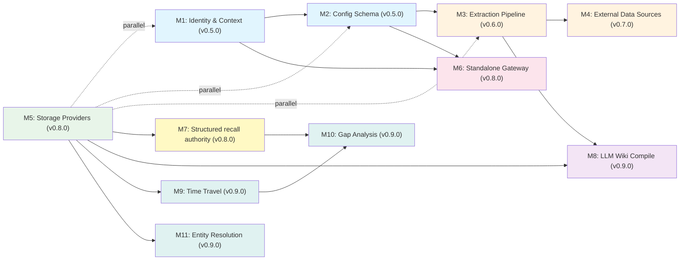

# Astrocyte v1.0.0 Roadmap

This roadmap organizes the v1.0.0 path into milestones, ordered by dependency and impact. Each milestone is a shippable increment — earlier milestones unblock later ones. `0.9.x` contains the pre-GA M8–M11 implementation; `v1.0.0` is reserved for the GA declaration after eval gates pass.

**Architecture references**: See `c4-deployment-domain.md` (System Architecture, Domain Model, Application Architecture), ADR-001 (Deployment Models), ADR-002 (Identity Model), ADR-003 (Config Schema).

---

## Milestone Overview

| # | Milestone | Version | Gaps Addressed | Dependencies | Scope |
|---|-----------|---------|---------------|--------------|-------|
| M1 | Identity & Context | v0.5.0 | Gap 1, Gap 5 | None | Core |
| M2 | Config Schema Evolution | v0.5.0 | Gap 4 | M1 (same release) | Core |
| M3 | Extraction Pipeline | v0.6.0 | Gap 7 | M2 | Core |
| M4 | External Data Sources | v0.7.0 | Gap 2 | M2, M3 | Core + Adapters |
| M5 | Production Storage Providers | v0.8.0 | Gap 6 | None (parallel) | Adapters |
| M6 | Standalone Gateway | v0.8.0 | Gap 3 | M1, M2 | Shipped in-repo (`astrocyte-gateway-py`); **v0.8.x** tags (see § Release numbering) |
| M7 | Structured recall authority | v0.8.0 | Gap 8 | M5 | Core |
| M8 | LLM wiki compile | v0.9.0 | — | M3, M5 | Core; opt-in per bank; manual `brain.compile()` plus gateway/MCP surfaces — [`llm-wiki-compile.md`](llm-wiki-compile.md) |
| M9 | Time travel | v0.9.0 | — | M5 | Core; `retained_at` + `forgotten_at` + `as_of` on VectorFilters + `brain.history()` |
| M10 | Gap analysis | v0.9.0 | — | M7, M9 | Core; `brain.audit()` → `AuditResult(gaps, coverage_score)` |
| M11 | Entity resolution | v0.9.0 | — | M5 (GraphStore) | Core; retain-time `EntityResolver` + evidence chains + `astrocyte-age` graph adapter |

**Release pairing:** **M1 and M2 ship together in a single v0.5.0 tag** (identity + structured context first; config schema immediately after in the same minor). Later milestones renumber as above.

**v0.8.0 ships three milestones:** **M5** (production storage adapters), **M6** (standalone gateway — deployment models / Gap 3), and **M7** (structured recall authority). M7 depends on multi-store hybrid recall from M5; **M6** is logically last but ships on the **same v0.8.x line** as M5/M7.

**v0.9.0 ships M8–M11** (LLM wiki compile, time travel, gap analysis, and entity resolution). These complete the pre-GA feature surface. GA remains gated on the v0.9.x evaluation bar, not on additional API surface.

**v1.0.0 general availability requires M1–M11 implemented and eval-validated.** M9 (time travel), M10 (gap analysis), and M11 (entity resolution) constitute the full "third option" answer; they are implemented in v0.9.0 and remain under release-gate validation before GA. See `platform-positioning.md` for the diagnostic test framing.

**Post-0.9 research track:** Five research phases (R1–R5) target fundamental barriers to benchmark accuracy after the M8–M11 feature surface. Each phase has an eval gate before promotion to core. See § Research track below.

**v0.7.4** closes out pre-**v0.8** standalone gateway and repository packaging (image workflows, Helm, CI gates, docs alignment) before **v0.8.0** milestone work.

---

## M1: Identity & Context

**Gap**: Identity & Authorization Protocol (Gap 1) + User-Scoped Memory (Gap 5)

**Why first**: Every other milestone depends on structured identity. You can't route ingest to the right bank without knowing who the data belongs to. You can't scope memory without knowing user vs agent vs OBO.

### Deliverables

1. **Structured `AstrocyteContext`** (backwards-compatible)
   - Add `actor: ActorIdentity | None` (type, id, claims)
   - Add `on_behalf_of: ActorIdentity | None` (OBO delegation)
   - Keep `principal: str` working — derive from `actor.id` when actor is set
   - Add `effective_permissions()` → intersection of actor + OBO grants
   - File: `astrocyte-py/astrocyte/types.py`

2. **Identity-driven bank resolution**
   - `BankResolver` that maps `(actor, on_behalf_of)` → `bank_id`
   - Default: `user:{id}` → `user-{id}` bank (convention-based)
   - Configurable via `identity:` config section
   - File: new `astrocyte-py/astrocyte/identity.py`

3. **Integration adapter migration (Phase 1)**
   - Add optional `context` parameter to all 19 adapters
   - No breaking changes — `context=None` uses current behavior
   - Files: `astrocyte-py/astrocyte/integrations/*.py`

### Acceptance Criteria

- [x] `AstrocyteContext(principal="user:123")` still works unchanged
- [x] `AstrocyteContext(actor=ActorIdentity(type="user", id="123"))` resolves principal automatically
- [x] OBO: `context.effective_permissions(bank_id)` returns intersection
- [x] Bank resolver maps identity to bank_id with configurable rules
- [x] All existing tests pass without modification (`tests/test_identity_m1.py`, `tests/test_types.py`, etc.)
- [x] ADR-002 implementation validated (library surface; HTTP JWT/OIDC mapping lives in **`astrocyte-gateway-py`** — § M6)

---

## M2: Config Schema Evolution

**Gap**: Config Schema for External World (Gap 4)

**Why second**: M3 and M4 need config sections to declare sources, agents, and extraction profiles. M6 needs the `deployment:` section.

### Deliverables

1. **New config sections** (all optional, backwards-compatible)
   ```yaml
   sources:              # External data source definitions
     tavus-transcripts:
       type: webhook
       extraction_profile: conversation
       target_bank_template: "user-{principal}"
       auth:
         type: hmac
         secret: ${TAVUS_WEBHOOK_SECRET}

   agents:               # Agent registration and default bank mapping
     support-bot:
       principal: "agent:support-bot"
       default_bank: "shared-support"
       allowed_banks: ["shared-*", "user-*"]

   deployment:           # Deployment mode configuration
     mode: library       # "library" | "standalone" | "plugin"

   identity:             # Identity resolution configuration
     resolver: convention  # "convention" | "config" | "custom"
     obo_enabled: false

   extraction_profiles:  # Reusable extraction configurations
     conversation:
       chunking_strategy: dialogue
       entity_extraction: llm
       metadata_mapping:
         speaker: "$.participant_name"
   ```

2. **Config dataclass extensions**
   - New dataclasses: `SourceConfig`, `AgentRegistrationConfig`, `DeploymentConfig`, `IdentityConfig`, `ExtractionProfileConfig`
   - Added to `AstrocyteConfig` as optional fields
   - File: `astrocyte-py/astrocyte/config.py`

3. **Config validation**
   - Validate source references to extraction profiles exist
   - Validate agent bank patterns against declared banks
   - Validate deployment mode prerequisites

### Acceptance Criteria

- [x] Loading a config with no new sections produces identical `AstrocyteConfig` to current
- [x] New sections parse correctly with type validation
- [x] `${ENV_VAR}` substitution works in new sections
- [x] Profile merge order preserved (compliance → profile → user config)
- [x] ADR-003 implementation validated

---

## M3: Extraction Pipeline

**Gap**: Extraction Pipeline (Gap 7)

**Why third**: External data sources (M4) push raw content through the extraction pipeline. Building the pipeline before the connectors means M4 just needs to wire sources to an existing pipeline.

### Deliverables

1. [x] **Extraction pipeline** (inbound complement to retrieval pipeline)
   ```
   Raw Content → Content Normalizer → Chunker → Entity Extractor → brain.retain()
   ```
   - Content normalizer: handles different content types (transcript, email, document, event)
   - Routes to appropriate chunking strategy (sentence, paragraph, dialogue, fixed)
   - Applies extraction profile from config
   - File: new `astrocyte-py/astrocyte/pipeline/extraction.py`

2. [x] **Dialogue chunking strategy**
   - Detect turn boundaries (`Speaker: text` pattern)
   - Keep complete turns together
   - Group consecutive turns up to max_chunk_size
   - Fallback to sentence splitting for single oversized turns
   - File: extend `astrocyte-py/astrocyte/pipeline/chunking.py`

3. [x] **Content type routing**
   - `content_type` field on `RetainRequest`
   - Routes to appropriate chunking strategy
   - Extraction profile can override defaults
   - File: extend `astrocyte-py/astrocyte/pipeline/orchestrator.py`

4. [x] **Extraction profile resolution**
   - Load from config `extraction_profiles:` section
   - Source → profile mapping
   - Default profiles for common content types

### Acceptance Criteria

- [x] Dialogue chunker preserves speaker attribution in chunks (see `chunking._chunk_dialogue` + tests in `tests/test_chunking.py`)
- [x] Content type routing selects chunking strategy; optional `extraction_profile` overrides (`astrocyte.pipeline.extraction.resolve_retain_chunking`, `PipelineOrchestrator.retain`)
- [x] Extraction profiles load from YAML `extraction_profiles:`; built-ins `builtin_text` / `builtin_conversation` merged at runtime (`merged_extraction_profiles` / `merged_user_and_builtin_profiles`)
- [x] Inbound chain: normalize → chunk → optional entity extract → embed → store; profile-driven `metadata_mapping`, `tag_rules`, and `entity_extraction` applied on retain (`prepare_retain_input`)
- [x] Default `RetainRequest.content_type` remains `text`; omitting `extraction_profile` preserves prior behavior aside from light normalization and builtin profile table merge inside the orchestrator

---

## M4: External Data Sources

**Gap**: External Data Sources / Inbound Connectors (Gap 2)

**Why fourth**: Requires M2 (config schema for source definitions) and M3 (extraction pipeline to process inbound data).

### Deliverables

1. **IngestSource SPI** (Protocol class)
   ```python
   class IngestSource(Protocol):
       source_id: str
       source_type: str  # "webhook" | "stream" | "poll"

       async def start(self) -> None: ...
       async def stop(self) -> None: ...
       async def health_check(self) -> HealthStatus: ...
   ```
   File: new `astrocyte-py/astrocyte/ingest/source.py`

2. **Webhook receiver** (first implementation)
   - HTTP endpoint that receives POST payloads
   - HMAC signature validation
   - Routes to extraction pipeline based on source config
   - File: new `astrocyte-py/astrocyte/ingest/webhook.py`

3. **Source registry**
   - Register/deregister sources at runtime
   - Load from config `sources:` section
   - Health monitoring and error thresholds
   - File: new `astrocyte-py/astrocyte/ingest/registry.py`

4. **Proxy query adapter** (for federated recall) — **M4.1** (see below)
   - Forward recall queries to external APIs
   - Merge results with local recall hits
   - Configurable via `sources:` with `type: proxy`

### Acceptance Criteria

- [x] Webhook ingest validates HMAC (when `auth.type: hmac`), parses JSON body, resolves target bank, calls `brain.retain()` — library API: `astrocyte.ingest.handle_webhook_ingest` (HTTP server binding is M6 / app-specific)
- [x] Source registry loads `type: webhook` entries from `sources:` and manages start/stop/health (`SourceRegistry`, `WebhookIngestSource`)
- [x] Proxy query adapter merges external recall with local recall — **M4.1 / federated recall** (`astrocyte.recall.proxy`, RRF in `PipelineOrchestrator.recall`; optional `RecallRequest.external_context`)
- [x] Source health available via `IngestSource.health_check()` → `HealthStatus` (surfaced on **`GET /health/ingest`** and **`GET /v1/admin/sources`** in **`astrocyte-gateway-py`**; structured ingest logs via `astrocyte.ingest.logutil` when `ASTROCYTE_LOG_FORMAT=json`)
- [x] Ingest uses `brain.retain()` so policy (PII, validation, rate limits, quotas) applies on the same path as interactive retains

### M4.1 (implemented): Federated / proxy recall

**Scope**: `sources:` entries with `type: proxy`, `url` (query template with `{query}`), and `target_bank` forward recall queries to external HTTP APIs (JSON `hits` / `results` arrays). Hits merge with local vector/graph recall via **RRF** in `PipelineOrchestrator.recall`; callers may also pass `RecallRequest.external_context`. Tier-2 engine-only recall merges proxy hits by score without double-counting `HybridEngineProvider`.

**Implementation**: `astrocyte.recall.proxy` (`fetch_proxy_recall_hits`, `gather_proxy_hits_for_bank`, `merge_manual_and_proxy_hits`); config validation in `validate_astrocyte_config`; dependency **httpx** for outbound GET.

**Later (when we need them)**: a **hosted redirect/callback server** (or tighter gateway integration) for full browser OAuth UX, **PKCE**, and **device** / **JWT bearer** token grants — not required for the current library surface; see **`adr-003-config-schema.md`** (design note under proxy OAuth).

**Relation to releases**: Shipped after **v0.7.0** (webhook ingest); bundled for users on the **v0.8.0** line — see root **`CHANGELOG.md`**.

**Thin HTTP binding (library)**: optional `astrocyte[gateway]` provides `create_ingest_webhook_app` (Starlette ASGI) → `POST /v1/ingest/webhook/{source_id}` forwarding raw body/headers to `handle_webhook_ingest`. **Standalone** JWT/OIDC, OpenAPI, Docker/Helm, and ops packaging are **`astrocyte-gateway-py`** (§ M6 — shipped in-repo).

### v0.8.x connector track — shipped in-repo (incremental)

- **Event streams:** **`astrocyte-ingestion-kafka`**, **`astrocyte-ingestion-redis`** — `type: stream` with **`ingest_stream_drivers`**; gateway lifespan starts **`IngestSupervisor`**.
- **API poll:** **`astrocyte-ingestion-github`** — `type: poll` / **`api_poll`** with **`driver: github`**; same supervisor model.
- Further connectors (NATS, additional poll targets, gateway plugins) remain on the **v0.8.x** cadence per § Release Strategy — not deferred to post-GA only.

### Deferred / remaining (see § Release Strategy)

- NATS and other stream backends as needed
- Additional **poll** drivers (beyond GitHub) as product priorities dictate
- Additional gateway plugin targets (AWS API Gateway, Envoy, etc.) as needed — see **`gateway-plugins/`** for the shipped Kong, APISIX, and Azure APIM plugins

---

## M5: Production Storage Providers

**Gap**: Production Storage Providers (Gap 6)

**Parallel track**: No dependency on M1-M4. Can be developed concurrently.

### Deliverables

1. **Graph store: Neo4j adapter** — PyPI package **`astrocyte-neo4j`** (`adapters-storage-py/astrocyte-neo4j/`)
   - Implements `GraphStore` SPI
   - Entity and relationship CRUD
   - Neighborhood traversal for graph-enhanced recall
   - Cypher query generation

2. **Document store: Elasticsearch/OpenSearch adapter** — **`astrocyte-elasticsearch`** (`adapters-storage-py/astrocyte-elasticsearch/`)
   - Implements `DocumentStore` SPI
   - BM25 full-text search
   - Keyword retrieval for hybrid recall
   - Index lifecycle management

3. **Vector stores** — **`astrocyte-pgvector`** (PostgreSQL + pgvector), **`astrocyte-qdrant`** (Qdrant); both under `adapters-storage-py/`
   - Implement `VectorStore` SPI (pgvector may also expose document-oriented helpers where applicable)
   - Payload / collection management per backend

### Acceptance Criteria

- [x] Each adapter has integration tests exercising the `VectorStore` / `GraphStore` / `DocumentStore` API (see each package’s `tests/`; optional: authors may also run shared suites from `astrocyte.testing`)
- [x] Hybrid recall (vector + graph + document) produces fused results — core E2E: `tests/test_m5_hybrid_recall_e2e.py`, `tests/test_astrocyte_tier1.py` (in-memory); production adapters validated in `adapters-storage-ci.yml`
- [x] Each adapter ships as a separate PyPI package (`astrocyte-pgvector`, `astrocyte-qdrant`, `astrocyte-neo4j`, `astrocyte-elasticsearch`)
- [x] Integration tests run against containerized instances in CI (`.github/workflows/adapters-storage-ci.yml`; pgvector also covered from root `ci.yml`)
- [x] README with quick-start — `adapters-storage-py/README.md` plus per-adapter READMEs

**Same release — v0.8.0:** This milestone shares the **v0.8.0** line with **M6** (standalone gateway) and **M7** (structured recall authority). Hybrid adapters, gateway, and precedence config ship on the same minor family; see **§ M6** and **§ M7**.

---

## M6: Standalone Gateway

**Gap**: Deployment Models (Gap 3)

**Implementation status (as of 2026-04-12):** The standalone gateway is **shipped in this repository** under **`astrocyte-services-py/astrocyte-gateway-py/`** — FastAPI routes, auth modes, webhook ingest, health/admin, multi-stage **Dockerfile**, **Compose** + runbook, **Helm** chart, **example configs**, CI gates, **GHCR** publish with attestations, and observability hooks (request IDs, JSON access logs, optional OpenTelemetry extra). Release **tagging** follows the **v0.8.x** policy above (not a separate **v0.9.0** tag for gateway-only).

**Why last**: Requires M1 (identity) and M2 (deployment config). The gateway is a thin HTTP adapter over the same `Astrocyte` core — all intelligence stays in the library.

### Deliverables

1. **FastAPI-based standalone gateway** (`astrocyte-gateway-py` package)
   - REST API: `/v1/retain`, `/v1/recall`, `/v1/reflect`, `/v1/forget`
   - JWT validation middleware (consumes tokens from external IdP)
   - Maps JWT claims → `AstrocyteContext` with structured identity
   - OpenAPI spec auto-generated

2. **Webhook receiver endpoint**
   - `/v1/ingest/webhook/{source_id}` — routes to IngestSource registry
   - HMAC validation per source config

3. **Health and admin endpoints**
   - `/health` — gateway + storage backend health
   - `/v1/admin/sources` — source registry status
   - `/v1/admin/banks` — bank listing and health

4. **Docker packaging**
   - Multi-stage Dockerfile
   - `docker-compose.yml` with pgvector + gateway
   - Helm chart (basic) for Kubernetes

### Acceptance Criteria

- [x] Gateway exposes the **Tier 1** core memory API via REST (`/v1/retain`, `/recall`, `/reflect`, `/forget`; OpenAPI at `/docs`). *(Tier 2 engine HTTP surface remains library-first / product-specific.)*
- [x] AuthN maps to structured **`AstrocyteContext`**: **`api_key`**, **`jwt`/`jwt_hs256`**, **`jwt_oidc`** (JWKS, RS256) with **`ActorIdentity`** / claims — see `astrocyte-gateway-py` README and ADR-002.
- [x] Webhook ingest works end-to-end through the gateway (`/v1/ingest/webhook/{source_id}`; CI + tests).
- [x] Docker Compose + runbook bring up a working stack (`astrocyte-services-py/`; see services README).
- [ ] **Performance:** < 10ms gateway-only overhead vs core latency — a benchmark harness exists in-repo (`astrocyte-services-py/astrocyte-gateway-py/scripts/bench_gateway_overhead.py`) and a manual GitHub Actions workflow can run it, but the **< 10 ms** threshold is **not** enforced as a release gate because results are environment-dependent.
- [x] **ADR-001:** Standalone gateway deployment path is **documented and implemented** (package, container, Helm, ops docs). Full organizational “validated” sign-off stays a **release / operator** checklist outside this file.

### Deferred (post–core gateway; scheduled from v0.8.x onward)

Gateway **plugin** integration (Kong, APISIX, Azure API Management, and similar), **event stream** connectors, and **poll** schedulers are **in scope from the v0.8.0 baseline toward v1.0.0**, shipped incrementally on **v0.8.x** tags per § Release numbering — see **§ v0.8.x — Connector & gateway integration track** and **§ Stability: SPI, adapters, and config files**.

- gRPC transport — wait for demand signal (may remain post–v1.0.0)

---

## M7: Structured recall authority

**Gap**: Structured **truth / authority precedence** across heterogeneous stores (Gap 8) — orthogonal to **`tiered_retrieval`** (cost / latency tiers) and to **MIP** (retain routing in `mip.yaml`).

**Why with M5**: Precedence across **graph vs document vs vector** (and optional proxy tiers) requires **production** `GraphStore` / `DocumentStore` / `VectorStore` adapters and validated **hybrid recall** behavior. M7 layers **declarative authority** and **prompt- or code-enforced conflict policy** on top. **Release:** **v0.8.0**, **same line as M5 and M6** (adapters + gateway + authority on one minor family).

**Product stance:** **Optional** in config (default off). The **default** Astrocyte recall path remains multi-strategy fusion (RRF, weights). Naming and docs must keep **cost tiers** (`tiered_retrieval`) and **truth tiers** (this milestone) distinct. See `built-in-pipeline.md` §9.4.

### Deliverables

1. [x] **`astrocyte.yaml` schema** — optional `recall_authority:` (`RecallAuthorityConfig`: tiers, `tier_by_bank`, `rules_inline` / `rules_path`, `apply_to_reflect`). Phase 1 formats fused hits and injects `authority_context`; per-backend binding and **strategy** (`parallel_all` / `sequential_stop`) remain future if we add multi-query tier retrieval.
2. [x] **Runtime** — `apply_recall_authority` on recall; pipeline / `Astrocyte.reflect` optional injection; retain-time `metadata["authority_tier"]` via `tier_by_bank` / extraction profiles. Code-side demotion of hits is not required for Phase 1 (see ADR-004).
3. [x] **Documentation** — `docs/_design/adr/adr-004-recall-authority.md`; cross-links in `built-in-pipeline.md` and roadmap.
4. [x] **Tests** — `tests/test_recall_authority.py`, `tests/test_m7_reflect_authority.py`, `tests/test_m5_hybrid_recall_e2e.py` (interaction with hybrid recall).

### Acceptance Criteria

- [x] Disabled by default; enabling does not change behavior for existing configs without the new section
- [x] Clear separation from `tiered_retrieval` in code, config keys, and docs (ADR-004 + `built-in-pipeline.md` §9.4)
- [x] At least one end-to-end path: multi-store recall → `authority_context` / reflect injection — see tests above
- [x] Performance and token-budget implications documented (ADR-004 — authority blocks add prompt tokens; combine with `homeostasis` / reflect limits)

---

---

## M9: Time Travel

**Why**: Diagnostic test 3 from *Familiarity is the Enemy* — "What did we believe about X on March 1st?" Immutable history with as-of queries is required for compliance audit, post-mortems, and accountability. Without it, memory systems are a mutable black box.

**Design**: Every `VectorItem` gains `retained_at: datetime` (system-set on write, immutable) and `forgotten_at: datetime | None` (set on soft-delete via `forget()`). `VectorFilters` gains `as_of: datetime | None`. The recall path applies the filter: `retained_at <= as_of AND (forgotten_at IS NULL OR forgotten_at > as_of)`. A new `brain.history(bank_id, start, end)` method returns the memory timeline.

### Deliverables

1. **`VectorItem` + `VectorFilters` type changes** — `retained_at: datetime`, `forgotten_at: datetime | None`, `as_of: datetime | None` on filters
2. **`brain.history(bank_id, start, end)`** — returns memories retained and forgotten in a date range
3. **Soft-delete semantics for `forget()`** — default mode writes `forgotten_at`; hard delete available via flag
4. **`astrocyte-pgvector` + `astrocyte-age` adapter updates** — implement `as_of` filter in SQL queries
5. **`as_of` on REST gateway** — `/v1/recall` accepts `as_of` ISO timestamp parameter

### Acceptance Criteria

- [ ] `brain.recall(query, as_of=datetime(...))` returns only memories retained before that timestamp and not yet forgotten
- [ ] `forget()` default mode writes `forgotten_at`; hard delete mode physically removes
- [ ] `brain.history(bank_id, start, end)` returns correctly scoped timeline
- [ ] All existing tests pass (no breaking changes to default retain/recall behavior)
- [ ] pgvector adapter SQL uses indexed `retained_at` column (no sequential scan)

---

## M10: Gap Analysis

**Why**: Diagnostic test 1 from *Familiarity is the Enemy* — "What don't we know?" The ability to reason about absence is what separates an intelligent memory system from a retrieval index. Compliance teams, engineering managers, and agents preparing for a task all need to know where coverage is thin.

**Design**: `brain.audit(scope: str, bank_id: str) -> AuditResult`. Implementation: scoped recall → LLM judge (given these memories, what's missing?) → structured `AuditResult`. The LLM judge is prompted to identify absent topics, thin coverage, and potential contradictions. `coverage_score: float` is a 0–1 composite (memory density × recency × topic breadth).

### Deliverables

1. **`AuditResult` type** — `gaps: list[GapItem]`, `coverage_score: float`, `memories_scanned: int`, `scope: str`
2. **`GapItem` type** — `topic: str`, `severity: Literal["high", "medium", "low"]`, `reason: str`
3. **`brain.audit(scope, bank_id, *, max_memories=50)`** — core implementation
4. **Audit judge** — LLM prompt template in `astrocyte/pipeline/audit.py`; swappable via `audit_judge:` config
5. **`/v1/audit` REST endpoint** — on the standalone gateway

### Acceptance Criteria

- [ ] `brain.audit("topic", bank_id)` returns `AuditResult` with at least one gap when coverage is sparse
- [ ] `coverage_score` is 1.0 for a well-covered topic, < 0.5 for an empty bank
- [ ] Works with mock LLM provider (testable without API key)
- [ ] Audit is opt-in (no cost impact when not called)

---

## M11: Entity Resolution

**Why**: Diagnostic test 2 from *Familiarity is the Enemy* — "Is 'Calvin' the same person as 'the CTO'?" Cosine similarity can retrieve both documents, but it cannot assert they are the same entity with evidence. Entity resolution with evidence chains is what enables cross-document reasoning, graph traversal, and trustworthy recall.

**Design**: Retain-time pipeline stage. After fact extraction: extract named entities from the incoming content → query `GraphStore` for existing entity candidates → for each candidate above similarity threshold, call LLM to confirm with evidence quote → if confirmed, write `EntityLink(link_type="alias_of", entity_a, entity_b, evidence, confidence)` to graph. On recall, graph-enhanced retrieval automatically traverses entity links.

**Default graph store**: `astrocyte-age` (Apache AGE on PostgreSQL) — same instance as `astrocyte-pgvector`, zero additional operational burden. Neo4j remains available as an alternative.

### Deliverables

1. **`EntityResolver` class** — `astrocyte/pipeline/entity_resolution.py`; configurable similarity threshold, LLM confirmation
2. **`EntityLink` type** — `type: str`, `entity_a: str`, `entity_b: str`, `evidence: str`, `confidence: float`, `created_at: datetime`
3. **`GraphStore` SPI extensions** — `find_entity_candidates(name, threshold)`, `store_entity_link(link)`
4. **`astrocyte-age` adapter** — new PyPI package `astrocyte-age`; Apache AGE on PostgreSQL; implements `GraphStore` SPI; `docker-compose.yml` updated to use PostgreSQL image with both pgvector + age extensions
5. **Retain pipeline integration** — entity resolution runs after fact extraction, before dedup; opt-in via `entity_resolution: enabled: true` in config
6. **Recall integration** — graph traversal includes entity links; query for "Calvin" returns memories tagged with "CTO" via link

### Acceptance Criteria

- [ ] Entity resolution stage identifies that "Calvin" and "the CTO" are the same entity when evidence is present in the retained text
- [ ] `EntityLink` written to graph with evidence quote, not just cosine score
- [ ] Disabled by default; `entity_resolution: enabled: true` in config activates
- [ ] `astrocyte-age` passes `GraphStore` SPI contract tests
- [ ] `astrocyte-age` + `astrocyte-pgvector` work against the same PostgreSQL instance
- [ ] Docker Compose updated with AGE-enabled PostgreSQL image

---

## Dependency Graph



**Critical path to v1.0.0**: M1 → M2 → M3 → M4 → M5 → M7 → M8/M9/M10/M11 → eval gates. M8–M11 are implemented in v0.9.0; GA is the validation milestone.

**Parallel track**: M5 (storage providers) can proceed independently of M1–M4

**Gateway track**: v0.5.0 (M1+M2) → M6 (can start after M2, parallel with M3/M4). **M6** ships on the **v0.8.0** line **with M5/M7** (see § Milestone Overview).

**Authority track**: **M5 → M7** (both ship **v0.8.0**)

**Wiki compile track (v0.9.0)**: M3 + M5 → M8. It now runs alongside M9–M11 and is part of the pre-GA validation surface.

**Third-option track (v0.9.0 → v1.0.0)**: M5 → M9 (time travel) → M10 (gap analysis); M5 → M11 (entity resolution). All three are implemented before v1.0.0 GA.

**Research track (post-0.9)**: R1–R5 phases targeting benchmark accuracy barriers; eval gates promotion.

---

## Stability: SPI, adapters, and config files

This section is the **single place** for stability expectations ahead of **v1.0.0**. It applies to the **v0.8.x** connector/plugin track and to GA.

### Core SPIs (library)

Protocols and abstract surfaces that third-party code implements or calls — including **`VectorStore`**, **`GraphStore`**, **`DocumentStore`**, **`IngestSource`**, integration adapter hooks, and pipeline entrypoints documented as public API.

- **Through v1.0.0:** Prefer **additive** changes (new optional fields, new methods with defaults). **Breaking** changes require a **documented deprecation** in release notes and, where applicable, an ADR; after **v1.0.0**, **1.x** keeps SPIs **backwards-compatible** except in a **major** semver bump.
- **Tier distinction:** **Tier 1** memory API and documented SPIs are stability-guaranteed; **Tier 2** engine-only or experimental surfaces stay explicitly labeled in code/docs until promoted.

### Adapter packages (`adapters-storage-py/`, PyPI `astrocyte-*`)

- Adapters **implement** core SPIs; they release on their **own PyPI versions** but declare a **supported `astrocyte` core range** in each package README.
- A **breaking SPI change** in core triggers coordinated **minor/major** adapter releases; CI (e.g. `adapters-storage-ci.yml`) is the enforcement backstop.

### Ingest transport packages (`adapters-ingestion-py/`)

- **Ingest transport** adapters split from core (**`astrocyte-ingestion-kafka`**, **`astrocyte-ingestion-redis`**, …). Version and test like storage adapters when published; CI uses **`adapters-ingestion-ci.yml`**.

### Vendor integration packages (`adapters-integration-py/`)

- Reserved for **vendor / product** integrations (outbound API clients, bidirectional flows, gateway-related shims) that are **not** storage SPIs and **not** generic ingest transports. Empty until packages land.

### `astrocyte.yaml` / `astrocyte.yml` (declarative config)

- **Schema evolution is additive-first:** new sections and keys ship as **optional** with defaults that preserve behavior for existing files.
- **Renames/removals** of supported keys go through **deprecation** (warn → major) as described in ADR-003; validation errors should name the migration path.
- Cross-references (`sources` → `extraction_profiles`, `recall_authority`, etc.) stay validated so invalid configs fail at load time.

### `mip.yaml` (Memory Intent Protocol)

- **Routing contracts** (intents, bank patterns, tool routing) are **stable for integrators** in the same sense as config: **additive** evolution; breaking changes require version bump of the MIP **schema or file format** if we introduce a version field, or deprecation of prior behavior.
- **Orthogonality:** MIP controls **where** retain/recall routes; **`tiered_retrieval`**, **`recall_authority`**, and hybrid fusion are separate knobs — docs must not overload names (see **§ M7** and `built-in-pipeline.md`).

---

## Release Strategy

### Current release line

**`v0.8.0`** and follow-on **`v0.8.x`** tags shipped **M5–M7** (production storage adapters, standalone gateway, structured recall authority) and the connector track. **`v0.9.0`** shipped **M8–M11**. Release notes: root **`CHANGELOG.md`**; tag and PyPI order: **`RELEASING.md`**.

### Historical — v0.4.x era (pre–M1 snapshot)

- Library-first deployment narrative; opaque `principal: str`; early integrations
- Baseline pipeline, policy, MIP, MCP — superseded by **v0.5.0+** milestones below

### v0.5.0 — Identity & Context (M1) + Config Schema (M2)
- **M1:** Structured `AstrocyteContext` with `ActorIdentity` (backwards-compatible, `principal: str` still works)
- **M1:** OBO delegation with permission intersection
- **M1:** Identity-driven bank resolution (`BankResolver`)
- **M1:** Phase 1 integration adapter migration (optional `context` parameter on all 19 adapters)
- **M2:** New optional config sections: `sources`, `agents`, `deployment`, extended `identity`, `extraction_profiles`
- **M2:** Config validation for cross-references (source → extraction profile, agent → bank patterns)
- **M2:** No breaking changes to existing `astrocyte.yml` files

### v0.6.0 — Extraction Pipeline (M3)
- Inbound extraction pipeline: raw content → normalize → chunk → extract → retain
- Dialogue chunking strategy (speaker-aware, turn-preserving)
- Content type routing on `RetainRequest`
- Extraction profile resolution from config

### v0.7.0 — External Data Sources (M4, ingest)
- `IngestSource` SPI (Protocol class)
- Webhook receiver with HMAC validation
- Source registry with health monitoring

### v0.7.1 — Federated recall (M4.1)
- Proxy recall: `sources:` with `type: proxy` + HTTP merge with local RRF (`astrocyte.recall.proxy`, `httpx`)
- Optional manual federated hits via `RecallRequest.external_context`

### v0.8.0 — Production storage (M5) + standalone gateway (M6) + structured recall authority (M7)
- **M5 — adapters:** Neo4j (`astrocyte-neo4j`), Elasticsearch (`astrocyte-elasticsearch`), Qdrant (`astrocyte-qdrant`), PostgreSQL/pgvector (`astrocyte-pgvector`) — packages under `adapters-storage-py/`; hybrid recall validated end-to-end (vector + graph + document)
- **M6 — gateway:** FastAPI **`astrocyte-gateway-py`** (implemented in repo): Tier 1 REST, JWT/OIDC → `AstrocyteContext`, webhook ingest, health/admin, Docker/Compose/Helm, GHCR — **§ M6**
- **M7 — precedence:** Optional `astrocyte.yaml` `recall_authority:` (ADR-004); labeled `authority_context` for recall/reflect; **not** the default recall path — full spec **§ M7**

### v0.8.x — Connector & gateway integration track

**Scope:** Implemented from the v0.8.0 baseline. This line added ingest transports, gateway plugins, and gateway hardening before the v0.9.0 M8–M11 feature release.

- Additional event stream / poll connectors (beyond Kafka, Redis, GitHub) and NATS where needed
- **Gateway plugins — shipped:** Thin integration plugins for **Kong** (Lua), **Apache APISIX** (Lua), and **Azure API Management** (XML policy fragments + Bicep/Terraform/APIOps deployment). Located in **`gateway-plugins/`** at the repo root. Each plugin intercepts OpenAI-compatible `/chat/completions` requests and calls the standalone gateway for recall (pre-hook) and retain (post-hook). See **[`gateway-plugins/README.md`](../../gateway-plugins/README.md)**.
- Hardening: CORS, body limits, admin auth, rate limits at the edge (as product requires)
- **LLM wiki compile (M8 — v0.9.0):** Async CompileEngine maintains rewritable **`WikiPage`** memories (entity/topic/concept) from raw memories, with provenance and cross-links; recall tiers wiki hits ahead of raw with fallback; periodic **lint** pass catches contradictions, stale claims, and orphans. Opt-in per bank; defaults **off**. Full design: **[`llm-wiki-compile.md`](llm-wiki-compile.md)**.

SPI, adapter, and **astrocyte.yaml** / **mip.yaml** stability rules for this track — **§ Stability: SPI, adapters, and config files**.

### v1.0.0 — General Availability (M1–M11)

M8–M11 are implemented in v0.9.0 and are required for GA validation. Together with M1–M7 they constitute the full "third option" system that passes all four diagnostic tests once the eval gates clear.

| Milestone | Diagnostic test | What it delivers |
|-----------|----------------|-----------------|
| **M8: Wiki compile** | Supports gap/entity/time-travel quality | `brain.compile()` + durable wiki pages and provenance |
| **M9: Time travel** | Test 3 — time travel | `retained_at` + `forgotten_at` + `as_of` filter + `brain.history()` |
| **M10: Gap analysis** | Test 1 — gap analysis | `brain.audit()` → `AuditResult(gaps, coverage_score)` |
| **M11: Entity resolution** | Test 2 — entity resolution | `EntityResolver` + `EntityLink` with evidence + `astrocyte-age` graph adapter |

**`astrocyte-age` is the preferred graph store for the PostgreSQL reference stack** — Apache AGE runs inside the same PostgreSQL instance as pgvector, eliminating the need for a separate graph database for most deployments.

### v0.9.0 — M8–M11 feature release

v0.9.0 ships M8–M11: wiki compile, time travel, gap analysis, entity resolution, and the `astrocyte-age` Apache AGE adapter. Full design: [`llm-wiki-compile.md`](llm-wiki-compile.md).

GA eval gate: validate quality gains and no unacceptable latency regression across the memory benchmarks before declaring `v1.0.0`.

### Research track

The research track continues after the M8–M11 implementation. Eval gates determine promotion of each technique to core. All techniques are additive — no SPI breaking changes.

**Post-GA engineering candidates:**
- Additional storage adapters (Pinecone, Weaviate, Memgraph)
- Multi-region / global deployment patterns
- Tavus CVI integration (bidirectional) — HTTP client package **`astrocyte-integration-tavus`** (`adapters-integration-py/`); full bidirectional + e2e deferred
- Phase 3 identity migration (context required, principal-only deprecated)
- Graph-enhanced wiki: `WikiPage` entity cross-links traversable in graph store

**Research track: path to 100% benchmark accuracy**

Five research phases targeting the fundamental barriers remaining after v1.0.0. Each phase addresses a distinct barrier identified by benchmark category-level analysis. Phases are independent and can proceed in parallel on the v0.9.0 line; evaluation gates determine promotion to core. All techniques are additive — no SPI breaking changes.

See `platform-positioning.md` § Research Agenda for the full diagnostic-test grounding.

#### Phase R1: Retrieval recall (getting the right chunks into context)

**Barrier:** Recall hit rate plateaus at ~76% with current embeddings — 24% of queries never retrieve a relevant chunk. No synthesis improvement helps if the right content isn't in the window.

| Technique | Mechanism | Expected lift | Eval gate |
|-----------|-----------|---------------|-----------|
| **Hypothetical Document Embedding (HyDE)** | LLM generates hypothetical answer → embed that → search; bridges paraphrase gap between query and memory | +5–10pp recall hit rate | LoCoMo recall_hit_rate ≥ 0.85 |
| **Hierarchical indexing** | Index at sentence, paragraph, session, and topic granularity; recall searches across levels | +3–5pp MRR | LongMemEval extraction ≥ 90% |
| **Exhaustive multi-pass reformulation** | N diverse query reformulations (beyond current multi-query expansion); union-dedupe results | +2–4pp recall hit rate | No regression on adversarial abstention |
| **Learned retrieval fine-tuning** | Domain-adapted embedding model trained on retain/recall pairs from operator query logs | +5–8pp recall precision | Requires operator opt-in; not benchmarked centrally |

#### Phase R2: Synthesis quality (extracting the right answer from retrieved context)

**Barrier:** Even with correct chunks retrieved, `gpt-4o-mini` synthesis misses details, conflates entities, or hallucinates ~10–15% of the time.

| Technique | Mechanism | Expected lift | Eval gate |
|-----------|-----------|---------------|-----------|
| **Chain-of-thought extraction** | "Step 1: Which memories mention X? Step 2: What do they say? Step 3: Synthesize" — forces explicit grounding | +3–5pp reflect accuracy | LoCoMo multi-hop ≥ 90% |
| **Retrieval-augmented verification** | After LLM generates answer, recall using the *answer* as query; verify retrieved memories support it; abstain if not | +3–5pp on open-domain (fewer false positives) | No regression on single-hop |
| **Contrastive reflect** | Generate N answers with different chunk orderings; keep the most consistent; abstain if divergent | +2–3pp reflect accuracy | Retain p95 latency increase < 50% |
| **Fine-tuned synthesis model** | Small model trained specifically on "given these chunks, extract the answer" — plugs in as Tier 2 engine via SPI | +5–10pp across all categories | LongMemEval overall ≥ 85% |

#### Phase R3: Structured memory representation

**Barrier:** Raw text chunks lose relational and temporal structure. Multi-hop and reasoning queries require structured knowledge that chunked text doesn't encode.

| Technique | Mechanism | Expected lift | Eval gate |
|-----------|-----------|---------------|-----------|
| **Relation extraction** | Retain-time: extract typed triples `(entity, relation, value, temporal)` alongside raw chunks; store in graph | +5–8pp LoCoMo multi-hop | Entity resolution confidence ≥ 0.9 |
| **Episodic memory indexing** | Index by episode context (who, where, emotional valence, sequence) not just content — enables situational retrieval | +3–5pp on contextual queries | New benchmark category needed |
| **Contradiction detection + resolution** | Retain-time: compare incoming facts against existing; flag conflicts; prefer newer or higher-confidence | +5–8pp LongMemEval update | Update category ≥ 90% |

#### Phase R4: Temporal reasoning

**Barrier:** LongMemEval temporal category is at ~11% (mock). LLMs can retrieve timestamped content but struggle to reason about ordering, duration, and change over time.

| Technique | Mechanism | Expected lift | Eval gate |
|-----------|-----------|---------------|-----------|
| **Temporal knowledge graph** | Time intervals on every graph edge; temporal queries become interval algebra (Allen's), not LLM reasoning | +20–30pp LongMemEval temporal | Temporal category ≥ 50% |
| **Timeline generation** | Before answering temporal query, generate explicit timeline artifact; answer from that | +10–15pp temporal reasoning | No regression on extraction |
| **Temporal embeddings** | Encode *when* something was true, not just *what* it says; time-aware similarity search | Research-stage; lift TBD | Requires custom embedding model |
| **Change detection pipeline** | Retain-time: flag superseded facts, tag updates with `preference_update` / `correction` types | +5–8pp LongMemEval update | Update category ≥ 85% |

#### Phase R5: Calibrated abstention

**Barrier:** Perfect abstention means answering when you know and declining when you don't — never hallucinating, never refusing something answerable. Current adversarial is 100% but open-domain is 61.5%.

| Technique | Mechanism | Expected lift | Eval gate |
|-----------|-----------|---------------|-----------|
| **Calibrated confidence scoring** | Output confidence with every reflect; train calibration on benchmark pairs | +5–8pp open-domain | Calibration error < 0.05 |
| **Retrieval sufficiency classifier** | Lightweight model predicts "Is there enough info to answer?" before LLM synthesis; short-circuits to abstention | +5–8pp open-domain (fewer false positives) | No regression on single-hop |
| **Self-consistency verification** | Generate answer N times with different chunk orderings; divergence → abstain | +3–5pp across categories | Adversarial stays ≥ 98% |
| **Coverage-aware retrieval** | `brain.audit()` coverage map checked at recall time; abstain if query topic outside bank coverage | +3–5pp open-domain | Requires M10 (gap analysis) |

#### Projected benchmark trajectory

| Phase | LoCoMo (canonical) | LongMemEval (canonical) | Primary categories improved |
|-------|-------------------|------------------------|----------------------------|
| **Current** | ~70–78% | ~75% (20Q) | — |
| **v0.9.x + M8–M11** | ~72–80% | ~60–68% (200Q) | Multi-session, knowledge-update, temporal, entity |
| **v1.0.0 GA gates** | ~78–85% | ~68–75% (200Q) | Multi-hop, temporal, reasoning, update |
| **After R1 (retrieval)** | ~82–88% | ~75–82% | All (higher recall hit rate) |
| **After R2 (synthesis)** | ~85–90% | ~80–85% | Multi-hop, open-domain, reasoning |
| **After R3 (structured)** | ~88–92% | ~83–88% | Multi-hop, update |
| **After R4 (temporal)** | ~89–93% | ~88–92% | Temporal, update |
| **After R5 (abstention)** | ~92–95% | ~90–93% | Open-domain, adversarial edge cases |
| **Theoretical ceiling** | ~95–97% | ~93–97% | Bounded by embedding + LLM model quality |

**True 100% requires a purpose-built synthesis model** fine-tuned on the "given structured memory, answer questions" task — not a general-purpose LLM. Astrocyte's SPI model means such a model plugs in as a Tier 2 engine without changing the framework. The research track creates the structured substrate (temporal KG, episodic indexing, contradiction resolution) that makes such a model trainable.

---

## Gap-to-Milestone Mapping

| Gap | Description | Milestone | Version | Status |
|-----|-------------|-----------|---------|--------|
| Gap 1 | Identity & Authorization Protocol | M1 | v0.5.0 | Implemented in core (ADR-002 Phase 1); JWT/`tenant_id` enforcement = later milestones |
| Gap 2 | External Data Sources | M4 + M4.1 | v0.7.0 / v0.7.1 | Shipped: webhook ingest, source registry, stream + poll adapters (`adapters-ingestion-py/`), proxy federated recall (`astrocyte.recall.proxy`) |
| Gap 3 | Deployment Models | M6 | v0.8.0 | **Shipped in-repo:** `astrocyte-gateway-py`, Docker/Compose/Helm, CI, GHCR (ADR-001 standalone path). |
| Gap 4 | Config Schema Evolution | M2 | v0.5.0 | Implemented in core (ADR-003); ships with M1 in same tag |
| Gap 5 | User-Scoped Memory | M1 | v0.5.0 | Implemented in core (`BankResolver`, ACL, optional adapter `context`); HTTP UX via **`astrocyte-gateway-py`** auth + config |
| Gap 6 | Production Storage Providers | M5 | v0.8.0 | Implemented: `adapters-storage-py/` packages + CI + publish workflows |
| Gap 7 | Extraction Pipeline | M3 | v0.6.0 | Implemented (`pipeline/extraction`, chunking, profiles) |
| Gap 8 | Structured recall authority (truth precedence vs cost-tiered retrieval) | M7 | v0.8.0 | Implemented (`recall_authority`, `astrocyte.recall.authority`, ADR-004) |

---

## Next milestone focus

**Current state:** M1–M11 are implemented on the v0.9.x line. Active lines in order:

**1. M8–M11 (v0.9.x) — pre-GA feature surface, eval-gated**
Ships the complete third-option implementation surface: wiki compile, time travel, gap analysis, entity resolution, and Apache AGE. Depends on M3 + M5 (both done).

**2. Research track (R1–R5)**
Runs after the M8–M11 feature surface, before and after v1.0.0 GA as quality work warrants. Five research phases target fundamental benchmark accuracy barriers; each has its own eval gate. See § Research track.

**3. v1.0.0 GA — validation and stabilization**
Required for GA:

1. **Eval gates** — M8–M11 pass the benchmark and latency release bar.
2. **Docs and examples** — operator and integrator docs match the shipped API surface.
3. **Stability pass** — SPI, adapter, `astrocyte.yaml`, and `mip.yaml` contracts are frozen or explicitly deprecated.
4. **Tag v1.0.0** once M1–M11 all pass CI and release gates.

**SPI, adapter, `astrocyte.yaml`, and `mip.yaml` stability:** follow **§ Stability**; encode deprecations before breaking changes.
