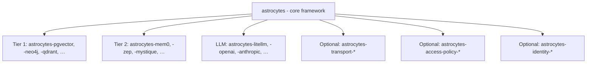

# Ecosystem, packaging, and open-core model

This document defines how Astrocytes is distributed, how providers plug in at both tiers, how optional outbound transport and **access policy** plugins register, and how the open-source / proprietary boundary works. For the two-tier provider model, see `architecture-framework.md`. For SPI definitions, see `provider-spi.md`. For credential gateways and proxy wiring, see `outbound-transport.md`. For identity wiring and external PDP integration, see `identity-and-external-policy.md`.

---

## 1. Open-core model

Astrocytes follows an **open-core** distribution model with a two-tier provider architecture:

| Layer | License | Value |
|---|---|---|
| `astrocytes` (core framework) | Apache 2.0 | Built-in intelligence pipeline, policy layer, profiles, observability |
| `astrocytes-{storage}` (Tier 1 adapters; package slug) | Apache 2.0 | Retrieval Provider SPI - vector DBs, graph DBs, document stores |
| `astrocytes-{engine}` (Tier 2 community) | Apache 2.0 | Community-maintained adapters for full-stack memory engines |
| `astrocytes-{llm}` (LLM adapters) | Apache 2.0 | LLM provider adapters for pipeline + policy operations |
| `astrocytes-transport-{name}` (optional) | Apache 2.0 | Outbound HTTP/TLS/proxy plugins for credential gateways and enterprise proxies |
| `astrocytes-access-policy-{name}` (optional) | Apache 2.0 | External PDP adapters (OPA, Cerbos, …) for `AccessPolicyProvider` |
| `astrocytes-identity-{framework}` (optional) | Apache 2.0 | Thin helpers mapping auth middleware / JWT claims to Astrocyte principals |
| `astrocytes-mystique` (Tier 2 premium) | Proprietary | Best-in-class engine with native reflect, dispositions, consolidation |

**The key insight:** The open-source core is **fully functional** with just Tier 1 retrieval providers. Users get a complete memory system - embedding, entity extraction, multi-strategy retrieval, fusion, reflect - without purchasing any commercial engine. Mystique is the premium upgrade for users who need production-grade performance.

### Natural upgrade path

| Stage | Stack | Cost |
|---|---|---|
| Getting started | `astrocytes` + `astrocytes-pgvector` + `astrocytes-openai` | Free (+ LLM API costs) |
| Add graph retrieval | + `astrocytes-neo4j` | Free |
| Want a managed engine | `astrocytes` + `astrocytes-mem0` | Free (+ Mem0 cloud costs) |
| Want best-in-class | `astrocytes` + `astrocytes-mystique` | Paid |

---

## 2. Package structure



### 2.1 Core framework

The PyPI package is **`astrocytes`**; in this repository it lives under **`astrocytes-py/`**. Design documents are in **`docs/`** at the repository root (not under `astrocytes-py/`).

```
astrocytes-py/                         # Python implementation (open source)
├── astrocytes/
│   ├── __init__.py                    # Public API: Astrocyte class
│   ├── provider.py                    # VectorStore, GraphStore, DocumentStore,
│   │                                  # EngineProvider, LLMProvider, OutboundTransportProvider,
│   │                                  # AccessPolicyProvider (optional)
│   ├── types.py                       # All DTOs (RetainRequest, RecallResult, etc.)
│   ├── capabilities.py                # EngineCapabilities, negotiation logic
│   ├── pipeline/                      # Built-in intelligence pipeline (Tier 1)
│   │   ├── orchestrator.py            # Coordinates pipeline stages
│   │   ├── chunking.py                # Content chunking strategies
│   │   ├── entity_extraction.py       # NER / LLM-based entity extraction
│   │   ├── embedding.py               # Embedding generation via LLM SPI
│   │   ├── retrieval.py               # Multi-strategy retrieval orchestration
│   │   ├── fusion.py                  # RRF fusion
│   │   ├── reranking.py               # Basic reranking (flashrank or LLM)
│   │   ├── reflect.py                 # LLM-based synthesis
│   │   └── consolidation.py           # Basic dedup + archive orchestration
│   ├── policy/
│   │   ├── homeostasis.py             # Rate limits, token budgets, quotas
│   │   ├── barriers.py                # PII, validation, metadata sanitization
│   │   ├── signal_quality.py          # Dedup, scoring, noisy bank detection
│   │   ├── escalation.py              # Circuit breaker, degraded mode
│   │   └── observability.py           # OTel spans, Prometheus metrics, logging
│   ├── profiles/
│   │   ├── support.yaml
│   │   ├── coding.yaml
│   │   ├── personal.yaml
│   │   ├── research.yaml
│   │   └── minimal.yaml
│   ├── testing/                       # Conformance test suites
│   │   ├── vector_store_tests.py      # Tests for VectorStore implementations
│   │   ├── graph_store_tests.py       # Tests for GraphStore implementations
│   │   ├── document_store_tests.py    # Tests for DocumentStore implementations
│   │   ├── engine_provider_tests.py   # Tests for EngineProvider implementations
│   │   └── llm_provider_tests.py      # Tests for LLMProvider implementations
│   └── config.py                      # Config loading, tier detection, profile resolution
└── pyproject.toml
```

### 2.2 Tier 1 retrieval providers

```
astrocytes-pgvector/                   # Vector + optional full-text via PostgreSQL
├── astrocytes_pgvector/
│   ├── __init__.py                    # PgVectorStore (implements VectorStore)
│   ├── fulltext.py                    # Optional: PgDocumentStore (tsvector BM25)
│   └── migrations/                    # Alembic migrations for required tables
├── pyproject.toml

astrocytes-neo4j/                      # Graph store via Neo4j
├── astrocytes_neo4j/
│   ├── __init__.py                    # Neo4jGraphStore (implements GraphStore)
├── pyproject.toml

astrocytes-qdrant/                     # Vector store via Qdrant
├── astrocytes_qdrant/
│   ├── __init__.py                    # QdrantVectorStore (implements VectorStore)
├── pyproject.toml
```

### 2.3 Tier 2 memory engine providers

```
astrocytes-mystique/                   # Proprietary engine
├── astrocytes_mystique/
│   ├── __init__.py                    # MystiqueProvider (implements EngineProvider)
│   └── adapter.py                     # Maps Astrocytes DTOs ↔ Mystique/Hindsight types
├── pyproject.toml

astrocytes-mem0/                       # Community engine
├── astrocytes_mem0/
│   ├── __init__.py                    # Mem0Provider (implements EngineProvider)
│   └── adapter.py                     # Maps Astrocytes DTOs ↔ Mem0 types
├── pyproject.toml
```

### 2.4 LLM providers

```
astrocytes-litellm/                    # Unified gateway (100+ models)
├── astrocytes_litellm/
│   ├── __init__.py                    # LiteLLMProvider (implements LLMProvider)
├── pyproject.toml

astrocytes-openai/                     # Direct OpenAI adapter
├── astrocytes_openai/
│   ├── __init__.py                    # OpenAIProvider (implements LLMProvider)
├── pyproject.toml

astrocytes-anthropic/                  # Direct Anthropic adapter
├── astrocytes_anthropic/
│   ├── __init__.py                    # AnthropicProvider (implements LLMProvider)
├── pyproject.toml
```

Note: AWS Bedrock, Azure OpenAI, and Google Vertex AI are accessed via `astrocytes-litellm` (which supports them natively) or via `astrocytes-openai` with a custom `api_base` for OpenAI-compatible endpoints. Self-hosted models (Ollama, vLLM, LM Studio) also work through either adapter. See `provider-spi.md` section 4.6-4.7 for configuration details.

### 2.5 Outbound transport plugins

```
astrocytes-transport-onecli/           # Example: OneCLI-oriented HTTP/proxy wiring
├── astrocytes_transport_onecli/
│   ├── __init__.py                    # OneCLIOutboundTransport (implements OutboundTransportProvider)
├── pyproject.toml
```

Naming: **`astrocytes-transport-{name}`** - distinct from memory providers (`astrocytes-pgvector`, `astrocytes-mem0`) so packages are recognizable as **network path** plugins, not storage or engines. See `outbound-transport.md`.

### 2.6 Access policy plugins (external PDP, optional)

```
astrocytes-access-policy-opa/          # Example: OPA REST adapter
├── astrocytes_access_policy_opa/
│   ├── __init__.py                    # OPAAccessPolicyProvider (implements AccessPolicyProvider)
├── pyproject.toml
```

Naming: **`astrocytes-access-policy-{name}`**. These are **not** memory providers - they answer allow/deny for memory permissions at the framework boundary. See `identity-and-external-policy.md`.

---

## 3. Plugin discovery via entry points

Providers register using Python's standard entry point mechanism (`importlib.metadata`). **Six** groups are resolved today by `astrocytes-py` discovery: `vector_stores`, `graph_stores`, `document_stores`, `engine_providers`, `llm_providers`, `outbound_transports`. A **seventh** group, `astrocytes.access_policies`, is specified in §3.5 for external PDP packages but is **not** in `ENTRY_POINT_GROUPS` or YAML resolution yet (see §3.8).

### 3.1 Tier 1: Retrieval providers

```toml
# astrocytes-pgvector/pyproject.toml
[project.entry-points."astrocytes.vector_stores"]
pgvector = "astrocytes_pgvector:PgVectorStore"

[project.entry-points."astrocytes.document_stores"]
pgvector = "astrocytes_pgvector.fulltext:PgDocumentStore"
```

```toml
# astrocytes-neo4j/pyproject.toml
[project.entry-points."astrocytes.graph_stores"]
neo4j = "astrocytes_neo4j:Neo4jGraphStore"
```

```toml
# astrocytes-qdrant/pyproject.toml
[project.entry-points."astrocytes.vector_stores"]
qdrant = "astrocytes_qdrant:QdrantVectorStore"
```

### 3.2 Tier 2: Memory engine providers

```toml
# astrocytes-mystique/pyproject.toml
[project.entry-points."astrocytes.engine_providers"]
mystique = "astrocytes_mystique:MystiqueProvider"
```

```toml
# astrocytes-mem0/pyproject.toml
[project.entry-points."astrocytes.engine_providers"]
mem0 = "astrocytes_mem0:Mem0Provider"
```

### 3.3 LLM providers

```toml
# astrocytes-litellm/pyproject.toml
[project.entry-points."astrocytes.llm_providers"]
litellm = "astrocytes_litellm:LiteLLMProvider"
```

### 3.4 Outbound transport providers (optional)

```toml
# astrocytes-transport-onecli/pyproject.toml
[project.entry-points."astrocytes.outbound_transports"]
onecli = "astrocytes_transport_onecli:OneCLIOutboundTransport"
```

### 3.5 Access policy providers (optional, spec)

```toml
# astrocytes-access-policy-opa/pyproject.toml
[project.entry-points."astrocytes.access_policies"]
opa = "astrocytes_access_policy_opa:OPAAccessPolicyProvider"
```

**Today:** core config uses `access_control.enabled` / `default_policy` and **static access grants** under `banks.<id>.access` (see `production-grade-http-service.md`). The `astrocytes.access_policies` entry point group is the intended future hook for an external PDP; it is not yet listed in `ENTRY_POINT_GROUPS` or loaded from YAML.

### 3.6 Resolution in config

```yaml
# Tier 1 - references storage entry points
provider_tier: storage
vector_store: pgvector          # → astrocytes.vector_stores:pgvector
graph_store: neo4j              # → astrocytes.graph_stores:neo4j
llm_provider: openai            # → astrocytes.llm_providers:openai

# Tier 2 - references memory engine entry points
provider_tier: engine
provider: mystique              # → astrocytes.engine_providers:mystique

# Optional - outbound HTTP/TLS (credential gateway, corporate proxy)
outbound_transport:
  provider: onecli               # → astrocytes.outbound_transports:onecli
  config:
    gateway_url: http://localhost:10255

# Access control (implemented today — see [production-grade HTTP service](../_end-user/production-grade-http-service.md))
access_control:
  enabled: true
  default_policy: owner_only

# Optional per-bank grants (when access_control.enabled)
# banks:
#   my-bank:
#     access:
#       - principal: "team:analytics"
#         grants: [recall]

# Future — external PDP via astrocytes.access_policies (not in core discovery yet)
# access_control:
#   policy_provider: opa
#   policy_provider_config: { base_url: http://localhost:8181 }
```

Direct import paths also work for unregistered providers:

```yaml
vector_store: mycompany.stores.custom:CustomVectorStore
```

### 3.7 Discovery in code

Discovery lives in `astrocytes._discovery` (used by the reference service and tests). It returns **classes** registered under the groups in §3.1–3.4 (not `astrocytes.access_policies` until that group is added to discovery).

```python
from astrocytes._discovery import available_providers, discover_entry_points

# All non-empty groups: {"vector_stores": {...}, "engine_providers": {...}, ...}
available_providers()

# Single group, same shape as YAML short names (e.g. Tier-2 `provider:` keys)
discover_entry_points("engine_providers")
# → {"mystique": <class MystiqueProvider>, ...}
```

### 3.8 Reference `astrocytes-rest` vs embedding Astrocyte

**Plugins and config:** Contributors ship packages with `pyproject.toml` entry points (§3.1–3.4). §3.6 shows how deployers reference those plugins in YAML (short name or `module:Class`). Discovery helpers live in `astrocytes._discovery`.

**Important:** `Astrocyte.from_config(path)` loads **`AstrocyteConfig` only** — it does not instantiate vector stores, LLMs, or Tier‑2 engines. Bootstrap code must call `resolve_provider`, construct providers with `provider_config`, and attach them via `set_pipeline` and/or `set_engine_provider`. The reference HTTP app (`astrocytes-services-py`) implements **Tier 1** wiring from YAML; **Tier‑2 / engine wiring from the same config** there is optional work — see `wiring.py` / `brain.py` for what is enabled today.

**HTTP extensions (auth, extra routers):** there are **no** published `astrocytes.rest.*` entry point groups yet. Identity is handled **in-process** (env-driven auth modes in the REST package). For custom auth or routes, embed `astrocyte` in your own FastAPI/ASGI app today; a narrow plugin surface for `astrocytes-rest` (e.g. optional router and auth factory entry points) is planned so third parties do not have to fork the reference app.

---

## 4. Provider implementation guides

### 4.1 Tier 1: Minimal vector store

```python
"""astrocytes-example-vector: a minimal vector store provider."""

from astrocytes.provider import VectorStore
from astrocytes.types import VectorItem, VectorHit, VectorFilters, HealthStatus


class InMemoryVectorStore(VectorStore):
    """Minimal vector store for development/testing."""

    def __init__(self, config: dict):
        self._vectors: dict[str, VectorItem] = {}

    async def store_vectors(self, items: list[VectorItem]) -> list[str]:
        for item in items:
            self._vectors[item.id] = item
        return [item.id for item in items]

    async def search_similar(
        self,
        query_vector: list[float],
        bank_id: str,
        limit: int = 10,
        filters: VectorFilters | None = None,
    ) -> list[VectorHit]:
        # Real implementation: cosine similarity against stored vectors
        results = []
        for item in self._vectors.values():
            if item.bank_id == bank_id:
                score = self._cosine_similarity(query_vector, item.vector)
                results.append(VectorHit(
                    id=item.id, text=item.text, score=score,
                    metadata=item.metadata, tags=item.tags,
                    fact_type=item.fact_type, occurred_at=item.occurred_at,
                ))
        results.sort(key=lambda h: h.score, reverse=True)
        return results[:limit]

    async def delete(self, ids: list[str], bank_id: str) -> int:
        count = 0
        for id in ids:
            if id in self._vectors and self._vectors[id].bank_id == bank_id:
                del self._vectors[id]
                count += 1
        return count

    async def health(self) -> HealthStatus:
        return HealthStatus(healthy=True, message="in-memory vector store")

    @staticmethod
    def _cosine_similarity(a: list[float], b: list[float]) -> float:
        # Implementation omitted for brevity
        ...
```

### 4.2 Tier 2: Minimal memory engine provider

```python
"""astrocytes-example-engine: a minimal memory engine provider."""

from astrocytes.provider import EngineProvider
from astrocytes.types import (
    RetainRequest, RetainResult,
    RecallRequest, RecallResult,
    HealthStatus,
)
from astrocytes.capabilities import EngineCapabilities


class ExampleEngine(EngineProvider):
    """Wraps an external memory engine with Astrocytes DTOs."""

    def __init__(self, config: dict):
        self._client = ExternalEngineClient(config["endpoint"], config["api_key"])

    def capabilities(self) -> EngineCapabilities:
        return EngineCapabilities(
            supports_reflect=False,
            supports_forget=True,
            supports_semantic_search=True,
            supports_keyword_search=True,
        )

    async def health(self) -> HealthStatus:
        ok = await self._client.ping()
        return HealthStatus(healthy=ok, message="connected" if ok else "unreachable")

    async def retain(self, request: RetainRequest) -> RetainResult:
        # Map Astrocytes DTO → engine's native format
        result = await self._client.add_memory(
            text=request.content,
            user_id=request.bank_id,
            metadata=request.metadata,
        )
        return RetainResult(stored=True, memory_id=result["id"])

    async def recall(self, request: RecallRequest) -> RecallResult:
        # Map engine results → Astrocytes DTOs
        raw = await self._client.search(
            query=request.query,
            user_id=request.bank_id,
            limit=request.max_results,
        )
        hits = [self._map_hit(h) for h in raw["results"]]
        return RecallResult(
            hits=hits,
            total_available=raw["total"],
            truncated=len(hits) < raw["total"],
        )
```

### 4.3 Provider configuration

All providers receive configuration via the appropriate config section:

```yaml
# Tier 1
vector_store_config:
  connection_url: postgresql://localhost/memories
  pool_size: 10

graph_store_config:
  uri: bolt://localhost:7687
  user: neo4j
  password: ${NEO4J_PASSWORD}

# Tier 2
provider_config:
  endpoint: https://api.mem0.ai
  api_key: ${MEM0_API_KEY}
  org_id: my-org

# LLM
llm_provider_config:
  api_key: ${OPENAI_API_KEY}
  model: text-embedding-3-small
```

The core passes the relevant `*_config` dict to the provider's `__init__`. The core does not interpret or validate provider-specific config.

### 4.4 Conformance test suites

The `astrocytes` core ships **separate conformance suites** for each SPI:

```python
# Testing a vector store
from astrocytes.testing import VectorStoreConformanceTests

class TestMyVectorStore(VectorStoreConformanceTests):
    def create_vector_store(self):
        return MyVectorStore(config={...})

# Testing a graph store
from astrocytes.testing import GraphStoreConformanceTests

class TestMyGraphStore(GraphStoreConformanceTests):
    def create_graph_store(self):
        return MyGraphStore(config={...})

# Testing a memory engine provider
from astrocytes.testing import EngineProviderConformanceTests

class TestMyEngine(EngineProviderConformanceTests):
    def create_engine_provider(self):
        return MyEngine(config={...})
```

Each suite tests:

- Required methods work correctly (store → retrieve round-trip)
- Health check returns valid `HealthStatus`
- Filters are applied correctly (bank_id isolation, tags, time ranges)
- DTOs are correctly populated (no None where required, scores in range)
- Declared capabilities match actual behavior

---

## 5. Versioning and compatibility

### 5.1 SPI versioning

Each protocol is independently versioned:

```python
class VectorStore(Protocol):
    SPI_VERSION: ClassVar[int] = 1

class GraphStore(Protocol):
    SPI_VERSION: ClassVar[int] = 1

class EngineProvider(Protocol):
    SPI_VERSION: ClassVar[int] = 1

class LLMProvider(Protocol):
    SPI_VERSION: ClassVar[int] = 1
```

The core supports providers targeting the current and previous SPI version. Breaking changes require a major version bump.

### 5.2 DTO evolution

DTOs use `dataclass` with default values for all optional fields. New fields are always added as optional with defaults, so existing providers continue to work.

**Portable DTO constraint:** All DTOs must use only serializable, cross-implementation types (str, int, float, bool, None, list, dict, datetime, dataclass). No `Any`, no callables, no Python-specific constructs in portable contract fields. This keeps Python and Rust implementations aligned. See `implementation-language-strategy.md` for the full design checklist.

### 5.3 Compatibility matrix

| Provider | Type | astrocytes version | SPI version | Status |
|---|---|---|---|---|
| astrocytes-pgvector | VectorStore | >=0.1 | VS 1 | Official |
| astrocytes-neo4j | GraphStore | >=0.1 | GS 1 | Official |
| astrocytes-qdrant | VectorStore | >=0.1 | VS 1 | Official |
| astrocytes-mystique | EngineProvider | >=0.1 | EP 1 | Official |
| astrocytes-mem0 | EngineProvider | >=0.1 | EP 1 | Community |
| astrocytes-zep | EngineProvider | >=0.1 | EP 1 | Community |
| astrocytes-litellm | LLMProvider | >=0.1 | LP 1 | Official |
| astrocytes-openai | LLMProvider | >=0.1 | LP 1 | Official |
| astrocytes-anthropic | LLMProvider | >=0.1 | LP 1 | Official |

---

## 6. Installation patterns

### Tier 1: DIY with your own databases (fully open source)

```bash
pip install astrocytes astrocytes-pgvector astrocytes-openai
```

```yaml
profile: personal
provider_tier: storage
vector_store: pgvector
vector_store_config:
  connection_url: postgresql://localhost/memories
llm_provider: openai
llm_provider_config:
  api_key: ${OPENAI_API_KEY}
```

### Tier 1: With graph retrieval

```bash
pip install astrocytes astrocytes-pgvector astrocytes-neo4j astrocytes-anthropic
```

```yaml
profile: research
provider_tier: storage
vector_store: pgvector
vector_store_config:
  connection_url: postgresql://localhost/memories
graph_store: neo4j
graph_store_config:
  uri: bolt://localhost:7687
llm_provider: anthropic
llm_provider_config:
  api_key: ${ANTHROPIC_API_KEY}
```

### Tier 1: With split completion + embedding providers

```bash
pip install astrocytes astrocytes-pgvector astrocytes-anthropic
```

```yaml
profile: coding
provider_tier: storage
vector_store: pgvector
vector_store_config:
  connection_url: postgresql://localhost/memories
llm_provider: anthropic
llm_provider_config:
  api_key: ${ANTHROPIC_API_KEY}
  model: claude-sonnet-4-20250514
embedding_provider: local                    # No API cost for embeddings
embedding_provider_config:
  model: all-MiniLM-L6-v2
```

### Tier 1: Enterprise with AWS Bedrock

```bash
pip install astrocytes astrocytes-pgvector astrocytes-litellm
```

```yaml
profile: support
provider_tier: storage
vector_store: pgvector
vector_store_config:
  connection_url: postgresql://rds-host/memories
llm_provider: litellm
llm_provider_config:
  model: bedrock/anthropic.claude-sonnet-4-20250514-v1:0
  # Uses AWS IAM credentials from environment
```

### Tier 1: Fully local (air-gapped / privacy-sensitive)

```bash
pip install astrocytes astrocytes-pgvector astrocytes-openai
```

```yaml
profile: personal
provider_tier: storage
vector_store: pgvector
vector_store_config:
  connection_url: postgresql://localhost/memories
llm_provider: openai                         # OpenAI-compatible API
llm_provider_config:
  api_base: http://localhost:11434/v1        # Ollama
  api_key: not-needed
  model: llama3.2
embedding_provider: local
embedding_provider_config:
  model: all-MiniLM-L6-v2
```

### Tier 2: Managed memory engine (Mem0)

```bash
pip install astrocytes astrocytes-mem0
```

```yaml
profile: personal
provider_tier: engine
provider: mem0
provider_config:
  api_key: ${MEM0_API_KEY}
```

### Tier 2: Premium memory engine (Mystique)

```bash
pip install astrocytes astrocytes-mystique
```

```yaml
profile: support
provider_tier: engine
provider: mystique
provider_config:
  endpoint: https://mystique.company.com
  api_key: ${MYSTIQUE_API_KEY}
  tenant_id: my-tenant
```

### Development (minimal, no external services)

```bash
pip install astrocytes astrocytes-sqlite astrocytes-openai
```

```yaml
profile: minimal
provider_tier: storage
vector_store: sqlite
vector_store_config:
  db_path: ./dev-memory.db
llm_provider: openai
llm_provider_config:
  api_key: ${OPENAI_API_KEY}
```

---

## 7. Community provider guidelines

### For Tier 1 retrieval providers

1. **Name your package `astrocytes-{database}`** (e.g., `astrocytes-pgvector`, `astrocytes-neo4j`).
2. **Register the entry point** under the appropriate group: `astrocytes.vector_stores`, `astrocytes.graph_stores`, or `astrocytes.document_stores`.
3. **Implement only the storage protocol.** You handle CRUD operations. The pipeline handles intelligence.
4. **Run the conformance test suite** for your protocol type.
5. **Handle your own connections.** Accept connection config in `__init__`, manage pools, handle reconnection.
6. **Respect the async contract.** Use proper async I/O (asyncpg, httpx, etc.).
7. **A single package may implement multiple protocols.** For example, `astrocytes-pgvector` can implement both `VectorStore` (pgvector) and `DocumentStore` (tsvector BM25) and register both entry points.

### For Tier 2 memory engine providers

1. **Name your package `astrocytes-{engine}`** (e.g., `astrocytes-mem0`, `astrocytes-zep`).
2. **Register the entry point** under `astrocytes.engine_providers`.
3. **Own your DTOs mapping.** Accept Astrocytes types, return Astrocytes types. Never expose your engine's internal types through the SPI.
4. **Declare capabilities honestly.** Under-declare rather than over-declare. The core's fallback layer handles the gaps.
5. **Own your storage.** Your engine manages its own vector DB, graph DB, etc. Users configure database choices through `provider_config`.
6. **Run the conformance test suite** and include results in your README.

### For all providers

- **Don't depend on `astrocytes` internals.** Import only from `astrocytes.provider`, `astrocytes.types`, `astrocytes.capabilities`, and `astrocytes.testing`.
- **Handle your own configuration.** The core passes config as-is. Validate in `__init__`.
- **Respect the async contract.** All SPI methods are `async`. No blocking calls.

---

## 8. Governance

- The `astrocytes` core is maintained by the AstrocyteAI team.
- Official retrieval providers (pgvector, Neo4j, Qdrant) are maintained by the AstrocyteAI team.
- Community providers are maintained by their respective authors.
- The conformance test suites are the contract - if your provider passes them, it works with Astrocytes.
- SPI changes go through an RFC process with community input before implementation.
- Provider authors are encouraged to open issues on the core repo for SPI feature requests.
