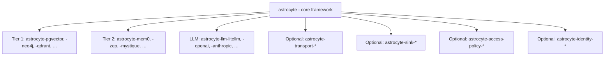

# Ecosystem, packaging, and open-core model

This document defines how Astrocyte is distributed, how providers plug in at both tiers, how optional **memory export sinks**, outbound transport, and **access policy** plugins register, and how the open-source / proprietary boundary works. For the two-tier model and the read vs export split, see `architecture.md` §2 and `storage-and-data-planes.md`. For SPI definitions, see `provider-spi.md`. For warehouse / lakehouse export design, see `memory-export-sink.md`. For credential gateways and proxy wiring, see `outbound-transport.md`. For identity wiring and external PDP integration, see `identity-and-external-policy.md`.

**Current release line (`v0.8.x`, latest shipped tag `v0.8.0`):** Tier 1 storage adapters under `adapters-storage-py/` (including **`astrocyte-pgvector`**), optional **`astrocyte-gateway-py`**, optional **`recall_authority`** ([ADR-004](/design/adr/adr-004-recall-authority/)), and ingest connectors (Kafka, Redis streams, GitHub poll). Release history: [`CHANGELOG.md`](https://github.com/AstrocyteAI/astrocyte/blob/main/CHANGELOG.md) in the repository root.

---

## 1. Open-core model

Astrocyte follows an **open-core** distribution model with a two-tier provider architecture:

| Layer | License | Value |
|---|---|---|
| `astrocyte` (core framework) | Apache 2.0 | Built-in intelligence pipeline, policy layer, profiles, observability |
| `astrocyte-{storage}` (Tier 1 adapters; package slug) | Apache 2.0 | Retrieval Provider SPI - vector DBs, graph DBs, document stores |
| `astrocyte-{engine}` (Tier 2 community) | Apache 2.0 | Community-maintained adapters for full-stack memory engines |
| `astrocyte-{llm}` (LLM adapters) | Apache 2.0 | LLM provider adapters for pipeline + policy operations |
| `astrocyte-transport-{name}` (optional) | Apache 2.0 | Outbound HTTP/TLS/proxy plugins for credential gateways and enterprise proxies |
| `astrocyte-sink-{target}` (optional) | Apache 2.0 | Memory export sink — warehouses, lakehouses, Iceberg/Delta/Parquet/Kafka, … |
| `astrocyte-access-policy-{name}` (optional) | Apache 2.0 | External PDP adapters (OPA, Cerbos, …) for `AccessPolicyProvider` |
| `astrocyte-identity-{framework}` (optional) | Apache 2.0 | Thin helpers mapping auth middleware / JWT claims to Astrocyte principals |
| `astrocyte-mystique` (Tier 2 premium) | Proprietary | Best-in-class engine with native reflect, dispositions, consolidation |

**The key insight:** The open-source core is **fully functional** with just Tier 1 retrieval providers. Users get a complete memory system - embedding, entity extraction, multi-strategy retrieval, fusion, reflect - without purchasing any commercial engine. Mystique is the premium upgrade for users who need production-grade performance.

### Natural upgrade path

| Stage | Stack | Cost |
|---|---|---|
| Getting started | `astrocyte` + `astrocyte-pgvector` + `astrocyte-openai` | Free (+ LLM API costs) |
| Add graph retrieval | + `astrocyte-neo4j` | Free |
| Want a managed engine | `astrocyte` + `astrocyte-mem0` | Free (+ Mem0 cloud costs) |
| Want best-in-class | `astrocyte` + `astrocyte-mystique` | Paid |

---

## 2. Package structure



### 2.1 Core framework

The PyPI package is **`astrocyte`**; in this repository it lives under **`astrocyte-py/`**. Design documents are in **`docs/`** at the repository root (not under `astrocyte-py/`).

```
astrocyte-py/                         # Python implementation (open source)
├── astrocyte/
│   ├── __init__.py                    # Public API: Astrocyte class
│   ├── provider.py                    # VectorStore, GraphStore, DocumentStore,
│   │                                  # EngineProvider, LLMProvider, OutboundTransportProvider,
│   │                                  # AccessPolicyProvider (optional)
│   ├── types.py                       # All DTOs (RetainRequest, RecallResult, etc.)
│   ├── capabilities.py                # EngineCapabilities, negotiation logic
│   ├── pipeline/                      # Built-in intelligence pipeline (Tier 1)
│   │   ├── orchestrator.py            # Coordinates pipeline stages
│   │   ├── chunking.py                # Content chunking strategies
│   │   ├── entity_extraction.py       # NER / LLM-based entity extraction
│   │   ├── embedding.py               # Embedding generation via LLM SPI
│   │   ├── retrieval.py               # Multi-strategy retrieval orchestration
│   │   ├── fusion.py                  # RRF fusion
│   │   ├── reranking.py               # Basic reranking (flashrank or LLM)
│   │   ├── reflect.py                 # LLM-based synthesis
│   │   └── consolidation.py           # Basic dedup + archive orchestration
│   ├── policy/
│   │   ├── homeostasis.py             # Rate limits, token budgets, quotas
│   │   ├── barriers.py                # PII, validation, metadata sanitization
│   │   ├── signal_quality.py          # Dedup, scoring, noisy bank detection
│   │   ├── escalation.py              # Circuit breaker, degraded mode
│   │   └── observability.py           # OTel spans, Prometheus metrics, logging
│   ├── profiles/
│   │   ├── support.yaml
│   │   ├── coding.yaml
│   │   ├── personal.yaml
│   │   ├── research.yaml
│   │   └── minimal.yaml
│   ├── testing/                       # Conformance test suites
│   │   ├── vector_store_tests.py      # Tests for VectorStore implementations
│   │   ├── graph_store_tests.py       # Tests for GraphStore implementations
│   │   ├── document_store_tests.py    # Tests for DocumentStore implementations
│   │   ├── engine_provider_tests.py   # Tests for EngineProvider implementations
│   │   └── llm_provider_tests.py      # Tests for LLMProvider implementations
│   └── config.py                      # Config loading, tier detection, profile resolution
└── pyproject.toml
```

### 2.2 Tier 1 retrieval providers

Monorepo layout: optional packages live under **`adapters-storage-py/`** (for example **`adapters-storage-py/astrocyte-pgvector/`**).

```
adapters-storage-py/astrocyte-pgvector/       # Vector + optional full-text via PostgreSQL
├── astrocyte_pgvector/
│   ├── __init__.py                    # PgVectorStore (implements VectorStore)
│   ├── fulltext.py                    # Optional: PgDocumentStore (tsvector BM25)
│   └── migrations/                    # Alembic migrations for required tables
├── pyproject.toml

adapters-storage-py/astrocyte-neo4j/          # Graph store via Neo4j
├── astrocyte_neo4j/
│   ├── __init__.py                    # Neo4jGraphStore (implements GraphStore)
├── pyproject.toml

adapters-storage-py/astrocyte-qdrant/         # Vector store via Qdrant
├── astrocyte_qdrant/
│   ├── __init__.py                    # QdrantVectorStore (implements VectorStore)
├── pyproject.toml
```

**Ingest transports** (optional): **`adapters-ingestion-py/`** holds packages such as **`astrocyte-ingestion-kafka`** and **`astrocyte-ingestion-redis`** — **not** `VectorStore` / `GraphStore` / `DocumentStore` (those stay under **`adapters-storage-py/`**). **Vendor / product** integrations (outbound, bidirectional) are intended to live under **`adapters-integration-py/`** as packages land. Core ingest types may still live in **`astrocyte-py`** until split for independent versioning.

### 2.3 Tier 2 memory engine providers

```
astrocyte-mystique/                   # Proprietary engine
├── astrocyte_mystique/
│   ├── __init__.py                    # MystiqueProvider (implements EngineProvider)
│   └── adapter.py                     # Maps Astrocyte DTOs ↔ Mystique/Hindsight types
├── pyproject.toml

astrocyte-mem0/                       # Community engine
├── astrocyte_mem0/
│   ├── __init__.py                    # Mem0Provider (implements EngineProvider)
│   └── adapter.py                     # Maps Astrocyte DTOs ↔ Mem0 types
├── pyproject.toml
```

### 2.4 LLM providers

```
astrocyte-llm-litellm/                    # Unified gateway (100+ models)
├── astrocyte_llm_litellm/
│   ├── __init__.py                    # LiteLLMProvider (implements LLMProvider)
├── pyproject.toml

astrocyte-openai/                     # Direct OpenAI adapter
├── astrocyte_openai/
│   ├── __init__.py                    # OpenAIProvider (implements LLMProvider)
├── pyproject.toml

astrocyte-anthropic/                  # Direct Anthropic adapter
├── astrocyte_anthropic/
│   ├── __init__.py                    # AnthropicProvider (implements LLMProvider)
├── pyproject.toml
```

Note: AWS Bedrock, Azure OpenAI, and Google Vertex AI are accessed via `astrocyte-llm-litellm` (which supports them natively) or via `astrocyte-openai` with a custom `api_base` for OpenAI-compatible endpoints. Self-hosted models (Ollama, vLLM, LM Studio) also work through either adapter. See `provider-spi.md` section 4.6-4.7 for configuration details.

### 2.5 Outbound transport plugins

```
astrocyte-transport-onecli/           # Example: OneCLI-oriented HTTP/proxy wiring
├── astrocyte_transport_onecli/
│   ├── __init__.py                    # OneCLIOutboundTransport (implements OutboundTransportProvider)
├── pyproject.toml
```

Naming: **`astrocyte-transport-{name}`** - distinct from memory providers (`astrocyte-pgvector`, `astrocyte-mem0`) so packages are recognizable as **network path** plugins, not storage or engines. See `outbound-transport.md`.

### 2.6 Memory export sink plugins (optional)

```
astrocyte-sink-iceberg/                # Example: append governed events to an Iceberg table
├── astrocyte_sink_iceberg/
│   ├── __init__.py                    # IcebergMemorySink (implements MemoryExportSink)
├── pyproject.toml
```

Naming: **`astrocyte-sink-{target}`** — **not** `astrocyte-{name}` (reserved for Tier 1 databases) and **not** `astrocyte-transport-*` (egress HTTP only). Sinks implement **`emit()` / `flush()`** for durable export, not `search_similar()`. See `memory-export-sink.md` and `provider-spi.md` §5.

### 2.7 Access policy plugins (external PDP, optional)

```
astrocyte-access-policy-opa/          # Example: OPA REST adapter
├── astrocyte_access_policy_opa/
│   ├── __init__.py                    # OPAAccessPolicyProvider (implements AccessPolicyProvider)
├── pyproject.toml
```

Naming: **`astrocyte-access-policy-{name}`**. These are **not** memory providers - they answer allow/deny for memory permissions at the framework boundary. See `identity-and-external-policy.md`.

---

## 3. Plugin discovery via entry points

Providers register using Python's standard entry point mechanism (`importlib.metadata`). **Six** groups are resolved today by `astrocyte-py` discovery: `astrocyte.vector_stores`, `astrocyte.graph_stores`, `astrocyte.document_stores`, `astrocyte.engine_providers`, `astrocyte.llm_providers`, `astrocyte.outbound_transports`. **Two** additional groups are specified for ecosystem packages and **core discovery / YAML wiring is not guaranteed yet**: `astrocyte.access_policies` (§3.6) and `astrocyte.memory_export_sinks` (§3.5). Treat both like transport—entry points and config shapes are stable in docs before core loaders catch up (see §3.9).

### 3.1 Tier 1: Retrieval providers

```toml
# adapters-storage-py/astrocyte-pgvector/pyproject.toml
[project.entry-points."astrocyte.vector_stores"]
pgvector = "astrocyte_pgvector:PgVectorStore"

[project.entry-points."astrocyte.document_stores"]
pgvector = "astrocyte_pgvector.fulltext:PgDocumentStore"
```

```toml
# adapters-storage-py/astrocyte-neo4j/pyproject.toml
[project.entry-points."astrocyte.graph_stores"]
neo4j = "astrocyte_neo4j:Neo4jGraphStore"
```

```toml
# adapters-storage-py/astrocyte-qdrant/pyproject.toml
[project.entry-points."astrocyte.vector_stores"]
qdrant = "astrocyte_qdrant:QdrantVectorStore"
```

### 3.2 Tier 2: Memory engine providers

```toml
# astrocyte-mystique/pyproject.toml
[project.entry-points."astrocyte.engine_providers"]
mystique = "astrocyte_mystique:MystiqueProvider"
```

```toml
# astrocyte-mem0/pyproject.toml
[project.entry-points."astrocyte.engine_providers"]
mem0 = "astrocyte_mem0:Mem0Provider"
```

### 3.3 LLM providers

```toml
# astrocyte-llm-litellm/pyproject.toml
[project.entry-points."astrocyte.llm_providers"]
litellm = "astrocyte_llm_litellm:LiteLLMProvider"
```

### 3.4 Outbound transport providers (optional)

```toml
# astrocyte-transport-onecli/pyproject.toml
[project.entry-points."astrocyte.outbound_transports"]
onecli = "astrocyte_transport_onecli:OneCLIOutboundTransport"
```

### 3.5 Memory export sink providers (optional, spec)

```toml
# astrocyte-sink-iceberg/pyproject.toml
[project.entry-points."astrocyte.memory_export_sinks"]
iceberg = "astrocyte_sink_iceberg:IcebergMemorySink"
```

**Today:** the **`MemoryExportSink`** protocol and event taxonomy are specified in `memory-export-sink.md` and `provider-spi.md` §5. Core does **not yet** load `memory_export_sinks:` from YAML.

**Temporary options (supported now):**

1. Use **`event-hooks.md`** webhooks to an ingestor that honors the same event shape.
2. Embed sink wiring in application code immediately after `Astrocyte` bootstrap.

### 3.6 Access policy providers (optional, spec)

```toml
# astrocyte-access-policy-opa/pyproject.toml
[project.entry-points."astrocyte.access_policies"]
opa = "astrocyte_access_policy_opa:OPAAccessPolicyProvider"
```

**Today:** core config uses `access_control.enabled` / `default_policy` and **static access grants** under `banks.<id>.access` (see `production-grade-http-service.md`). The `astrocyte.access_policies` entry point group is the intended future hook for an external PDP; it is not yet listed in `ENTRY_POINT_GROUPS` or loaded from YAML.

### 3.7 Resolution in config

```yaml
# Tier 1 - references storage entry points
provider_tier: storage
vector_store: pgvector          # → astrocyte.vector_stores:pgvector
graph_store: neo4j              # → astrocyte.graph_stores:neo4j
llm_provider: openai            # → astrocyte.llm_providers:openai

# Tier 2 - references memory engine entry points
provider_tier: engine
provider: mystique              # → astrocyte.engine_providers:mystique

# Optional - outbound HTTP/TLS (credential gateway, corporate proxy)
outbound_transport:
  provider: onecli               # → astrocyte.outbound_transports:onecli
  config:
    gateway_url: http://localhost:10255

# Access control (implemented today — see [production-grade HTTP service](../_end-user/production-grade-http-service.md))
access_control:
  enabled: true
  default_policy: owner_only

# Optional per-bank grants (when access_control.enabled)
# banks:
#   my-bank:
#     access:
#       - principal: "team:analytics"
#         grants: [recall]

# Future — external PDP via astrocyte.access_policies (not in core discovery yet)
# access_control:
#   policy_provider: opa
#   policy_provider_config: { base_url: http://localhost:8181 }

# Optional — durable export (warehouse / lakehouse); core wiring TBD — see memory-export-sink.md
# memory_export_sinks:
#   - provider: iceberg
#     config: { catalog_uri: thrift://metastore:9083, database: astrocyte, table: memory_events }
```

Direct import paths also work for unregistered providers:

```yaml
vector_store: mycompany.stores.custom:CustomVectorStore
```

### 3.8 Discovery in code

Discovery lives in `astrocyte._discovery` (used by the reference service and tests). It returns **classes** registered under the groups in §3.1–3.4 (`astrocyte.access_policies` and `astrocyte.memory_export_sinks` when added to `ENTRY_POINT_GROUPS`).

```python
from astrocyte._discovery import available_providers, discover_entry_points

# All non-empty groups: {"vector_stores": {...}, "engine_providers": {...}, ...}
available_providers()

# Single group, same shape as YAML short names (e.g. Tier-2 `provider:` keys)
discover_entry_points("engine_providers")
# → {"mystique": <class MystiqueProvider>, ...}
```

### 3.9 Reference `astrocyte-gateway-py` vs embedding Astrocyte

**Plugins and config:** Contributors ship packages with `pyproject.toml` entry points (§3.1–3.4 plus §3.5–3.6 when implemented). §3.7 shows how deployers reference those plugins in YAML (short name or `module:Class`). Discovery helpers live in `astrocyte._discovery`.

**Important:** `Astrocyte.from_config(path)` loads **`AstrocyteConfig` only** — it does not instantiate vector stores, LLMs, or Tier‑2 engines. Bootstrap code must call `resolve_provider`, construct providers with `provider_config`, and attach them via `set_pipeline` and/or `set_engine_provider`. The reference HTTP app (`astrocyte-services-py`) implements **Tier 1** wiring from YAML; **Tier‑2 / engine wiring from the same config** there is optional work — see `wiring.py` / `brain.py` for what is enabled today.

**HTTP extensions (auth, extra routers):** there are **no** published `astrocyte.rest.*` entry point groups yet. Identity is handled **in-process** (env-driven auth modes in the REST package). For custom auth or routes, embed `astrocyte` in your own FastAPI/ASGI app today; a narrow plugin surface for `astrocyte-gateway-py` (e.g. optional router and auth factory entry points) is planned so third parties do not have to fork the reference app.

**Operations and edge:** Compose, health checks, gateway package layout, and production checklists are in [Production-grade HTTP service](/end-user/production-grade-http-service/) (especially §4–§5). [Poll ingest with the standalone gateway](/end-user/poll-ingest-gateway/) covers GitHub poll + `GET /health/ingest`. [Gateway edge & API gateways](/end-user/gateway-edge-and-api-gateways/) covers Kong / APISIX–class edges, CORS, and rate limits in front of the reference HTTP process.

---

## 4. Provider implementation guides

### 4.1 Tier 1: Minimal vector store

```python
"""astrocyte-example-vector: a minimal vector store provider."""

from astrocyte.provider import VectorStore
from astrocyte.types import VectorItem, VectorHit, VectorFilters, HealthStatus


class InMemoryVectorStore(VectorStore):
    """Minimal vector store for development/testing."""

    def __init__(self, config: dict):
        self._vectors: dict[str, VectorItem] = {}

    async def store_vectors(self, items: list[VectorItem]) -> list[str]:
        for item in items:
            self._vectors[item.id] = item
        return [item.id for item in items]

    async def search_similar(
        self,
        query_vector: list[float],
        bank_id: str,
        limit: int = 10,
        filters: VectorFilters | None = None,
    ) -> list[VectorHit]:
        # Real implementation: cosine similarity against stored vectors
        results = []
        for item in self._vectors.values():
            if item.bank_id == bank_id:
                score = self._cosine_similarity(query_vector, item.vector)
                results.append(VectorHit(
                    id=item.id, text=item.text, score=score,
                    metadata=item.metadata, tags=item.tags,
                    fact_type=item.fact_type, occurred_at=item.occurred_at,
                ))
        results.sort(key=lambda h: h.score, reverse=True)
        return results[:limit]

    async def delete(self, ids: list[str], bank_id: str) -> int:
        count = 0
        for id in ids:
            if id in self._vectors and self._vectors[id].bank_id == bank_id:
                del self._vectors[id]
                count += 1
        return count

    async def health(self) -> HealthStatus:
        return HealthStatus(healthy=True, message="in-memory vector store")

    @staticmethod
    def _cosine_similarity(a: list[float], b: list[float]) -> float:
        # Implementation omitted for brevity
        ...
```

### 4.2 Tier 2: Minimal memory engine provider

```python
"""astrocyte-example-engine: a minimal memory engine provider."""

from astrocyte.provider import EngineProvider
from astrocyte.types import (
    RetainRequest, RetainResult,
    RecallRequest, RecallResult,
    HealthStatus,
)
from astrocyte.capabilities import EngineCapabilities


class ExampleEngine(EngineProvider):
    """Wraps an external memory engine with Astrocyte DTOs."""

    def __init__(self, config: dict):
        self._client = ExternalEngineClient(config["endpoint"], config["api_key"])

    def capabilities(self) -> EngineCapabilities:
        return EngineCapabilities(
            supports_reflect=False,
            supports_forget=True,
            supports_semantic_search=True,
            supports_keyword_search=True,
        )

    async def health(self) -> HealthStatus:
        ok = await self._client.ping()
        return HealthStatus(healthy=ok, message="connected" if ok else "unreachable")

    async def retain(self, request: RetainRequest) -> RetainResult:
        # Map Astrocyte DTO → engine's native format
        result = await self._client.add_memory(
            text=request.content,
            user_id=request.bank_id,
            metadata=request.metadata,
        )
        return RetainResult(stored=True, memory_id=result["id"])

    async def recall(self, request: RecallRequest) -> RecallResult:
        # Map engine results → Astrocyte DTOs
        raw = await self._client.search(
            query=request.query,
            user_id=request.bank_id,
            limit=request.max_results,
        )
        hits = [self._map_hit(h) for h in raw["results"]]
        return RecallResult(
            hits=hits,
            total_available=raw["total"],
            truncated=len(hits) < raw["total"],
        )
```

### 4.3 Provider configuration

All providers receive configuration via the appropriate config section:

```yaml
# Tier 1
vector_store_config:
  connection_url: postgresql://localhost/memories
  pool_size: 10

graph_store_config:
  uri: bolt://localhost:7687
  user: neo4j
  password: ${NEO4J_PASSWORD}

# Tier 2
provider_config:
  endpoint: https://api.mem0.ai
  api_key: ${MEM0_API_KEY}
  org_id: my-org

# LLM
llm_provider_config:
  api_key: ${OPENAI_API_KEY}
  model: text-embedding-3-small
```

The core passes the relevant `*_config` dict to the provider's `__init__`. The core does not interpret or validate provider-specific config.

### 4.4 Conformance test suites

The `astrocyte` core ships **separate conformance suites** for each SPI:

```python
# Testing a vector store
from astrocyte.testing import VectorStoreConformanceTests

class TestMyVectorStore(VectorStoreConformanceTests):
    def create_vector_store(self):
        return MyVectorStore(config={...})

# Testing a graph store
from astrocyte.testing import GraphStoreConformanceTests

class TestMyGraphStore(GraphStoreConformanceTests):
    def create_graph_store(self):
        return MyGraphStore(config={...})

# Testing a memory engine provider
from astrocyte.testing import EngineProviderConformanceTests

class TestMyEngine(EngineProviderConformanceTests):
    def create_engine_provider(self):
        return MyEngine(config={...})
```

Each suite tests:

- Required methods work correctly (store → retrieve round-trip)
- Health check returns valid `HealthStatus`
- Filters are applied correctly (bank_id isolation, tags, time ranges)
- DTOs are correctly populated (no None where required, scores in range)
- Declared capabilities match actual behavior

---

## 5. Versioning and compatibility

### 5.1 SPI versioning

Each protocol is independently versioned:

```python
class VectorStore(Protocol):
    SPI_VERSION: ClassVar[int] = 1

class GraphStore(Protocol):
    SPI_VERSION: ClassVar[int] = 1

class DocumentStore(Protocol):
    SPI_VERSION: ClassVar[int] = 1

class EngineProvider(Protocol):
    SPI_VERSION: ClassVar[int] = 1

class LLMProvider(Protocol):
    SPI_VERSION: ClassVar[int] = 1

class OutboundTransportProvider(Protocol):
    SPI_VERSION: ClassVar[int] = 1
```

At registration time, Astrocyte validates the provider's `SPI_VERSION` via `check_spi_version(provider, protocol_name)`. Providers without `SPI_VERSION` are assumed to be v1 for backwards compatibility. Unsupported versions raise `ConfigError` with the list of supported versions. Breaking changes require a major version bump.

### 5.2 DTO evolution

DTOs use `dataclass` with default values for all optional fields. New fields are always added as optional with defaults, so existing providers continue to work.

**Portable DTO constraint:** All DTOs must use only serializable, cross-implementation types (str, int, float, bool, None, list, dict, datetime, dataclass). No `Any`, no callables, no Python-specific constructs in portable contract fields. This keeps Python and Rust implementations aligned. See `implementation-language-strategy.md` for the full design checklist.

### 5.3 Compatibility matrix

| Provider | Type | astrocyte version | SPI version | Status |
|---|---|---|---|---|
| astrocyte-pgvector | VectorStore | >=0.1 | VS 1 | Official |
| astrocyte-neo4j | GraphStore | >=0.1 | GS 1 | Official |
| astrocyte-qdrant | VectorStore | >=0.1 | VS 1 | Official |
| astrocyte-mystique | EngineProvider | >=0.1 | EP 1 | Official |
| astrocyte-mem0 | EngineProvider | >=0.1 | EP 1 | Community |
| astrocyte-zep | EngineProvider | >=0.1 | EP 1 | Community |
| astrocyte-llm-litellm | LLMProvider | >=0.1 | LP 1 | Official |
| astrocyte-openai | LLMProvider | >=0.1 | LP 1 | Official |
| astrocyte-anthropic | LLMProvider | >=0.1 | LP 1 | Official |

---

## 6. Installation patterns

### Tier 1: DIY with your own databases (fully open source)

```bash
pip install astrocyte astrocyte-pgvector astrocyte-openai
```

```yaml
profile: personal
provider_tier: storage
vector_store: pgvector
vector_store_config:
  connection_url: postgresql://localhost/memories
llm_provider: openai
llm_provider_config:
  api_key: ${OPENAI_API_KEY}
```

### Tier 1: With graph retrieval

```bash
pip install astrocyte astrocyte-pgvector astrocyte-neo4j astrocyte-anthropic
```

```yaml
profile: research
provider_tier: storage
vector_store: pgvector
vector_store_config:
  connection_url: postgresql://localhost/memories
graph_store: neo4j
graph_store_config:
  uri: bolt://localhost:7687
llm_provider: anthropic
llm_provider_config:
  api_key: ${ANTHROPIC_API_KEY}
```

### Tier 1: With split completion + embedding providers

```bash
pip install astrocyte astrocyte-pgvector astrocyte-anthropic
```

```yaml
profile: coding
provider_tier: storage
vector_store: pgvector
vector_store_config:
  connection_url: postgresql://localhost/memories
llm_provider: anthropic
llm_provider_config:
  api_key: ${ANTHROPIC_API_KEY}
  model: claude-sonnet-4-20250514
embedding_provider: local                    # No API cost for embeddings
embedding_provider_config:
  model: all-MiniLM-L6-v2
```

### Tier 1: Enterprise with AWS Bedrock

```bash
pip install astrocyte astrocyte-pgvector astrocyte-llm-litellm
```

```yaml
profile: support
provider_tier: storage
vector_store: pgvector
vector_store_config:
  connection_url: postgresql://rds-host/memories
llm_provider: litellm
llm_provider_config:
  model: bedrock/anthropic.claude-sonnet-4-20250514-v1:0
  # Uses AWS IAM credentials from environment
```

### Tier 1: Fully local (air-gapped / privacy-sensitive)

```bash
pip install astrocyte astrocyte-pgvector astrocyte-openai
```

```yaml
profile: personal
provider_tier: storage
vector_store: pgvector
vector_store_config:
  connection_url: postgresql://localhost/memories
llm_provider: openai                         # OpenAI-compatible API
llm_provider_config:
  api_base: http://localhost:11434/v1        # Ollama
  api_key: not-needed
  model: llama3.2
embedding_provider: local
embedding_provider_config:
  model: all-MiniLM-L6-v2
```

### Tier 2: Managed memory engine (Mem0)

```bash
pip install astrocyte astrocyte-mem0
```

```yaml
profile: personal
provider_tier: engine
provider: mem0
provider_config:
  api_key: ${MEM0_API_KEY}
```

### Tier 2: Premium memory engine (Mystique)

```bash
pip install astrocyte astrocyte-mystique
```

```yaml
profile: support
provider_tier: engine
provider: mystique
provider_config:
  endpoint: https://mystique.company.com
  api_key: ${MYSTIQUE_API_KEY}
  tenant_id: my-tenant
```

### Development (minimal, no external services)

```bash
pip install astrocyte astrocyte-sqlite astrocyte-openai
```

```yaml
profile: minimal
provider_tier: storage
vector_store: sqlite
vector_store_config:
  db_path: ./dev-memory.db
llm_provider: openai
llm_provider_config:
  api_key: ${OPENAI_API_KEY}
```

---

## 7. Community provider guidelines

### For Tier 1 retrieval providers

1. **Name your package `astrocyte-{database}`** (e.g., `astrocyte-pgvector`, `astrocyte-neo4j`).
2. **Register the entry point** under the appropriate group: `astrocyte.vector_stores`, `astrocyte.graph_stores`, or `astrocyte.document_stores`.
3. **Implement only the storage protocol.** You handle CRUD operations. The pipeline handles intelligence.
4. **Run the conformance test suite** for your protocol type.
5. **Handle your own connections.** Accept connection config in `__init__`, manage pools, handle reconnection.
6. **Respect the async contract.** Use proper async I/O (asyncpg, httpx, etc.).
7. **A single package may implement multiple protocols.** For example, `astrocyte-pgvector` can implement both `VectorStore` (pgvector) and `DocumentStore` (tsvector BM25) and register both entry points.

### For Tier 2 memory engine providers

1. **Name your package `astrocyte-{engine}`** (e.g., `astrocyte-mem0`, `astrocyte-zep`).
2. **Register the entry point** under `astrocyte.engine_providers`.
3. **Own your DTOs mapping.** Accept Astrocyte types, return Astrocyte types. Never expose your engine's internal types through the SPI.
4. **Declare capabilities honestly.** Under-declare rather than over-declare. The core's fallback layer handles the gaps.
5. **Own your storage.** Your engine manages its own vector DB, graph DB, etc. Users configure database choices through `provider_config`.
6. **Run the conformance test suite** and include results in your README.

### For all providers

- **Don't depend on `astrocyte` internals.** Import only from `astrocyte.provider`, `astrocyte.types`, `astrocyte.capabilities`, and `astrocyte.testing`.
- **Handle your own configuration.** The core passes config as-is. Validate in `__init__`.
- **Respect the async contract.** All SPI methods are `async`. No blocking calls.

---

## 8. Governance

- The `astrocyte` core is maintained by the AstrocyteAI team.
- Official retrieval providers (pgvector, Neo4j, Qdrant) are maintained by the AstrocyteAI team.
- Community providers are maintained by their respective authors.
- The conformance test suites are the contract - if your provider passes them, it works with Astrocyte.
- SPI changes go through an RFC process with community input before implementation.
- Provider authors are encouraged to open issues on the core repo for SPI feature requests.

---

## Further reading

- [Provider SPI](provider-spi/) — Protocol definitions for VectorStore, GraphStore, DocumentStore, LLM, MemoryExportSink
- [Outbound transport](outbound-transport/) — credential gateways and enterprise proxy wiring
- [Agent framework middleware](agent-framework-middleware/) — integration patterns for 17+ agent frameworks
- [Storage backend setup](../end-user/storage-backend-setup/) — operator guide for configuring storage adapters
- [Configuration reference](../end-user/configuration-reference/) — full `astrocyte.yaml` schema
